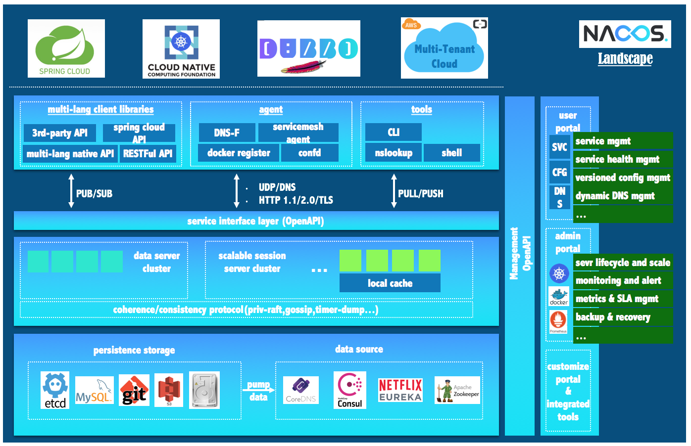

# Nacos

官方网站

https://nacos.io/zh-cn/

Nacos 致力于帮助您发现、配置和管理微服务。Nacos 提供了一组简单易用的特性集，帮助您实现动态服务发现、服务配置管理、服务及流量管理。

Nacos 帮助您更敏捷和容易地构建、交付和管理微服务平台。 Nacos 是构建以“服务”为中心的现代应用架构(例如微服务范式、云原生范式)的服务基础设施。




- 特性大图：要从功能特性，非功能特性，全面介绍我们要解的问题域的特性诉求
- 架构大图：通过清晰架构，让您快速进入 Nacos 世界
- 业务大图：利用当前特性可以支持的业务场景，及其最佳实践
- 生态大图：系统梳理 Nacos 和主流技术生态的关系
- 优势大图：展示 Nacos 核心竞争力
- 战略大图：要从战略到战术层面讲 Nacos 的宏观优势


**配置中心与注册中心压测报告**

https://nacos.io/zh-cn/docs/nacos-config-benchmark.html


## 动态配置服务

动态配置服务让您能够以中心化、外部化和动态化的方式管理所有环境的配置。动态配置消除了配置变更时重新部署应用和服务的需要。配置中心化管理让实现无状态服务更简单，也让按需弹性扩展服务更容易。


### 服务提供方

1. `bootstrap.yaml` 中配置 Nacos server 的地址和应用名

```
spring:
  cloud:
    nacos:
      config:
        server-addr: 192.168.29.1:8848
        file-extension: yaml
   
  application:
    name: nacos-p
```

之所以需要配置 `spring.application.name` ，是因为它是构成 Nacos 配置管理 `dataId`字段的一部分。

在 Nacos Spring Cloud 中，`dataId` 的完整格式如下：

```plain
${prefix}-${spring.profiles.active}.${file-extension}
```

- `prefix` 默认为 `spring.application.name` 的值，也可以通过配置项 `spring.cloud.nacos.config.prefix`来配置。
- `spring.profiles.active` 即为当前环境对应的 profile，详情可以参考 [Spring Boot文档](https://docs.spring.io/spring-boot/docs/current/reference/html/boot-features-profiles.html#boot-features-profiles)。 **注意：当 `spring.profiles.active` 为空时，对应的连接符 `-` 也将不存在，dataId 的拼接格式变成 `${prefix}.${file-extension}`**
- `file-exetension` 为配置内容的数据格式，可以通过配置项 `spring.cloud.nacos.config.file-extension` 来配置。目前只支持 `properties` 和 `yaml` 类型。

2. Controller

```
@RestController
@RefreshScope
public class MainController {

    @Value("${xxoo}")
    private String userName;

    @RequestMapping("/hello")
    public String hello() {
        return "hello+:" + userName;
    }
}
```


@RefreshScope注解能帮助我们做局部的参数刷新，但侵入性较强，需要开发阶段提前预知可能的刷新点，并且该注解底层是依赖于cglib进行代理

## 服务发现及管理

动态服务发现对以服务为中心的（例如微服务和云原生）应用架构方式非常关键。Nacos支持DNS-Based和RPC-Based（Dubbo、gRPC）模式的服务发现。Nacos也提供实时健康检查，以防止将请求发往不健康的主机或服务实例。借助Nacos，您可以更容易地为您的服务实现断路器。


### eureka


网上很多人说 Eureka 闭源，其实没有，只是 Eurkea 2.x 分支不再维护，官方依然在积极地维护 Eureka 1.x，Spring Cloud 还是使用的 1.x 版本的 Eureka

### Nacos注册中心

类似 Eureka、ZooKeeper、Consul 等组件，既可以支持 HTTP、https 的服务注册和发现，也可以支持 RPC 的服务注册和发现，比如 Dubbo，也是出自于阿里，完全可以替代 Eureka、ZooKeeper、Consul。


### 命名空间


##  动态DNS服务

通过支持权重路由，动态DNS服务能让您轻松实现中间层负载均衡、更灵活的路由策略、流量控制以及简单数据中心内网的简单DNS解析服务。动态DNS服务还能让您更容易地实现以DNS协议为基础的服务发现，以消除耦合到厂商私有服务发现API上的风险。

## 集群


单节点的nacos使用standalone 模式

### 修改为mysql存储配置

#### 修改conf/application.properties

核心配置

```
server.contextPath=/nacos
server.servlet.contextPath=/nacos
server.port=8841


spring.datasource.platform=mysql

db.num=1
db.url.0=jdbc:mysql://localhost:3306/nacos_config?characterEncoding=utf8&connectTimeout=1000&socketTimeout=3000&autoReconnect=true
db.user=root
db.password=840416
```

#### 导入sql文件

nacos-mysql.sql

### 集群配置

Nacos支持三种部署模式

- 单机模式 - 用于测试和单机试用。
- 集群模式 - 用于生产环境，确保高可用。
- 多集群模式 - 用于多数据中心场景。

window下默认启动脚本为单机版

修改startup.cmd

```
set MODE="cluster"
```


修改conf/cluster.conf

```
192.168.29.1:8841
192.168.29.1:8842
192.168.29.1:8843
```


#### SpringCloud客户端访问

##### 使用,分割

```
spring:
  cloud:
    nacos:
      config:
        server-addr: 192.168.29.1:8842,192.168.29.1:8840,192.168.29.1:8841
        file-extension: yaml
```

##### 使用Nginx负载


## NacosSync 迁移其他注册中心的数据

官方文档

https://nacos.io/zh-cn/docs/nacos-sync-use.html


CMDB 

Nacos官网提供了结合Prometheus和Grafana实现Metrics监控的示例。


## CAP 定律

推荐 DNS 解析 Nacos 地址，或者使用 Nginx 进行 TCP 层代理，这样配置的 Nacos 地址信息就不会跟随 Nacos 的 IP 变化而变化。

Nacos 的注册中心的持久化是存储在文件中的，MySQL 存储的是配置；

## Raft 协议

### Raft 实现原理

1. leader 选举：集群中必须存在一个 leader 节点。
2. 日志复制：leader 节点接受来自客户端的请求将这些序列化日志同步到其它的节点。
3. 安全性：如果某个节点已经将一条提交过的数据输入 Raft 状态机，其他节点不能将相同索引的另一条数据输入到 Raft 状态机中执行。

动画

http://thesecretlivesofdata.com/raft/

## MSE

阿里云上面已经有微服务引擎

## 创建用户与修改密码

连接密码

Nginx