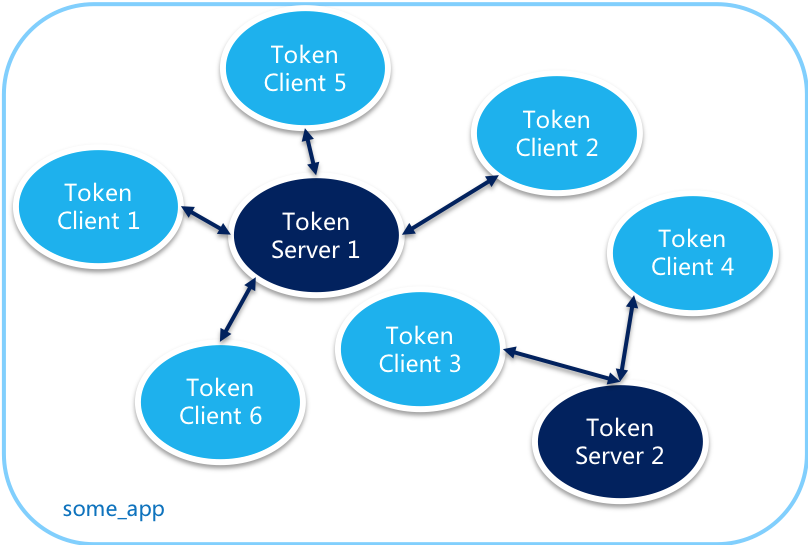

# SpringCloud Alibaba 03 Sentinel 

## 系统自适应限流

Sentinel 系统自适应限流从整体维度对应用入口流量进行控制，结合应用的 Load、CPU 使用率、总体平均 RT、入口 QPS 和并发线程数等几个维度的监控指标，通过自适应的流控策略，让系统的入口流量和系统的负载达到一个平衡，让系统尽可能跑在最大吞吐量的同时保证系统整体的稳定性。

- **Load 自适应**（仅对 Linux/Unix-like 机器生效）：系统的 load1 作为启发指标，进行自适应系统保护。当系统 load1 超过设定的启发值，且系统当前的并发线程数超过估算的系统容量时才会触发系统保护（BBR 阶段）。系统容量由系统的 `maxQps * minRt` 估算得出。设定参考值一般是 `CPU cores * 2.5`。

- **CPU usage**（1.5.0+ 版本）：当系统 CPU 使用率超过阈值即触发系统保护（取值范围 0.0-1.0），比较灵敏。
- **平均 RT**：当单台机器上所有入口流量的平均 RT 达到阈值即触发系统保护，单位是毫秒。
- **并发线程数**：当单台机器上所有入口流量的并发线程数达到阈值即触发系统保护。
- **入口 QPS**：当单台机器上所有入口流量的 QPS 达到阈值即触发系统保护。

## 集群流控

为什么要使用集群流控呢？假设我们希望给某个用户限制调用某个 API 的总 QPS 为 50，但机器数可能很多（比如有 100 台）。这时候我们很自然地就想到，找一个 server 来专门来统计总的调用量，其它的实例都与这台 server 通信来判断是否可以调用。这就是最基础的集群流控的方式。

另外集群流控还可以解决流量不均匀导致总体限流效果不佳的问题。假设集群中有 10 台机器，我们给每台机器设置单机限流阈值为 10 QPS，理想情况下整个集群的限流阈值就为 100 QPS。不过实际情况下流量到每台机器可能会不均匀，会导致总量没有到的情况下某些机器就开始限流。因此仅靠单机维度去限制的话会无法精确地限制总体流量。而集群流控可以精确地控制整个集群的调用总量，结合单机限流兜底，可以更好地发挥流量控制的效果。

集群流控中共有两种身份：

- Token Client：集群流控客户端，用于向所属 Token Server 通信请求 token。集群限流服务端会返回给客户端结果，决定是否限流。
- Token Server：即集群流控服务端，处理来自 Token Client 的请求，根据配置的集群规则判断是否应该发放 token（是否允许通过）。

http://192.168.110.140:8720/setClusterMode?mode=1

https://github.com/alibaba/Sentinel/wiki/%E9%9B%86%E7%BE%A4%E6%B5%81%E6%8E%A7