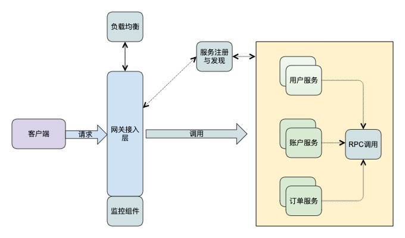

# SpringCloud Gateway



## 什么是网关？

网关是一个服务，是访问内部系统的唯一入口，提供内部服务的路由中转，额外还可以在此基础上提供如身份验证、监控、负载均衡、限流、降级与应用检测等功能。

### Spring Cloud Gateway 与 Zuul 对比

#### zuul1.x与zuul2.x

Zuul 1.x 基于同步 IO


zuul2.x

基于异步io


zuul1.x 对比 zuul2.x 性能提升


#### zuul 与Gateway对比


## SpringCloud Gateway 使用

### 断言 predicates

多个断言可以配合使用

#### path断言

```
        predicates:
        - Path=/mg/**
```

#### Query断言

参数值可以写正则，也可以只写参数名

```
        predicates:
        - Query=foo,ba.
```

#### Method断言

```
        predicates:
        - Method=get
```

#### Host断言

```
  predicates:
        - Host=mashibing.com
```

#### Cookie断言

```
        predicates:
        - Cookie=name,yiming
```


### 基本路由

#### 依赖

```
		<dependency>
			<groupId>org.springframework.cloud</groupId>
			<artifactId>spring-cloud-starter-gateway</artifactId>
		</dependency>
```


#### 配置文件

```
spring:
  cloud:
    gateway:
      routes:
      - id: xxooroute
        uri: http://localhost:8080  
        filters:
        - StripPrefix=2

          
server:
  port: 80
```


### 整合Eureka

#### 依赖

```
		<dependency>
			<groupId>org.springframework.cloud</groupId>
			<artifactId>spring-cloud-starter-gateway</artifactId>
		</dependency>
```


#### 配置

```
spring:
  cloud:
    gateway:
      discovery:
        locator:
        // 开启从eureka 拉取服务列表  并自动映射
          enabled: true
     
  application:
    name: myGateWay
eureka:
  client:
    service-url:
      defaultZone: http://euk1.com:7002/eureka/
   
        
server:
  port: 80
  
  
```


#### 负载均衡

```
spring:
  cloud:
    gateway:
      discovery:
        locator:
          enabled: true
          
          
          
      routes:
      - id: mdb
        predicates:
        - Path=/mangodb/**
        uri: lb://MDB
        filters:
        - StripPrefix=1
          
     
  application:
    name: myGateWay
    
       
    
  
eureka:
  client:
    service-url:
      defaultZone: http://euk1.com:7002/eureka/
   
        
server:
  port: 80
  
  
```


#### 自定义负载均衡

##### 配置

```
MDB:
  ribbon:
    NFLoadBalancerRuleClassName: com.mashibing.admin.MyRule
```


```
package com.mashibing.admin;

import java.util.List;

import com.netflix.client.config.IClientConfig;
import com.netflix.loadbalancer.AbstractLoadBalancerRule;
import com.netflix.loadbalancer.Server;

public class MyRule extends AbstractLoadBalancerRule{

	@Override
	public Server choose(Object key) {
		// TODO Auto-generated method stub
		List<Server> list = this.getLoadBalancer().getReachableServers();
		
		
		System.out.println(list);
		// 各种逻辑~~~~
		System.out.println("xxoo");
		return list.get(0);
	}

	@Override
	public void initWithNiwsConfig(IClientConfig clientConfig) {
		// TODO Auto-generated method stub
		
	}

}

```

### 自定义路由

```

	@Bean
	public RouteLocator routeLocator (RouteLocatorBuilder locatorBuilder) {
		
		return locatorBuilder.routes()
				.route(p -> 
					p.path("/xxoo")
					.filters(f -> f.stripPrefix(1))
					.uri("http://mashibing.com")
						)
				
				.route(p ->
				
					p.path("/go")
					.filters(f -> f.stripPrefix(1))
					.uri("lb://MDB")
						)
				
				.build();
	}
```


### 自定义过滤器

```
package com.mashibing.admin;

import java.util.List;

import org.springframework.cloud.gateway.filter.GatewayFilterChain;
import org.springframework.cloud.gateway.filter.GlobalFilter;
import org.springframework.core.Ordered;
import org.springframework.core.io.buffer.DataBuffer;
import org.springframework.http.HttpStatus;
import org.springframework.http.server.reactive.ServerHttpRequest;
import org.springframework.stereotype.Component;
import org.springframework.util.MultiValueMap;
import org.springframework.web.server.ServerWebExchange;

import reactor.core.publisher.Mono;

@Component
public class MyFilter implements Ordered,GlobalFilter {

	@Override
	public Mono<Void> filter(ServerWebExchange exchange, GatewayFilterChain chain) {
		
		ServerHttpRequest request = exchange.getRequest();
		
		MultiValueMap<String, String> queryParams = request.getQueryParams();
		List<String> list = queryParams.get("id");
		
		if (null == list || list.size() ==0) {
			
			// 非法请求
			
			System.out.println("不要~");
			
//			exchange.getResponse().setStatusCode(HttpStatus.UNAUTHORIZED);
//			
//			return exchange.getResponse().setComplete();
			DataBuffer dataBuffer = exchange.getResponse().bufferFactory().wrap("xiake~!!".getBytes());
			
			exchange.getResponse().setStatusCode(HttpStatus.UNAUTHORIZED);
			
			return exchange.getResponse().writeWith(Mono.just(dataBuffer));
			
		}
		
		return chain.filter(exchange);
	}

	@Override
	public int getOrder() {
		// TODO Auto-generated method stub
		return 0;
	}

}

```


### 

