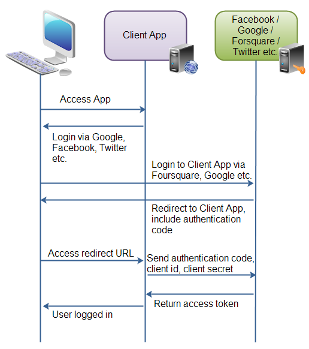
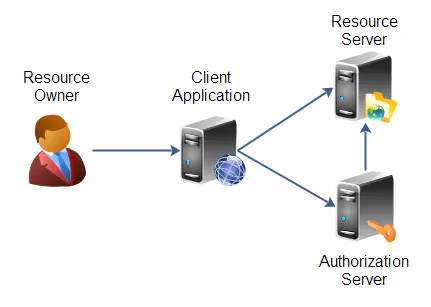
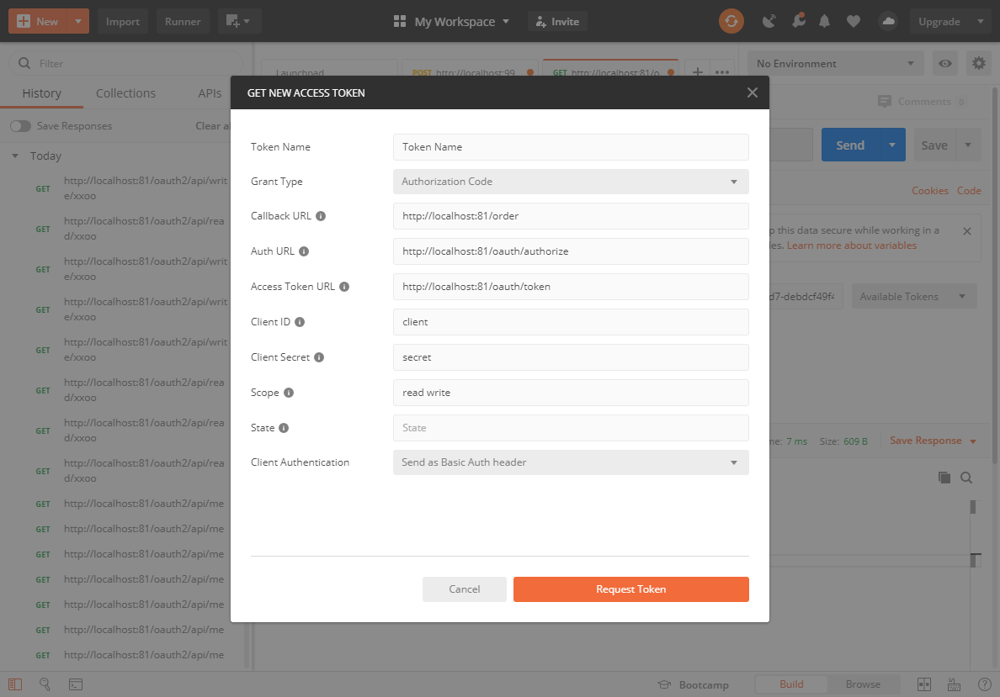
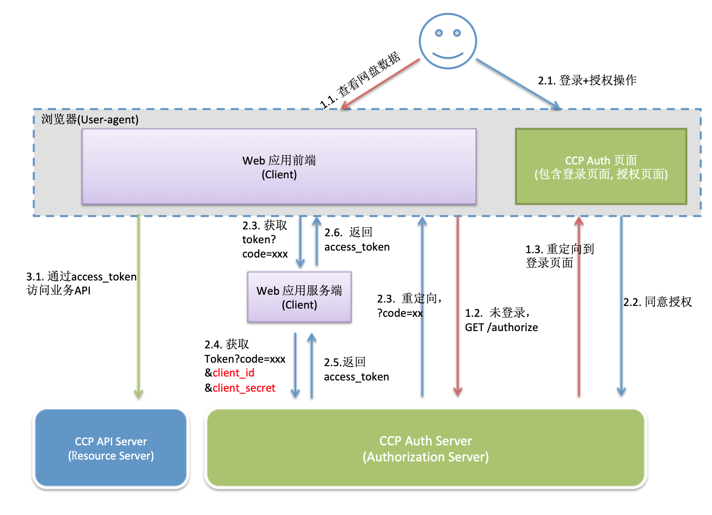
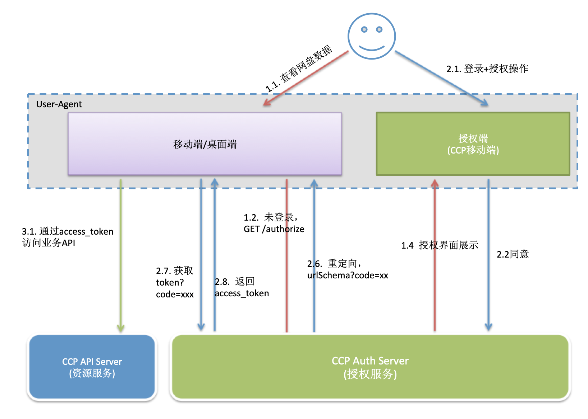

# 会话管理

## SSO

*SSO*是为了解决一个用户在鉴权服务器登陆过一次以后，可以在任何应用中畅通无阻，一次登陆，多系统访问

## Session共享

### SpringSession + Redis

#### 配置文件

```
spring.redis.host=localhost
#spring.redis.password=
spring.redis.port=6379

spring.security.user.name=123
spring.security.user.password=123

server.port=81
```

#### 依赖

```
		<dependency>
			<groupId>org.springframework.boot</groupId>
			<artifactId>spring-boot-starter-security</artifactId>
		</dependency>
		

		<dependency>
			<groupId>org.springframework.boot</groupId>
			<artifactId>spring-boot-starter-test</artifactId>
			<scope>test</scope>
			<exclusions>
				<exclusion>
					<groupId>org.junit.vintage</groupId>
					<artifactId>junit-vintage-engine</artifactId>
				</exclusion>
			</exclusions>
		</dependency>
		<dependency>
			<groupId>org.springframework.security</groupId>
			<artifactId>spring-security-test</artifactId>
			<scope>test</scope>
		</dependency>
		<dependency>
			<groupId>org.springframework.boot</groupId>
			<artifactId>spring-boot-starter-data-redis</artifactId>
		</dependency>
		<dependency>
			<groupId>org.springframework.session</groupId>
			<artifactId>spring-session-data-redis</artifactId>
		</dependency>
		<dependency>
			<groupId>org.springframework.boot</groupId>
			<artifactId>spring-boot-starter-web</artifactId>
		</dependency>
```

## OAuth2.0




**OAuth 的核心就是向第三方应用颁发令牌**

能够做到一个应用向用户征求授权，来向资源服务器获取资源

### 应用场景

- 单点登录
- 第三方登录


### 角色



**Resource Owner**

资源拥有者，对应微信的每个用户微信上设置的个人信息是属于每个用户的，不属于腾讯。

**Resource Server**

资源服务器，一般就是用户数据的一些操作（增删改查）的REST API，比如微信的获取用户基本信息的接口。

**Client Application**

第三方客户端，对比微信中就是各种微信公众号开发的应用，第三方应用经过`认证服务器`授权后即可访问`资源服务器`的REST API来获取用户的头像、性别、地区等基本信息。

**Authorization Server**

认证服务器，验证第三方客户端是否合法。如果合法就给客户端颁布token，第三方通过token来调用资源服务器的API。


### 授权认证流程

### 授权类型

**anthorization_code**

授权码类型，适用于Web Server Application。模式为：客户端先调用`/oauth/authorize/`进到用户授权界面，用户授权后返回`code`，客户端然后根据code和`appSecret`获取`access token`。

**implicit** 简化类型，相对于授权码类型少了授权码获取的步骤。客户端应用授权后认证服务器会直接将access token放在客户端的url。客户端解析url获取token。这种方式其实是不太安全的，可以通过**https安全通道**和**缩短access token的有效时间**来较少风险。

**password**

密码类型，客户端应用通过用户的username和password获access token。适用于资源服务器、认证服务器与客户端具有完全的信任关系，因为要将用户要将用户的用户名密码直接发送给客户端应用，客户端应用通过用户发送过来的用户名密码获取token，然后访问资源服务器资源。比如支付宝就可以直接用淘宝用户名和密码登录，因为它们属于同一家公司，彼此**充分信任**。

**client_credentials**

客户端类型，是不需要用户参与的一种方式，用于不同服务之间的对接。比如自己开发的应用程序要调用短信验证码服务商的服务，调用地图服务商的服务、调用手机消息推送服务商的服务。当需要调用服务是可以直接使用服务商给的`appID`和`appSecret`来获取token，得到token之后就可以直接调用服务。

#### 其他

- **scope**：访问资源服务器的哪些作用域。一组权限，Role
- **refresh token**：当access token 过期后，可以通过refresh token重新获取access token。

### 应用场景

#### 微信授权

https://developers.weixin.qq.com/doc/oplatform/Mobile_App/WeChat_Login/Development_Guide.html


### 实现

#### 依赖

```
<?xml version="1.0" encoding="UTF-8"?>
<project xmlns="http://maven.apache.org/POM/4.0.0" xmlns:xsi="http://www.w3.org/2001/XMLSchema-instance"
	xsi:schemaLocation="http://maven.apache.org/POM/4.0.0 https://maven.apache.org/xsd/maven-4.0.0.xsd">
	<modelVersion>4.0.0</modelVersion>
	<parent>
		<groupId>org.springframework.boot</groupId>
		<artifactId>spring-boot-starter-parent</artifactId>
		<version>2.2.7.RELEASE</version>
		<relativePath/> <!-- lookup parent from repository -->
	</parent>
	<groupId>com.mashibing.admin</groupId>
	<artifactId>o1</artifactId>
	<version>0.0.1-SNAPSHOT</version>
	<name>o1</name>
	<description>Demo project for Spring Boot</description>

	<properties>
		<java.version>1.8</java.version>
		<spring-cloud.version>Hoxton.SR4</spring-cloud.version>
	</properties>

	<dependencies>
		<dependency>
			<groupId>org.springframework.boot</groupId>
			<artifactId>spring-boot-starter-security</artifactId>
		</dependency>
		<dependency>
			<groupId>org.springframework.boot</groupId>
			<artifactId>spring-boot-starter-web</artifactId>
		</dependency>


		<dependency>
			<groupId>org.springframework.boot</groupId>
			<artifactId>spring-boot-starter-test</artifactId>
			<scope>test</scope>
			<exclusions>
				<exclusion>
					<groupId>org.junit.vintage</groupId>
					<artifactId>junit-vintage-engine</artifactId>
				</exclusion>
			</exclusions>
		</dependency>
		<dependency>
			<groupId>org.springframework.security</groupId>
			<artifactId>spring-security-test</artifactId>
			<scope>test</scope>
		</dependency>
		<dependency>
			<groupId>org.springframework.cloud</groupId>
			<artifactId>spring-cloud-starter-oauth2</artifactId>
		</dependency>
		
		
		<dependency>  
 <groupId>org.springframework.boot</groupId>  
 <artifactId>spring-boot-starter-data-redis</artifactId>  
</dependency>
	</dependencies>

	<dependencyManagement>
		<dependencies>
			<dependency>
				<groupId>org.springframework.cloud</groupId>
				<artifactId>spring-cloud-dependencies</artifactId>
				<version>${spring-cloud.version}</version>
				<type>pom</type>
				<scope>import</scope>
			</dependency>
		</dependencies>
	</dependencyManagement>

	<build>
		<plugins>
			<plugin>
				<groupId>org.springframework.boot</groupId>
				<artifactId>spring-boot-maven-plugin</artifactId>
			</plugin>
		</plugins>
	</build>

</project>

```


#### 认证服务器

```java
@EnableAuthorizationServer
@Configuration
public class AuthorizationServerConfiguration  extends AuthorizationServerConfigurerAdapter {

    @Override
    public void configure(ClientDetailsServiceConfigurer clients) throws Exception {
        clients.inMemory().withClient("client")
        .redirectUris("http://localhost:81/order")
                .scopes("read","write")
                .secret("secret")
                .authorizedGrantTypes("authorization_code","password","implicit","client_credentials");}

    @Override
    public void configure(AuthorizationServerSecurityConfigurer security) throws Exception {
        super.configure(security);
    }

    @Override
    public void configure(AuthorizationServerEndpointsConfigurer endpoints) throws Exception {
       endpoints.authenticationManager(authenticationManager);
    }

    @Autowired
    @Qualifier("authenticationManagerBean")
    private AuthenticationManager authenticationManager;
}

```


#### security配置

```java

@Configuration
public class SecurityConfiguration extends WebSecurityConfigurerAdapter {

    @Override
    protected void configure(HttpSecurity http) throws Exception {
        http.formLogin()
                .and().csrf().disable()
                .authorizeRequests().anyRequest().authenticated();
    }

    @Override
    public void configure(WebSecurity web) throws Exception {
        super.configure(web);
    }

    @Override
    protected void configure(AuthenticationManagerBuilder auth) throws Exception {
        auth.inMemoryAuthentication().withUser("111").password("222").authorities("user")
                .and().withUser("admin").password("admin").authorities("admin");
    }

    @Bean
    @Override
    public AuthenticationManager authenticationManagerBean() throws Exception {
        return super.authenticationManagerBean();
    }
    
    
	@Bean
	PasswordEncoder passwordEncoder() {
		return NoOpPasswordEncoder.getInstance();
	}
```

#### 资源服务器

```java
@EnableGlobalMethodSecurity(prePostEnabled = true)
@EnableResourceServer
@Configuration
public class ResourceServerConfiguration extends ResourceServerConfigurerAdapter {
	@Override
	public void configure(HttpSecurity http) throws Exception {
		http.antMatcher("/oauth2/api/**").authorizeRequests()
			.antMatchers(HttpMethod.GET, "/oauth2/api/read/**").access("#oauth2.hasScope('read')")
			.antMatchers(HttpMethod.GET, "/oauth2/api/write/**").access("#oauth2.hasScope('write')")
			;
	}

}
```


#### 第三方服务

```

@RestController
public class MainController {
    
    @GetMapping("/oauth2/api/me")
    public Authentication me() {
        //for debug
        Authentication authentication = SecurityContextHolder.getContext().getAuthentication();
      
        
        
        return authentication;
    }
    
    
    @GetMapping("/oauth2/api/read/xxoo")
    public Authentication xxoo() {
        //for debug
        Authentication authentication = SecurityContextHolder.getContext().getAuthentication();
      
        System.out.println("xxpp");
        
        return authentication;
    }
    
    @GetMapping("/oauth2/api/write/xxoo")
    public Authentication write() {
        //for debug
        Authentication authentication = SecurityContextHolder.getContext().getAuthentication();
        System.out.println("write");
        return authentication;
    }
}
```


#### 使用PostMan获取token




### 学习资源


https://oauth.net/2/

OAuth2从RFC 6749开始

https://tools.ietf.org/html/rfc6749


### 阿里云的浏览器介入流程

https://help.aliyun.com/document_detail/135390.html?spm=a2c4g.11186623.6.559.179b3ccbNHt8PM




### 移动端和桌面端应用的OAuth2.0接入流程

https://help.aliyun.com/document_detail/135588.html?spm=a2c4g.11186623.6.561.1f382cb7Jc48oR



## **OpenID**


OpenID是一个去中心化的网上身份认证系统。对于支持OpenID的网站，用户不需要记住像用户名和密码这样的传统验证标记。取而代之的是，他们只需要预先在一个作为OpenID身份提供者（identity provider, IdP）的网站上注册。OpenID是去中心化的，任何网站都可以使用OpenID来作为用户登录的一种方式，任何网站也都可以作为OpenID身份提供者。OpenID既解决了问题而又不需要依赖于中心性的网站来确认数字身份。

https://openid.net


### OpenID与OAuth2.0区别

- 社交网站联合登录
- 短信平台

OpenID：认证

OAuth2.0：授权

## JWT

JSON Web Token

https://jwt.io/

### 应用场景

JWT是一种基于JSON的令牌安全验证(在某些特定的场合可以替代Session或者Cookie)，一次生成随处校验


### JWT组成

#### 头部信息(header)

 作用:指定该JWT使用的签名

```
  {
      “alg”: “HS256”,// 签名算法
      “typ”: “JWT” //token类型  
  }
```

将上面的json，用Base64URL 算法转成字符串，即为header。

#### 消息体playload

也就是负载的信息

```
{
"exp" (expiration time)：过期时间
"sub" (subject)：主题,一般用用户id,用来标识用户会话
"iat" (Issued At)：签发时间
}
```

这个 JSON 对象也要使用 Base64URL 算法转成字符串。
**作用**:JWT的请求数据

#### 签名( signature)

Signature 部分是对前两部分的签名，防止数据篡改。
需要指定一个密钥（secret）。这个密钥只有服务器才知道，不能泄露给用户。然后，使用 Header 里面指定的签名算法（默认是 HMAC SHA256），按照下面的公式产生签名。

```
HMACSHA256(base64UrlEncode(header) + "." + base64UrlEncode(payload),secret) header.payload.signature
```


**头部、声明、签名用 . 号**

最终：把 Header、Payload、Signature 三个部分拼成一个字符串，每个部分之间用"点"（.）分隔连在一起就得到了我们要的JWT


### 实现

#### JWT工具类

```java
package com.mashibing.admin;

import java.util.Base64;
import java.util.Calendar;
import java.util.Date;

import io.jsonwebtoken.Claims;
import io.jsonwebtoken.ExpiredJwtException;
import io.jsonwebtoken.Jwts;

/**
 * @author yueyi2019
 */
public class JwtUtil {
    /**
     * 密钥，仅服务端存储
     */
    private static String secret = "ko346134h_we]rg3in_yip1!";

    /**
     *
     * @param subject
     * @param issueDate 签发时间
     * @return
     */
    public static String createToken(String subject, Date issueDate) {
    	
    	
        Calendar c = Calendar.getInstance();  
        c.setTime(issueDate);  
        c.add(Calendar.DAY_OF_MONTH, 20);        
        
    	
    	
        String compactJws = Jwts.builder()
                .setSubject(subject)
                .setIssuedAt(issueDate)
                .setExpiration(c.getTime())
                		
                .signWith(io.jsonwebtoken.SignatureAlgorithm.HS512, secret)
                .compact();
        return compactJws;

    }

    /**
     * 解密 jwt
     * @param token
     * @return
     * @throws Exception
     */
    public static String parseToken(String token) {
        try {
            Claims claims = Jwts.parser().setSigningKey(secret).parseClaimsJws(token).getBody();
            if (claims != null){
                return claims.getSubject();
            }
        }catch (ExpiredJwtException e){
            e.printStackTrace();
            System.out.println("jwt过期了");
        }

        return "";
    }

}
```

#### pom依赖

```
<dependency>
      <groupId>io.jsonwebtoken</groupId>
      <artifactId>jjwt</artifactId>
      <version>0.7.0</version>
    </dependency>
```

#### Filter校验

```
@WebFilter(filterName = "authFilter", urlPatterns = "/**")
@Component
public class MyFi implements Filter {

	@Override
	public void doFilter(ServletRequest request, ServletResponse response, FilterChain chain)
			throws IOException, ServletException {

		HttpServletRequest req = (HttpServletRequest) request;
		String token = req.getHeader("token");

		if (token != null) {
			// 判断解析token是否成功
			String parseToken = JwtUtil.parseToken(token);


			if (!StringUtils.isEmpty(parseToken)) {
				System.out.println("auth success");
				chain.doFilter(request, response);
			}

		} else {
			System.out.println("auth failed");
		}
	}

	@Override
	public void init(FilterConfig filterConfig) throws ServletException {
		// TODO Auto-generated method stub
		System.out.println("来了老弟");
		Filter.super.init(filterConfig);
	}
```


