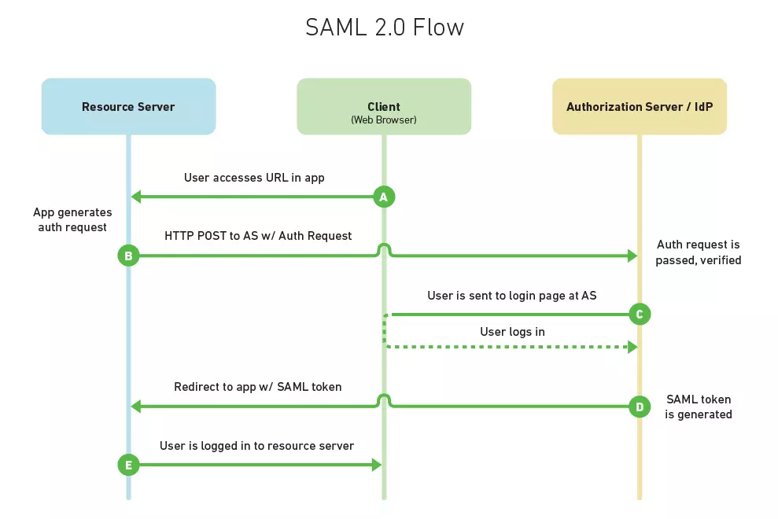

# 会话管理

## Token安全防御

### 注意安全！

- XSS重放攻击
- CSRF跨域攻击

### Token携带方式

#### 浏览器

- http header 
- url上的Get请求
- Cookies
- localStorage 

#### APP

- 本地存储

- 前后端签名，私钥存储

### **HMAC**

数据在传输过程中对数据产生的摘要，用于传输防篡改

## SAML 2.0

### 角色

#### Service Provider

资源/服务提供者

### Identity Provider

认证服务

## CAS

集中式身份验 Central Authentication Service