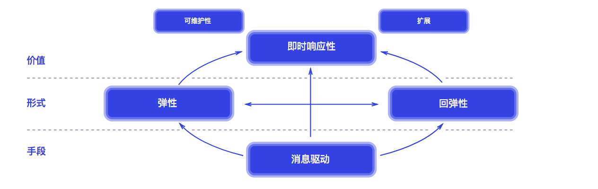

# 响应式web与微服务系统架构 01

## 响应式系统主流框架

- akka

使用Scala语言开发，后期支持Java，但是在Java社区并不如从前受欢迎

- Vert.x

Vert.x是Eclipse发行的开源项目，设计初衷是作为Node.js在Java虚拟机上的替代方法，支持非阻塞和事件驱动，在近几年开始受大家关注

- Project Reactor

Spring5中默认引入的响应式编程机制，出现的比较晚，所以也吸收了前辈的经验。

- RxJava

ReactiveExtensions，早起应用于.net平台

## 响应式与命令式的区别

## 响应式宣言

官网自带中文版

https://www.reactivemanifesto.org/

即时响应性（Responsive）、回弹性（Resilient）、弹性（Elastic）以及消息驱动（Message Driven）

## 特点

### 即时响应性:

只要有可能， 系统就会及时地做出响应。 即时响应是可用性和实用性的基石， 而更加重要的是，即时响应意味着可以快速地检测到问题并且有效地对其进行处理。 即时响应的系统专注于提供快速而一致的响应时间， 确立可靠的反馈上限， 以提供一致的服务质量。 这种一致的行为转而将简化错误处理、 建立最终用户的信任并促使用户与系统作进一步的互动。

### 回弹性：

系统在出现失败时依然保持即时响应性。 这不仅适用于高可用的、 任务关键型系统——任何不具备回弹性的系统都将会在发生失败之后丢失即时响应性。 回弹性是通过复制、 遏制、 隔离以及委托来实现的。 失败的扩散被遏制在了每个组件内部， 与其他组件相互隔离， 从而确保系统某部分的失败不会危及整个系统，并能独立恢复。 每个组件的恢复都被委托给了另一个（外部的）组件， 此外，在必要时可以通过复制来保证高可用性。 （因此）组件的客户端不再承担组件失败的处理。

### 弹性： 

系统在不断变化的工作负载之下依然保持即时响应性。 反应式系统可以对输入（负载）的速率变化做出反应，比如通过增加或者减少被分配用于服务这些输入（负载）的资源。 这意味着设计上并没有争用点和中央瓶颈， 得以进行组件的分片或者复制， 并在它们之间分布输入（负载）。 通过提供相关的实时性能指标， 反应式系统能支持预测式以及反应式的伸缩算法。 这些系统可以在常规的硬件以及软件平台上实现成本高效的弹性。

### 消息驱动：

反应式系统依赖异步的消息传递，从而确保了松耦合、隔离、位置透明的组件之间有着明确边界。 这一边界还提供了将失败作为消息委托出去的手段。 使用显式的消息传递，可以通过在系统中塑造并监视消息流队列， 并在必要时应用回压， 从而实现负载管理、 弹性以及流量控制。 使用位置透明的消息传递作为通信的手段， 使得跨集群或者在单个主机中使用相同的结构成分和语义来管理失败成为了可能。 非阻塞的通信使得接收者可以只在活动时才消耗资源， 从而减少系统开销。

## 应用场景

- 电商中的响应式
- 富客户端（Gmail、qq邮箱）
- 系统通知
- 股市K线
- 聊天室

## 特点

### 高性能

- 线程工作模式对比与复用

## 背压 Backpressure 

在数据流从上游生产者向下游消费者传输的过程中，上游生产速度大于下游消费速度，导致下游的 Buffer 溢出，这种现象就叫做 Backpressure 出现