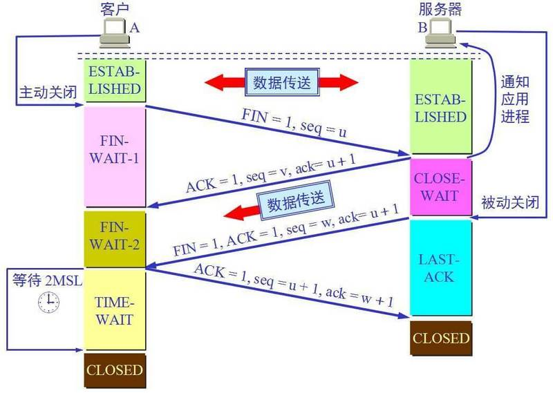

# 高并发负载均衡以及高可用

## 网络

1. 理论网络分为7层

   > 应用层
   >
   > 表示层
   >
   > 会话层
   >
   > 传输控制层
   >
   > 网络层
   >
   > 数据链路层
   >
   > 物理层

   

2. 目前网络主要有5层

   > 应用层
   >
   > 传输控制层
   >
   > 网络层
   >
   > 数据链路层
   >
   > 物理层

   
   
   1. 应用层：提供应用进程间交互完成特定网络应用。不同的网络应用使用不同的网络协议，例如www使用HTTP协议，email使用SMTP协议等等。应用层交互的数据单元称为报文。
   
   2. 传输控制层：负责向两台应用进程之间提供数据传输服务。应用层利用服务传输报文。目前有TCP协议、UDP协议。
      1. 三次握手：第一次握手：客户端发送连接请求报文段，客户进程进入SYN_SENT（同步已发送）状态；第二次握手：服务端收到连接请求会发出确认报文段，服务端进程进入SYN_RCVD（同步已接受）状态；第三次握手：客户端收到服务端确认后，客户端也会发出确认报文段，确认自己处于ESTABLISHED（确定建立连接）状态，服务端收到确认报文也会处于ESTABLISHED（确定建立连接）状态，那么两者之间就可以传输数据了。
      
         
      
      2. 四次挥手：第一次挥手：客户端应用进程发送释放连接报文段，主动关闭TCP连接，进入FIN-WAIT-1（终止等待1）状态；第二次挥手：服务端收到连接释放报文段后立即发出确认，服务端进入CLOSE-WAIT（关闭等待）状态，客户端收到服务端确认报文段，客户端进入FIN-WAIT-2（终止等待2）状态；第三次挥手：服务端应用进程通知TCP释放连接，服务端会发送连接释放报文段，服务端进入LAST-ACK（最后确认）状态；第四次挥手：客户端收到服务端连接释放报文，发出确认报文段，客户端进入TIME-WAIT（时间等待）状态，确保服务器收到ACK报文，等待2ms后客户端进入CLOSED（关闭）状态，服务端收到确认后也进入CLOSED（关闭）状态。
      
         
      
   3. 网络层：选择合适的路由和交换结点，网络层会把报文封装成数据报进行传送。目前常用的有IP协议、ARP协议。
      1. ARP协议：地址转换协议。完成IP与Mac地址的映射。当源主机发送一个数据包发送给目的主机时，会首先检查目的主机是否有该IP对应的Mac地址：有，把数据包发给这个MAC地址；没有，会向本地网段广播ARP请求，查询对应的Mac地址。ARP请求数据包有源主机的IP地址、源主机的MAC地址、目的主机的IP地址、目的主机的Mac地址。
      2. IP协议：IP通过和子网掩码按位与的操作会找到下一跳的IP地址。例如IP：192.168.42.12，NETMASK：255.255.255.0，按位与后为192.168.42.0就是下一跳的地址
      
   4. 数据链路层：将网络层的数据报封装成帧，会在相邻两个节点之间传输帧。目前常用的有PPP点对点协议。
   
   5. 物理层：实现相邻节点之间bit流的透明传输，尽可能屏蔽掉传输介质和网络设备的差异。
   
      

## 负载均衡

1. 专业名词缩写：

   > CIP:Client IP
   >
   > DIP:Dest IP
   >
   > VIP:Virtual IP
   >
   > RIP:Real IP
   >
   > DR:Direct Route
   >
   > NAT:Network Address Translation
   >
   > TUN:IP Tunneling
   >
   > LVS:Linux Virtual Server
   >
   > RS:Real Server

2. VS/NAT

   

   1. Client通过VIP访问网络服务，发送请求到负载均衡服务器（Load Balance Server）
   2. LB会根据算法选出RS，并将VIP换成RS对应的RIP
   3. RS处理完请求，把响应报文发给LB
   4. LB会把RIP改为VIP发送给client

   > LB需要处理请求和响应的数据报文，当RS增加时，LB会成为整个集群系统的新瓶颈

3. VS/DR

   

   1. client通过VIP访问网络服务，发送请求到负载均衡服务器（Load Balance Server）
   2. LB会根据算法选出RS，不修改报文，只添加RS的RIP和Mac地址，发送给对应的RS
   3. RS内部有一个与LB相同的VIP，RS的VIP对外隐藏对内可见的
   4. RS处理完请求将响应报文变成VIP和CIP，直接把响应报文发送给client

   > 必须要求LB和RS在同一个网段内

4. VS/TUN

   

   与DR不同的是：

   1. LB在把请求报文转发给RS时，对协议进行二次封装，RS收到请求先进行解包

   > 所有RS都必须职称"IP Tunneling"协议，配置复杂，也有建立IP 隧道的开销

5. 隐藏VIP方法：对内可见，对外隐藏

   > kernel parameter:
   > 目标mac地址为全F，交换机触发广播
   >  /proc/sys/net/ipv4/conf/*IF*/
   > arp_ignore: 定义接收到ARP请求时的响应级别；
   >  0：只要本地配置的有相应地址，就给予响应；
   >  1：仅在请求的目标(MAC)地址配置请求
   >     到达的接口上的时候，才给予响应；
   >
   > arp_announce：定义将自己地址向外通告时的通告级别；
   >  0：将本地任何接口上的任何地址向外通告；
   >  1：试图仅向目标网络通告与其网络匹配的地址；
   >  2：仅向与本地接口上地址匹配的网络进行通告；
   
6. 配置

   

   ```bash
   node01:
   ifconfig ens33:8 192.168.163.50/24 #设置VIP
   
   node02~node03:
   1)修改内核
   echo 1 > /proc/sys/net/ipv4/conf/ens33/arp_ignore 
   echo 1 > /proc/sys/net/ipv4/conf/all/arp_ignore 
   echo 2 > /proc/sys/net/ipv4/conf/ens33/arp_announce
   echo 2 > /proc/sys/net/ipv4/conf/all/arp_announce
   2)设置隐藏的VIP
   ifconfig lo:3 192.168.163.50 netmask 255.255.255.255
   
   RS中的服务
   node02~node03:
   yum install httpd -y
   service httpd start
   vi /var/www/html/index.html
   添加一句 from 192.168.163.1x
   
   LVS服务配置
   node01:
   yum install ipvsadm -y
   ipvsadm -A -t 192.168.163.50:80 -s rr
   ipvsadm -a -t 192.168.163.50:80 -r 192.168.163.12 -g -w 1
   ipvsadm -a -t 192.168.163.50:80 -r 192.168.163.13 -g -w 1
   ipvsadm -ln #查看偷窥记录本
   
   [root@node01 ~]# ipvsadm -lnc
   IPVS connection entries
   pro expire state       source             virtual            destination
   TCP 14:44  ESTABLISHED 192.168.163.3:53845 192.168.163.50:80  192.168.163.12:80
   TCP 14:56  ESTABLISHED 192.168.163.3:53844 192.168.163.50:80  192.168.163.13:80
   TCP 00:51  FIN_WAIT    192.168.163.3:53826 192.168.163.50:80  192.168.163.12:80
   
   FIN_WAIT： 连接过，偷窥了所有的包
   SYN_RECV： 基本上lvs都记录了，证明lvs没事，一定是后边网络层出问题
   
   验证：
   浏览器访问 192.168.163.50 看到负载 不断刷新
   node01：
   	netstat -natp   结论看不到socket连接
   node02~node03:
   	netstat -natp   结论看到socket连接
   	
   知识点：
   ======================================================================
   四种静态： 
   rr:轮循
   wrr:
   dh: 
   sh:
   
   动态调度方法：
   lc: 最少连接
   wlc: 加权最少连接
   sed: 最短期望延迟
   nq: never queue
   LBLC: 基于本地的最少连接
   DH: 
   LBLCR: 基于本地的带复制功能的最少连接
   ======================================================================
   ipvs内核模块
   yum install ipvsadm -y
   
   管理集群服务
   添加：-A -t|u|f service-address [-s scheduler]
   -t: TCP协议的集群 
   -u: UDP协议的集群
   service-address:     IP:PORT
   -f: FWM: 防火墙标记 
   service-address: Mark Number
   修改：-E
   删除：-D -t|u|f service-address
   
   ipvsadm -A -t 192.168.163.50:80 -s rr
   ======================================================================
   管理集群服务中的RS
   添加：-a -t|u|f service-address -r server-address [-g|i|m] [-w weight]
     -t|u|f service-address：事先定义好的某集群服务
     -r server-address: 某RS的地址，在NAT模型中，可使用IP：PORT实现端口映射；
     [-g|i|m]: LVS类型 
     -g: DR
     -i: TUN
     -m: NAT
     [-w weight]: 定义服务器权重
   修改：-e
   删除：-d -t|u|f service-address -r server-address
   # ipvsadm -a -t 172.16.100.1:80 -r 192.168.10.8 –g
   # ipvsadm -a -t 172.16.100.1:80 -r 192.168.10.9 -g
   查看
     -L|l
     -n: 数字格式显示主机地址和端口
     --stats：统计数据
     --rate: 速率
     --timeout: 显示tcp、tcpfin和udp的会话超时时长
     -:c 显示当前的ipvs连接状况
   删除所有集群服务
     -C：清空ipvs规则
   保存规则
     -S 
   # ipvsadm -S > /path/to/somefile
   载入此前的规则：
     -R
   # ipvsadm -R < /path/form/somefile 
   ```

## 高可用

1. node01作为LVS，会出现单点故障问题，加上node04，其中node01为master，node04为backup，只有当node01挂了，node04才会使用。使用keepalived实现LVS单点故障问题。

2. 配置

   ```bash
   keepalived实验：
   主机： node01~node04
   
   node01:
   	ipvsadm -C //clean偷窥记录本
   	ifconfig eth0:8 down //配置的VIP停掉
   ==============================================
   node01,node04:
   yum install keepalived ipvsadm -y
   修改keepalived.conf：
   global_defs {
      notification_email {
        acassen@firewall.loc
        failover@firewall.loc
        sysadmin@firewall.loc
      }
      notification_email_from Alexandre.Cassen@firewall.loc
      smtp_server 192.168.200.1
      smtp_connect_timeout 30
      router_id LVS_DEVEL
      vrrp_skip_check_adv_addr
      #vrrp_strict #这个要注释，不然没法ping通VIP，网页也就无法访问
      vrrp_garp_interval 0
      vrrp_gna_interval 0
   }
   
   vrrp_instance VI_1 {
       state MASTER #node04改为BACKUP
       interface ens33 #修改成自己的网络接口
       virtual_router_id 51
       priority 100 #node04改为50
       advert_int 1
       authentication {
           auth_type PASS
           auth_pass 1111
       }
       virtual_ipaddress {
           192.168.163.50/24 dev ens33 label ens33:3 #配置VIP
       }
   }
   
   virtual_server 192.168.163.50 80 {
       delay_loop 6
       lb_algo rr
       lb_kind DR #默认NAT，改为DR
       net_mask 255.255.255.0 #没有的话，需要添加上
       persistence_timeout 50
       protocol TCP
   
       real_server 192.168.163.12 80 { #改成RS的IP
           weight 1
           HTTP_GET { # SSL_GET改为HTTP_GET
               url {
                 path /
                 status_code 200
               }
               connect_timeout 3
               nb_get_retry 3
               delay_before_retry 3
           }
       }
       real_server 192.168.163.13 80 {
           weight 1
           HTTP_GET {
               url {
                 path /
                 status_code 200
               }
               connect_timeout 3
               nb_get_retry 3
               delay_before_retry 3
           }
       }
   }
   
   ==============================================
   scp  ./keepalived.conf  192.168.163.14:`pwd` #将node01配置文件copy到node04上，注意node04一定要进入 /etc/keepalived/ 文件目录下
   
   systemctl start keepalived //开启keepalived服务
   ```

   