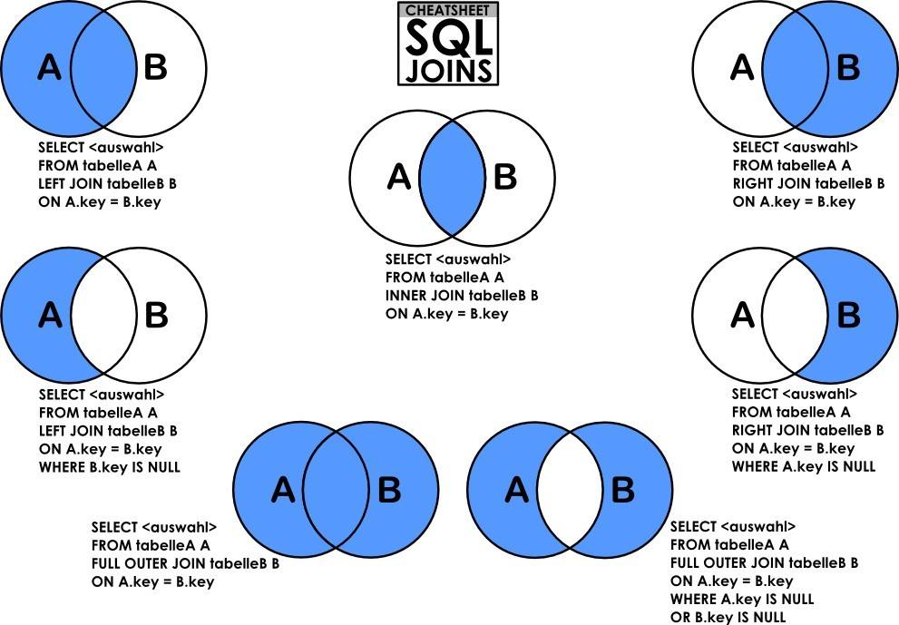

# MySQL调优

## MySQL执行过程

1. 客户端向数据库发送请求
2. 采用数据库连接池，连接DB，可以减少频繁的开、关连接
3. MySQL执行顺序：连接器 - 分析器 - 优化器 - 执行器
   1. 连接器。控制用户的连接
   2. 分析器。词法分析，语法分析
   3. 优化器。优化sql语句，规定执行流程。可以查看sql语句的执行计划，可以采用对应的优化点，来加快查询
   4. 执行器。sql语句的实际执行组件
4. 存储引擎存储数据。不同的存放位置，不同的文件格式。InnoDB：磁盘；MyISAM：磁盘；memory：内存

## 性能监控

查看详细资料-- java\资料\InternetArchitect\13mysql调优\MYSQL performance schema详解.md

```bash
use locktest;#创建数据库
#To control profiling, use the profiling session variable, which has a default value of 0 (OFF). Enable profiling by setting profiling to 1 or ON:
set profiling=1;
show profiles;#显示sql语句执行时间
show profile;#显示最近一条sql语句内部执行详细过程的时间

```

## 数据类型的优化

1. 数据类型

   1. 更小的通常更好

      1. 尽量使用满足需求最小的数据类型。例如存储true/false，用1/0存储，使用tinyint，没必要使用int，浪费内存空间

   2. 简单就好

      ```mysql
      # 好处是节省空间
      select INET_ATON('255.255.255.255'); # IP地址转化为整型
      select INET_NTOA('3232257391'); # 整型转化为IP地址
      ```

   3. 尽量避免null

      1. 如果查询中包含可为null的列，对MySQL来说是很难优化的，因为可为null的列使得索引、索引统计和值比较更加复杂，没必要所有列都改成not null，但是应该尽量避免设计成可为null的列

   4. 字符和字符串类型

      1. varchar根据实际内容长度保存数据。varchar(n) n小于等于255使用额外一个字节保存长度，大于255使用额外两个字节保存长度。varchar(5)与varchar(255)保存同样的内容，硬盘存储空间相同，但内存空间占用不同，是指定的大小，也就是MySQL通常会分配固定大小的内存块来保存值。
      2. char固定长度的字符串。最大长度255。会自动删除末尾的空格。检索效率、写效率会比varchar高，以空间换时间。适合存储长度波动不大的数据，例如md5摘要；存储短字符串、经常更新的字符串
      3. BLOB TEXT,适合大对象，但不建议使用，如果数据较大，可以用文件存储，MySQL存文件地址即可

   5. datetime和timestamp

      1. datetime。占用8个字节。可保存到毫秒，可保存时间范围大。不要使用字符串存储日期类型，占用空间大，损失日期类型函数的便捷性
      2. timestamp。占用4个字节。时间范围：1970-01-01到2038-01-19。精确到秒，采用整型存储。依赖数据库设置的时区。
      3. date。占用的字节数比使用字符串、datetime、int存储要少，使用date类型只需要3个字节。使用date类型还可以利用日期时间函数进行日期之间的计算

   6. 使用枚举代替字符串类型，MySQL在内部会将每个值在列表中的位置保存为整数，并且在表的.frm文件中保存“数字-字符串”映射关系的查找表

      ```mysql
      create table enum_test(e enum('fish','apple','dog') not null);
      insert into enum_test(e) values('fish'),('dog'),('apple');
      ```

   7. 特殊类型数据。IP地址转换

2. 合理使用范式和反范式

   1. 范式。范式要求数据表中不存在任何的传递函数依赖
      1. 优点。范式化的更新通常比反范式快。当数据较好的范式化后，很少或者没有重复的数据。范式化的数据比较小，可以放在内存中，操作比较快
      2. 缺点。通常需要进行关联
   2. 反范式。反范式允许存在传递函数，因此可以将所有数据汇集在一张表里面
      1. 优点。所有数据都在同一张表中，可以避免关联。可以设计有效的索引
      2. 缺点。表格内的冗余较多，删除数据时候会造成表有些有用的信息丢失
   3. 在企业中一般需要混合使用

3. 三范式

   1. 1NF。字段不可分，具有原子性
   2. 2NF。有主键，非主键字段依赖主键
   3. 3NF。非主键字段不能相互依赖

4. 主键的选择

   1. 代理主键
      1. 与业务无关的，无意义的数字序列
   2. 自然主键
      1. 事物属性中的自然唯一标识
   3. 推荐使用代理主键
      1. 他们不与业务耦合，因此更容易维护
      2. 一个大多数表，最好是全部表，通用的键策略能够减少需要编写的源码数量，减少系统的总体拥有成本

5. 字符集的选择

   1. 纯拉丁字符能表示的内容，没必要选择Latin1之外的其他字符编码，因为这会节省大量的存储空间
   2. 如果确定不需要存放多种语言，没必要用UTF8或其他UNICODE字符类型
   3. MySQL的数据类型可以精确到字段，需要存放多字节数据的时候，可以通过对不同表不同字段使用不同的数据类型来较大程度减小数据存储量，进而降低IO操作次数

6. 存储引擎的选择

   1. MyISAM 和 InnoDB
   2. 存储引擎。数据文件的组织形式

7. 适当的数据冗余

   1. 被频繁引用且只能通过join2张或者更多大表的方式才能得到的独立小字段

8. 适当拆分

   1. 当表中存在类似TEXT类型大字段的时候，如果大部分访问时都不需要这个字段，肯定要拆分到另外的一张表中。表中可以存储的数据条数大大增加，减少了IO操作次数

9. 执行计划

   1. 执行计划中包含的信息

   |    Column     |                    Meaning                     |
   | :-----------: | :--------------------------------------------: |
   |      id       |            The `SELECT` identifier             |
   |  select_type  |               The `SELECT` type                |
   |     table     |          The table for the output row          |
   |  partitions   |            The matching partitions             |
   |     type      |                 The join type                  |
   | possible_keys |         The possible indexes to choose         |
   |      key      |           The index actually chosen            |
   |    key_len    |          The length of the chosen key          |
   |      ref      |       The columns compared to the index        |
   |     rows      |        Estimate of rows to be examined         |
   |   filtered    | Percentage of rows filtered by table condition |
   |     extra     |             Additional information             |

   2. 重点记住type和extra，判断sql语句的执行效率

   ```mysql
   # 执行效率从高到低
   #### type : system > const > eq_ref > ref > range > index > all
   -- system:表只有一条记录（等于系统表），这是const特例，平时不会出现
   -- const:这个表至多只有一个匹配行
   mysql> explain select * from customer where customer_id=1;
   +----+-------------+----------+-------+---------------+---------+---------+-------+------+-------+
   | id | select_type | table    | type  | possible_keys | key     | key_len | ref   | rows | Extra |
   +----+-------------+----------+-------+---------------+---------+---------+-------+------+-------+
   |  1 | SIMPLE      | customer | const | PRIMARY       | PRIMARY | 2       | const |    1 | NULL  |
   +----+-------------+----------+-------+---------------+---------+---------+-------+------+-------+
   -- eq_ref:使用了唯一性索引进行查找
   mysql> explain select * from customer c,address a where c.address_id=a.address_id;
   +----+-------------+-------+--------+-------------------+---------+---------+---------------------+------+-------+
   | id | select_type | table | type   | possible_keys     | key     | key_len | ref                 | rows | Extra |
   +----+-------------+-------+--------+-------------------+---------+---------+---------------------+------+-------+
   |  1 | SIMPLE      | c     | ALL    | idx_fk_address_id | NULL    | NULL    | NULL                |  599 | NULL  |
   |  1 | SIMPLE      | a     | eq_ref | PRIMARY           | PRIMARY | 2       | sakila.c.address_id |    1 | NULL  |
   +----+-------------+-------+--------+-------------------+---------+---------+---------------------+------+-------+
   -- ref:使用了非唯一性索引进行查找
   mysql> explain select * from customer c,store s where c.address_id=s.address_id;
   +----+-------------+-------+------+-------------------+-------------------+---------+---------------------+------+-------+
   | id | select_type | table | type | possible_keys     | key               | key_len | ref                 | rows | Extra |
   +----+-------------+-------+------+-------------------+-------------------+---------+---------------------+------+-------+
   |  1 | SIMPLE      | s     | ALL  | idx_fk_address_id | NULL              | NULL    | NULL                |    2 | NULL  |
   |  1 | SIMPLE      | c     | ref  | idx_fk_address_id | idx_fk_address_id | 2       | sakila.s.address_id |    1 | NULL  |
   +----+-------------+-------+------+-------------------+-------------------+---------+---------------------+------+-------+
   -- range:表示利用索引查询时限制了范围，在指定范围内进行查询，这样避免了index的全索引扫描，适用的操作符： =, <>, >, >=, <, <=, IS NULL, BETWEEN, LIKE, or IN() 
   mysql> explain select * from customer where customer_id > 100;
   +----+-------------+----------+-------+---------------+---------+---------+------+------+-------------+
   | id | select_type | table    | type  | possible_keys | key     | key_len | ref  | rows | Extra       |
   +----+-------------+----------+-------+---------------+---------+---------+------+------+-------------+
   |  1 | SIMPLE      | customer | range | PRIMARY       | PRIMARY | 2       | NULL |  498 | Using where |
   +----+-------------+----------+-------+---------------+---------+---------+------+------+-------------+
   -- index:全索引扫描比all效率要好，主要有两种情况：第一种是当前查询时覆盖索引，即我们所需数据在索引中就可以索取；第二种使用了索引进行排序，避免数据的重排序
   mysql> explain select customer_id from customer;
   +----+-------------+----------+-------+---------------+-----------------+---------+------+------+-------------+
   | id | select_type | table    | type  | possible_keys | key             | key_len | ref  | rows | Extra       |
   +----+-------------+----------+-------+---------------+-----------------+---------+------+------+-------------+
   |  1 | SIMPLE      | customer | index | NULL          | idx_fk_store_id | 1       | NULL |  599 | Using index |
   +----+-------------+----------+-------+---------------+-----------------+---------+------+------+-------------+
   -- all:全表扫描
   mysql> explain select * from customer;
   +----+-------------+----------+------+---------------+------+---------+------+------+-------+
   | id | select_type | table    | type | possible_keys | key  | key_len | ref  | rows | Extra |
   +----+-------------+----------+------+---------------+------+---------+------+------+-------+
   |  1 | SIMPLE      | customer | ALL  | NULL          | NULL | NULL    | NULL |  599 | NULL  |
   +----+-------------+----------+------+---------------+------+---------+------+------+-------+
   
   #### extra : 包含额外的信息
   -- using filesort：说明MySQL无法利用索引进行排序，只能利用排序算法进行排序，会消耗额外的位置
   mysql> explain select * from customer order by first_name;
   +----+-------------+----------+------+---------------+------+---------+------+------+----------------+
   | id | select_type | table    | type | possible_keys | key  | key_len | ref  | rows | Extra          |
   +----+-------------+----------+------+---------------+------+---------+------+------+----------------+
   |  1 | SIMPLE      | customer | ALL  | NULL          | NULL | NULL    | NULL |  599 | Using filesort |
   +----+-------------+----------+------+---------------+------+---------+------+------+----------------+
   -- using temporary:建立临时表来保存临时结果，查询完成之后删除临时表
   mysql> explain select first_name,count(*) from customer where address_id=100 group by first_name\G;
   *************************** 1. row ***************************
              id: 1
     select_type: SIMPLE
           table: customer
            type: ref
   possible_keys: idx_fk_address_id
             key: idx_fk_address_id
         key_len: 2
             ref: const
            rows: 1
           Extra: Using where; Using temporary; Using filesort
   
   -- using index:当前查询是覆盖索引的。如果同时出现using where 表明索引被用来索引键值的查找，如果没有，索引被用来读取数据的
   mysql> explain select last_name from customer where last_name = 'Bob';
   +----+-------------+----------+------+---------------+---------------+---------+-------+------+--------------------------+
   | id | select_type | table    | type | possible_keys | key           | key_len | ref   | rows | Extra                    |
   +----+-------------+----------+------+---------------+---------------+---------+-------+------+--------------------------
   |  1 | SIMPLE      | customer | ref  | idx_last_name | idx_last_name | 182     | const |    1 | Using where; Using index |
   +----+-------------+----------+------+---------------+---------------+---------+-------+------+--------------------------
   mysql> explain select last_name from customer group by last_name limit 10;
   +----+-------------+----------+-------+---------------+---------------+---------+------+------+-------------+
   | id | select_type | table    | type  | possible_keys | key           | key_len | ref  | rows | Extra       |
   +----+-------------+----------+-------+---------------+---------------+---------+------+------+-------------+
   |  1 | SIMPLE      | customer | index | idx_last_name | idx_last_name | 182     | NULL |   10 | Using index |
   +----+-------------+----------+-------+---------------+---------------+---------+------+------+-------------+
   -- using where:使用where进行条件过滤
   mysql> explain select last_name from customer where customer_id >10;
   +----+-------------+----------+-------+---------------+---------+---------+------+------+-------------+
   | id | select_type | table    | type  | possible_keys | key     | key_len | ref  | rows | Extra       |
   +----+-------------+----------+-------+---------------+---------+---------+------+------+-------------+
   |  1 | SIMPLE      | customer | range | PRIMARY       | PRIMARY | 2       | NULL |  588 | Using where |
   +----+-------------+----------+-------+---------------+---------+---------+------+------+-------------+
   -- impossible where:where语句的结果总是false
   mysql> explain select * from customer where customer_id=1000\G;
   *************************** 1. row ***************************
              id: 1
     select_type: SIMPLE
           table: NULL
            type: NULL
   possible_keys: NULL
             key: NULL
         key_len: NULL
             ref: NULL
            rows: NULL
           Extra: Impossible WHERE noticed after reading const tables
   
   ```

## 索引优化

1. 索引基本知识

   1. 索引原理。

      1. Hash表。在HashMap中，对key hash取值，组成数组，hash值相同的延伸成链表，查询时，用hash取模找到特定值。缺点：利用hash存储需要把所有数据存储到内存，比较耗费内存空间；只能查询某一个值，不能查询范围
      2. 二叉树、红黑树。都会因为树的深度过深，导致IO次数变多，影响读取效率
      3. B树。每个节点占用一个磁盘块，一个节点上有三个指向子节点的指针和两个升序排列的索引和这一行数据。每次查询时，根据索引找出数据所在范围，往子节点寻找，找到直接返回数据（有点像跳表）。缺点：每个索引带着数据，如果数据比较大，减少存储的索引数量；当存储的数据量很大时，树的深度较大，增加IO次数，影响查询性能
      4. B+树。在B树基础上进行优化，索引处只有索引没有数据，每个节点可以包含更多的索引。叶子节点存储索引和数据，非叶子节点存储索引。每个根节点能存储更多索引，查询的数据量更多。

   2. 索引优点。大大减少了服务器要扫描的数据量；帮助服务器避免排序和临时表；将随机IO变成顺序IO

      > 随机IO：读写时间连续但读写地址不连续。顺序IO：读写地址连续

      

   3. 索引的用处。

   4. 索引的分类。主键索引；唯一索引；普通索引；全文索引；组合索引

   5. 面试技术名词。

      1. 回表。

      2. 覆盖索引。

      3. 最左匹配。前提是组合索引。符合最左匹配的使用索引查询，不符合的使用覆盖索引，效率较低

         ```mysql
         # 创建staffs表
         create table staffs(
             id int primary key auto_increment,
             name varchar(24) not null default '' comment '姓名',
             age int not null default 0 comment '年龄',
             pos varchar(20) not null default '' comment '职位',
             add_time timestamp not null default current_timestamp comment '入职时间'
           ) charset utf8 comment '员工记录表';
         #创建组合索引
         alter table staffs add index idx_nap(name, age, pos);
         
         mysql> desc staffs;
         +----------+-------------+------+-----+-------------------+----------------+
         | Field    | Type        | Null | Key | Default           | Extra          |
         +----------+-------------+------+-----+-------------------+----------------+
         | id       | int(11)     | NO   | PRI | NULL              | auto_increment |
         | name     | varchar(24) | NO   | MUL |                   |                |
         | age      | int(11)     | NO   |     | 0                 |                |
         | pos      | varchar(20) | NO   |     |                   |                |
         | add_time | timestamp   | NO   |     | CURRENT_TIMESTAMP |                |
         +----------+-------------+------+-----+-------------------+----------------+
         5 rows in set (0.00 sec)
         #符合最左匹配，type为ref，ref为2个const
         mysql> explain select id from staffs where name='July' and age='23';
         +----+-------------+--------+------+---------------+---------+---------+-------------+------+--------------------------+
         | id | select_type | table  | type | possible_keys | key     | key_len | ref         | rows | Extra                    |
         +----+-------------+--------+------+---------------+---------+---------+-------------+------+--------------------------+
         |  1 | SIMPLE      | staffs | ref  | idx_nap       | idx_nap | 78      | const,const |    1 | Using where; Using index |
         +----+-------------+--------+------+---------------+---------+---------+-------------+------+--------------------------+
         1 row in set (0.00 sec)
         #符合最左匹配，type为ref，ref为1个const
         mysql> explain select id from staffs where name='July';
         +----+-------------+--------+------+---------------+---------+---------+-------+------+--------------------------+
         | id | select_type | table  | type | possible_keys | key     | key_len | ref   | rows | Extra                    |
         +----+-------------+--------+------+---------------+---------+---------+-------+------+--------------------------+
         |  1 | SIMPLE      | staffs | ref  | idx_nap       | idx_nap | 74      | const |    1 | Using where; Using index |
         +----+-------------+--------+------+---------------+---------+---------+-------+------+--------------------------+
         1 row in set (0.00 sec)
         #不符合最左匹配，type为index，也就是覆盖索引，ref为null
         mysql> explain select id from staffs where age='23';
         +----+-------------+--------+-------+---------------+---------+---------+------+------+--------------------------+
         | id | select_type | table  | type  | possible_keys | key     | key_len | ref  | rows | Extra                    |
         +----+-------------+--------+-------+---------------+---------+---------+------+------+--------------------------+
         |  1 | SIMPLE      | staffs | index | NULL          | idx_nap | 140     | NULL |    1 | Using where; Using index |
         +----+-------------+--------+-------+---------------+---------+---------+------+------+--------------------------+
         1 row in set (0.00 sec)
         
         
         ```

      4. 索引下推。

         ```mysql
         #创建user表，name是普通索引
         create table user (id int primary key, name varchar(20), sex varchar(5), index(name))engine=innodb;
         #B+树存储主键值，用普通索引查询时，同时会查询到id，sex只能通过id查询行记录，找到sex，两次通过索引查询，就叫回表
         select id name sex from user where name="zhangsan";
         #只需在一棵索引树上查询到sql所有列数据，没有回表，就叫索引覆盖
         select id name from user where name="zhangsan";
         #回表可以实现覆盖,修改表结构，name单列索引升级为name、sex联合索引
         create table user (id int primary key, name varchar(20), sex varchar(5), index(name,sex))engine=innodb;
         #再次查询时，就能实现覆盖索引
         select id name sex from user where name="zhangsan";
         #第一条sql，对最左边的name优先查询，第二条sql，where条件没有name，使用全表扫描，有name使用索引扫描，这个就叫最左匹配，如果有两条sql分别查询name和sex，最好给sex加索引，也就是空间最小的列。
         select id from user where name=? and sex=?;
         select id from user where sex=?;
         select id from user where name=?;
         #MySQL高版本，会同时过滤name和sex，减少回表的次数。叫做索引下推
         select id from user where name like '%s%' and sex=?;
         
         ```

   6. 数据结构。hash表，memory存储引擎；B+树，InnoDB、MyISAM存储引擎

   7. 索引匹配方式

      1. 全值匹配。和索引中所有列进行匹配
      2. 最左前缀匹配。只匹配前面的几列
      3. 匹配列前缀。可以匹配某一列的值的开头部分
      4. 匹配范围值。可以查找某一个范围的数据
      5. 精确匹配某一列并范围匹配另一列。可以查询第一列的全部和第二列的部分
      6. 只访问索引的查询。查询的时候只查询索引，不查询数据行，本质上就是覆盖索引

2. 哈希索引。

3. 组合索引。

4. 聚簇索引与非聚簇索引

   1. 聚簇索引。索引跟数据放在同一个文件。InnoDB在B+树中子节点每个索引带着原始数据。

   2. 非聚簇索引。数据文件和索引文件分开存放。MyISAM在B+树中子节点每个索引带着数据地址，查询时在数据文件中根据地址找到行数据。

      > 如果现在有大量的数据要迁移到MySQL，因为MySQL默认会为主键和唯一键创建索引，那么在数据迁移前关闭建索引功能，当数据迁移到MySQL后，打开建索引功能，为什么？开启建索引功能，在每导入一条数据，会创建一个索引，频繁更新索引。导致迁移速度极慢。

5. 覆盖索引。如果一个索引包含所有需要查询字段的值，不需要回表查询的，称之为覆盖索引。由于InnoDB的聚簇索引，覆盖索引对InnoDB表特别有用。

6. 优化小细节

   1. 当使用索引进行查询时尽量不要使用表达式，把计算放到业务层而不是数据库

      ```mysql
      #explain解析后，type分别为const和index，查询效率相差很多
      select user_id from user where user_id=4;
      select user_id from user where user_id+1=5;
      ```

   2. where尽量带上主键查询，而不是其他索引，主键查询不会触发回表查询

   3. 使用前缀索引。

      > 需要长字符串作索引时，可以截取字符串前几位作为索引，而不是整个字符串。这个就是前缀索引。
      >
      > 但是字符串截取的位数对查询效率有很大差异，截取少了重复项多，截取多了查询效率变低，必须通过测试需要截取几位。

   4. 使用索引扫描来排序。如果where和order by满足最左前缀，使用索引排序。

      > where使用范围查询，后面所有条件都失效

      ```mysql
      #使用索引排序，索引本身是排好序的，顺序IO，效率很快，默认排序为升序，如果降序没法使用索引排序。下面加上order by user_id desc; extra为filesort
      select * from user order by user_id;
      #使用普通列排序，explain解析后extra为filesort，文件排序，随机IO，效率很慢
      select * from user order by username;
      ```

   5. union，all，in都能够使用索引，但是推荐使用in

      ```mysql
      #union附带distinct操作，union all不带distinct，查询效率偏高
      explain select * from user where user_id=1 union all select * from user where user_id=2;
      explain select * from user where user_id in (1,2);
      explain select * from user where user_id =1 or user_id=2;
      #性能监控
      set profiling=1;
      #再执行查询语句，才能显示每条sql性能
      show profiles;
      ```

      ```mysql
      #exists
      #查询部门号为20 30的员工
      select * from emp where deptno=20 or deptno=30;
      #查询全表，exists内只要有值，where没有限制条件
      select * from emp where exists(select deptno from dept where deptno=20 or deptno = 30);
      #还是查询全表，and条件优先级高于or
      select * from emp e where exists(select deptno from dept d where deptno=20 or deptno = 30 and e.deptno=d.deptno);
      #or条件使用()提高优先级
      select * from emp e where exists(select deptno from dept d where (deptno=20 or deptno = 30) and e.deptno=d.deptno);
      ```

   6. 范围列可以用到索引，范围列后面的列无法用到索引，索引最多用于一个范围列

      > name age组合索引时，先对name过滤查询，再对age过滤查询，因为age存储空间比name小

      ```mysql
      mysql> explain select * from customer where address_id>100 and last_name='Bob'\G;
      *************************** 1. row ***************************
                 id: 1
        select_type: SIMPLE
              table: customer
               type: ref
      possible_keys: idx_fk_address_id,idx_last_name
                key: idx_last_name
            key_len: 182
                ref: const #只使用一个查询条件
               rows: 1
              Extra: Using index condition; Using where
      
      ```

      

   7. 强制类型转换会全表扫描

      ```mysql
      #phone是varchar类型，查询时用整型，MySQL会转换成字符串，但是不会触发索引
      ##创建user表
      create table user(id int,name varchar(10),phone varchar(11));
      #给phone创建索引
      alter table user add index idx_1(phone);
      mysql> explain select * from user where phone='15222108290';
      +----+-------------+-------+------+---------------+-------+---------+-------+------+-----------------------+
      | id | select_type | table | type | possible_keys | key   | key_len | ref   | rows | Extra                 |
      +----+-------------+-------+------+---------------+-------+---------+-------+------+-----------------------+
      |  1 | SIMPLE      | user  | ref  | idx_1         | idx_1 | 14      | const |    1 | Using index condition |
      +----+-------------+-------+------+---------------+-------+---------+-------+------+-----------------------+
      1 row in set (0.00 sec)
      
      mysql> explain select * from user where phone=15222108290;
      +----+-------------+-------+------+---------------+------+---------+------+------+-------------+
      | id | select_type | table | type | possible_keys | key  | key_len | ref  | rows | Extra       |
      +----+-------------+-------+------+---------------+------+---------+------+------+-------------+
      |  1 | SIMPLE      | user  | ALL  | idx_1         | NULL | NULL    | NULL |    1 | Using where |
      +----+-------------+-------+------+---------------+------+---------+------+------+-------------+
      1 row in set (0.00 sec)
      ```

   8. 更新十分频繁，数据区分度不高的字段上不宜建立索引。

      1. 更新会变更B+树，更新频繁的字段建立索引会降低数据库性能
      2. 类似性别的字段，区分度不高，建立索引是没有意义的
      3. 一般区分度在80%以上可以建立索引，区分度可以使用count(distinct(列名))/count(*)来计算

   9. 创建索引的列，不允许为null，可能会得到不符合预期的结果

   10. 当需要进行表连接的时候，最好不要超过三张表，因为需要join的字段，数据类型必须一致

       1. join用法

       

       > join的几种实现方式：
       >
       > 表A join 表B，A为驱动表，B为非驱动表。join适用于小表驱动大表
       >
       > Simple Nested_Loop Join: 依次查询方式
       >
       > Index Nested_Loop Join: A通过B的索引匹配B，适合join索引的方式
       >
       > Block Nested_Loop Join: 先把A读取到内存join_buffer里，A批量与B匹配，从内存读取磁盘的方式。默认join_buffer_size=256k

       ```mysql
       #mysql查询join_buffer_size
       mysql> show variables like '%join_buffer%';
       +------------------+--------+
       | Variable_name    | Value  |
       +------------------+--------+
       | join_buffer_size | 262144 |
       +------------------+--------+
       ```

       ```mysql
       ## 条件and/where 区别
       # where 根据条件过滤A B两表，只会显示符合条件的
       # and 左连接时显示A表所有数据，B表只显示符合条件的，不符合的显示null。右连接同理
       --课程表
       CREATE TABLE `course`(
           `c_id`  VARCHAR(20),
           `c_name` VARCHAR(20) NOT NULL DEFAULT '',
           `t_id` VARCHAR(20) NOT NULL,
           PRIMARY KEY(`c_id`)
       ) ENGINE=InnoDB DEFAULT CHARSET=utf8;
       --教师表
       CREATE TABLE `teacher`(
           `t_id` VARCHAR(20),
           `t_name` VARCHAR(20) NOT NULL DEFAULT '',
           PRIMARY KEY(`t_id`)
       ) ENGINE=InnoDB DEFAULT CHARSET=utf8;
       --课程表测试数据
       insert into course values('01' , '语文' , '02');
       insert into course values('02' , '数学' , '01');
       insert into course values('03' , '英语' , '03');
       --教师表测试数据
       insert into teacher values('01' , '张三');
       insert into teacher values('02' , '李四');
       insert into teacher values('03' , '王五');
       insert into teacher values('04' , '赵柳');
       # join on 默认是inner join on，条件and/where都一样
       mysql> select * from course c join teacher t on c.t_id=t.t_id and c_name='英语';
       +------+--------+------+------+--------+
       | c_id | c_name | t_id | t_id | t_name |
       +------+--------+------+------+--------+
       | 03   | 英语   | 03   | 03   | 王五   |
       +------+--------+------+------+--------+
       
       mysql> select * from course c join teacher t on c.t_id=t.t_id where c_name='英语';
       +------+--------+------+------+--------+
       | c_id | c_name | t_id | t_id | t_name |
       +------+--------+------+------+--------+
       | 03   | 英语   | 03   | 03   | 王五   |
       +------+--------+------+------+--------+
       
       # left/right join on,无条件
       mysql> select * from course c left join teacher t on c.t_id=t.t_id;
       +------+--------+------+------+--------+
       | c_id | c_name | t_id | t_id | t_name |
       +------+--------+------+------+--------+
       | 02   | 数学   | 01   | 01   | 张三   |
       | 01   | 语文   | 02   | 02   | 李四   |
       | 03   | 英语   | 03   | 03   | 王五   |
       +------+--------+------+------+--------+
       mysql> select * from course c right join teacher t on c.t_id=t.t_id;
       +------+--------+------+------+--------+
       | c_id | c_name | t_id | t_id | t_name |
       +------+--------+------+------+--------+
       | 01   | 语文   | 02   | 02   | 李四   |
       | 02   | 数学   | 01   | 01   | 张三   |
       | 03   | 英语   | 03   | 03   | 王五   |
       | NULL | NULL   | NULL | 04   | 赵柳   |
       +------+--------+------+------+--------+
       
       # left/right join on,条件 and/where
       mysql> select * from course c left join teacher t on c.t_id=t.t_id and c_name='英语';
       +------+--------+------+------+--------+
       | c_id | c_name | t_id | t_id | t_name |
       +------+--------+------+------+--------+
       | 03   | 英语   | 03   | 03   | 王五   |
       | 01   | 语文   | 02   | NULL | NULL   |
       | 02   | 数学   | 01   | NULL | NULL   |
       +------+--------+------+------+--------+
       
       mysql> select * from course c left join teacher t on c.t_id=t.t_id where c_name='英语';
       +------+--------+------+------+--------+
       | c_id | c_name | t_id | t_id | t_name |
       +------+--------+------+------+--------+
       | 03   | 英语   | 03   | 03   | 王五   |
       +------+--------+------+------+--------+
       
       mysql> select * from course c right join teacher t on c.t_id=t.t_id where c_name='英语';
       +------+--------+------+------+--------+
       | c_id | c_name | t_id | t_id | t_name |
       +------+--------+------+------+--------+
       | 03   | 英语   | 03   | 03   | 王五   |
       +------+--------+------+------+--------+
       
       mysql> select * from course c right join teacher t on c.t_id=t.t_id and c_name='英语';
       +------+--------+------+------+--------+
       | c_id | c_name | t_id | t_id | t_name |
       +------+--------+------+------+--------+
       | 03   | 英语   | 03   | 03   | 王五   |
       | NULL | NULL   | NULL | 01   | 张三   |
       | NULL | NULL   | NULL | 02   | 李四   |
       | NULL | NULL   | NULL | 04   | 赵柳   |
       +------+--------+------+------+--------+
       # mysql没有 outer join on,可以用union 合并左连接和右连接
       mysql> select * from course c left join teacher t on c.t_id=t.t_id union select * from course c right join teacher t on c.t_id=t.t_id;
       +------+--------+------+------+--------+
       | c_id | c_name | t_id | t_id | t_name |
       +------+--------+------+------+--------+
       | 02   | 数学   | 01   | 01   | 张三   |
       | 01   | 语文   | 02   | 02   | 李四   |
       | 03   | 英语   | 03   | 03   | 王五   |
       | NULL | NULL   | NULL | 04   | 赵柳   |
       +------+--------+------+------+--------+
       
       # straight_join。在A join B时mysql优化器可能会让B驱动A，加上这个强制让A驱动B，但是不建议这样做，因为优化器会有各方面考量，效率会更好一点
       # 看rows 加上straight_join 为1002，不加202
       # using(film_id) 等同于 film.film_id=film_actor.film_id
       use sakila;
       mysql> explain select film.film_id, film.title, film.release_year, actor.actor_id, actor.first_name, actor.last_name from film inner join film_actor using(film_id) inner join actor using(actor_id)\G;
       *************************** 1. row ***************************
                  id: 1
         select_type: SIMPLE
               table: actor
                type: ALL
       possible_keys: PRIMARY
                 key: NULL
             key_len: NULL
                 ref: NULL
                rows: 200
               Extra: NULL
       *************************** 2. row ***************************
                  id: 1
         select_type: SIMPLE
               table: film_actor
                type: ref
       possible_keys: PRIMARY,idx_fk_film_id
                 key: PRIMARY
             key_len: 2
                 ref: sakila.actor.actor_id
                rows: 1
               Extra: Using index
       *************************** 3. row ***************************
                  id: 1
         select_type: SIMPLE
               table: film
                type: eq_ref
       possible_keys: PRIMARY
                 key: PRIMARY
             key_len: 2
                 ref: sakila.film_actor.film_id
                rows: 1
               Extra: NULL
       3 rows in set (0.00 sec)
       
       mysql> show status like 'last_query_cost';
       +-----------------+-------------+
       | Variable_name   | Value       |
       +-----------------+-------------+
       | Last_query_cost | 2611.999000 |
       +-----------------+-------------+
       1 row in set (0.01 sec)
       
       mysql> explain select straight_join film.film_id, film.title, film.release_year, actor.actor_id, actor.first_name, actor.last_name actor.last_name from film inner join film_actor using(film_id) inner join actor using(actor_id)\G;
       *************************** 1. row ***************************
                  id: 1
         select_type: SIMPLE
               table: film
                type: ALL
       possible_keys: PRIMARY
                 key: NULL
             key_len: NULL
                 ref: NULL
                rows: 1000
               Extra: NULL
       *************************** 2. row ***************************
                  id: 1
         select_type: SIMPLE
               table: film_actor
                type: ref
       possible_keys: PRIMARY,idx_fk_film_id
                 key: idx_fk_film_id
             key_len: 2
                 ref: sakila.film.film_id
                rows: 1
               Extra: Using index
       *************************** 3. row ***************************
                  id: 1
         select_type: SIMPLE
               table: actor
                type: eq_ref
       possible_keys: PRIMARY
                 key: PRIMARY
             key_len: 2
                 ref: sakila.film_actor.actor_id
                rows: 1
               Extra: NULL
       
       mysql> show status like 'last_query_cost';                                                                                                   
       +-----------------+------------+
       | Variable_name   | Value      |
       +-----------------+------------+
       | Last_query_cost | 520.999000 |
       +-----------------+------------+
       1 row in set (0.00 sec)
       ```
       
       ```mysql
       -- 1、查询"01"课程比"02"课程成绩高的学生的信息及课程分数  
       select a.*,b.s_score as 01_score,c.s_score as 02_score 
       from student a 
       join score b on a.s_id=b.s_id and b.c_id='01' 
       left join score c on a.s_id=c.s_id and c.c_id='02' or c.c_id=null 
       where b.s_score>c.s_score;
       -- 2、查询"01"课程比"02"课程成绩低的学生的信息及课程分数 
       select a.*,b.s_score as 01_score,c.s_score as 02_score 
       from student a 
       left join score b on a.s_id=b.s_id and b.c_id='01' or b.c_id=null
       join score c on a.s_id=c.s_id and c.c_id='02'  
       where b.s_score<c.s_score;
       -- 3、查询平均成绩大于等于60分的同学的学生编号和学生姓名和平均成绩
       select a.s_id,a.s_name,round(avg(b.s_score),2) 
       from student a 
       join score b on a.s_id=b.s_id 
       group by a.s_id,a.s_name having round(avg(b.s_score),2)>=60;
       -- 4、查询平均成绩小于60分的同学的学生编号和学生姓名和平均成绩
               -- (包括有成绩的和无成绩的) 
       select a.s_id,a.s_name,round(avg(b.s_score),2) as avg_score 
       from student a 
       join score b on a.s_id=b.s_id 
       group by a.s_id,a.s_name having round(avg(b.s_score),2)<60 
       union 
       select s_id,s_name,0 as avg_score 
       from student 
       where s_id not in (select distinct s_id from score);
       -- 5、查询所有同学的学生编号、学生姓名、选课总数、所有课程的总成绩
       select a.s_id,a.s_name,count(b.c_id) as sum_course,sum(b.s_score) as sum_score 
       from student a 
       left join score b using(s_id) 
       group by a.s_id,a.s_name;
       -- 6、查询"李"姓老师的数量 
       select count(t_id) from teacher where t_name like '李%';
       -- 7、查询学过"张三"老师授课的同学的信息 
       select a.* from 
       	student a 
       	join score b on a.s_id=b.s_id where b.c_id in (
           	select c_id from course where t_id=(
               	select t_id from teacher where t_name='张三'));
       -- 8、查询没学过"张三"老师授课的同学的信息 
       select stu.* from 
       	student stu
       	where stu.s_id not in (
           	select a.s_id from student a join score b on a.s_id=b.s_id where b.c_id in(
               	select c_id from course where t_id = (
                   	select t_id from teacher where t_name='张三')));
       ```
       
       

   11. 单索引字段不允许超过5个。也就是组合索引。当超过5个字段时，用最后一个字段当作查询条件时，想要用到索引查询，必须把前面索引字段都带上(满足最左匹配)，浪费很多存储空间。
   
   12. 创建索引的时候应该避免以下错误概念。索引越多越好；过早优化，在不了解系统的情况下进行优化

   13. 索引监控

       ```mysql
       show status like 'Handler_read%';
       # Handler_read_first:读取索引第一个条目的次数
       # Handler_read_key:通过index读取数据的次数
       # Handler_read_last:读取索引最后一个条目的次数
       # Handler_read_next:通过索引读取下一条数据的次数
       # Handler_read_prev:通过索引读取上一条数据的次数
       # Handler_read_rnd:从固定位置读取数据的次数
       # Handler_read_rnd_next:从数据节点读取下一条数据的次数
       ```

   14. 索引优化案例。参考 InternetArchitect\13mysql调优\索引优化分析案例.md

## 查询优化

1. 查询慢的原因

   1. 网络。分布式集群时，查询数据受到网络的影响
   2. CPU。计算执行需要CPU时间片的单位，需要多少时间片才能执行成功
   3. IO。内存通过IO读取磁盘数据，当数据量很大时，查询速度受IO影响很大
   4. 上下文切换。多线程在并行时，需要频繁的切换线程，如果线程过多，系统花费大量的资源切换线程
   5. 系统调用。调用内核的信息
   6. 生产统计信息。show profiles，performance_schema都需要有收集过程，肯定要调用系统资源的
   7. 锁等待时间。锁与存储引擎相关的。MyISAM是共享读锁，独占写锁。InnoDB是共享锁，排它锁

2. 优化数据访问

   1. 查询性能的低下的主要原因是访问的数据太多，某些查询不可避免查询大量的数据，可以通过减少访问数据量的方式进行优化。

      1. 确认应用程序是否在检索大量超过需要的数据。

         ```mysql
         # limit [offset,] rows限制查询，做分页，需要大量的文件排序方式
         # limit分页查询时要使用order by才能获取想要的数据，limit与order by一起使用，MySQL会在找到排序结果的第一行立即结束排序，而不是全文排序
         explain select * from rental limit 10000,5;
         # 要对rental_id排序，不然取到的值不是我们想要的
         explain select a.* from rental a join (select rental_id from rental order by rental_id limit 10000,5) b on a.rental_id=b.rl_id=b.rental_id;
         
         ## limit使用有问题，上面查询出来10005~10009，根本不是从10000开始的。找到原因了，rental_id到10005只有10000个数据
         mysql> select count(*) from rental where rental_id<10005;
         +----------+
         | count(*) |
         +----------+
         |    10000 |
         +----------+
         
         # 测试limit
         CREATE TABLE people
         (id INT DEFAULT NULL,
         name VARCHAR(50) DEFAULT NULL,
         birthday DATE DEFAULT NULL
         )ENGINE=INNODB;
         # 删除存储过程
         DROP PROCEDURE IF EXISTS load_data;
         # 创建存储过程，插入80000个数据
         DELIMITER && 
         CREATE PROCEDURE load_data()
         BEGIN
             DECLARE i INT;
             SET i=1;
             WHILE i<200000
             DO
             INSERT INTO people VALUES(i,CONCAT('name',i),ADDDATE('1995-01-01',(RAND(i)*36520) MOD 3652));
             SET i=i+1;
             END WHILE;
         END&&
         DELIMITER ;
         # 调用存储过程
         CALL load_data;
         
         # 查询70000开始10条数据，直接limit查询效率较高
          1 | 0.01815900 | select * from people limit 70000,10
          2 | 0.05649125 | select a.* from people a join(select id from people order by id limit 70000,10) b on a.id=b.id 
          3 | 0.01923075 | select * from people limit 70000,10
          4 | 0.05362200 | select a.* from people a join(select id from people order by id limit 70000,10) b on a.id=b.id 
         
         # 可能id不是主键，设置成主键后的效果呢？
         alter table people add primary key (id);
         # 设置完主键后，第二条sql效率略高
          9 | 0.01254825 | select * from people limit 70000,10
         10 | 0.01118225 | select a.* from people a join(select id from people order by id limit 70000,10) b on a.id=b.id
         ```

      2. 确认mysql服务器层是否在分析大量超过需要的数据行

   2. 是否向数据库请求了不需要的数据

      1. 查询不需要的记录。我们误以为mysql会只返回需要的数据，实际上mysql先返回全部结果再进行计算。在日常开发习惯中，先select查询大量的结果，然后获取前面的N行后关闭结果集。优化方式是在查询后面添加limit
      2. 多表关联时返回全部列。也就是不要使用select * from table
      3. 总是取出全部列。禁止使用select *
      4. 重复查询相同的数据

   3. 执行过程的优化

      1. 查询缓存

      2. 查询优化处理

         1. 语法解析器和预处理。AST 抽象解析树

         2. 查询优化器

            1. 当语法解析树没有问题之后，由优化器将其转成执行计划，一条查询语句可以使用非常多的执行方式，而优化器最主要的目的就是选择最有效的执行计划。

               > 目前有两种优化器：CBO RBO。CBO是基于成本的，RBO是基于规划的。
               >
               > mysql使用的是基于成本的优化器，会尝试预测一个查询使用某种执行计划时的成本，并选择成本最小的执行计划

            2. 示例

               ```mysql
               # 可以看到查询这条sql语句时大概需要123个数据页才能找到对应的数据，这是经过一系列统计信息计算来的
               # 统计信息包括 每个表或索引的页面个数；索引的基数；索引和数据行的长度；索引的分别情况
               mysql> select count(*) from city;
               +----------+
               | count(*) |
               +----------+
               |      600 |
               +----------+
               1 row in set (0.00 sec)
               
               mysql> show status like 'last_query_cost';
               +-----------------+------------+
               | Variable_name   | Value      |
               +-----------------+------------+
               | Last_query_cost | 122.999000 |
               +-----------------+------------+
               1 row in set (0.00 sec)
               ```

            3. 在很多情况下mysql会选择错误的执行计划

               1. 统计信息不准确。InnoDB因为其mvcc架构，并不能维护一个数据表行数的精确统计信息。

                  > mvcc:Multi-Version Concurrency Control，多版本并发控制
                  >
                  > 在Mysql的InnoDB引擎中就是指在已提交读(READ COMMITTD)和可重复读(REPEATABLE READ)这两种隔离级别下的事务对于SELECT操作会访问版本链中的记录的过程。

               2. 执行计划的成本估算不等同于实际执行的成本

               3. mysql的最优可能跟你想的不一样。A join B join C 时并不一定按照顺序查询表，优化器会有自己的判断

               4. mysql不考虑其他并发执行的查询。mysql也不知道并发的数量

               5. mysql不考虑不受控制的操作成本。执行存储过程或自定义函数的成本没法预判

            4. 优化器的优化策略

               1. 静态优化。直接对解析树进行分析，并完成优化

               2. 动态优化。与查询的上下文有关，也可能跟取值、索引对应的行数有关

               3. mysql对查询的静态优化只需要一次，但对动态优化在每次执行时都需要重新评估

                  > context，上下文。当做之前查询的操作对当前的查询的影响。

            5. 优化器的优化类型

               1. 重新定义关联表的顺序。决定关联表顺序是优化器很重要的功能

               2. 将外连接转换成内连接，内连接的效率要高于外连接。内连接获取的数据量小于外连接

               3. 使用等价变换规则。mysql可以使用一些等价交换简化并规划表达式。

                  ```mysql
                  # 第一条sql会被简化成第二条sql
                  select count(*) from actor where actor_id > 100 or actor_id < 100;
                  select count(*) from actor where actor_id != 100;
                  ```

               4. 优化count(),min(),max()。要找到某一列的最小值，只需要查询索引的最左前缀即可，不需要全表扫描

               5. 当mysql检测到一个表达式可以转化为常数的时候，就会把该表达式作为常数进行处理

                  ```mysql
                  # type为const
                  explain select * from actor where actor_id=1;
                  ```

               6. 索引覆盖扫描，每次查询最好包含在索引字段里，不会进行回表查询

               7. 子查询优化。经常查询的数据放在缓存中

               8. 等值传播

         3. 排序优化。

            1. 两次传输排序。第一次读取数据是将需要排序的字段读取出来，然后进行排序。第二次排序是将排好序的字段按顺序读取数据行。第二次需要读取所有记录更多是随机IO，读取成本较高。两次传输的优势在于排序时存储尽可能少的数据，让排序缓冲区尽可能多的容纳行数来进行排序

            2. 单次传输排序。先是读取需要的所有列，根据给定的列进行排序。无随机IO。但是查询的列特别多时，会占用大量的存储空间，无法存储大量的数据

            3. 当需要排序的列总大小加上orderby的列大小超过max_length_for_sort_data定义的字节，mysql选择两次传输，反之选择单次传输

               ```mysql
               mysql> show variables like 'max_length_for_sort_data';
               +--------------------------+-------+
               | Variable_name            | Value |
               +--------------------------+-------+
               | max_length_for_sort_data | 1024  |
               +--------------------------+-------+
               ```

   4. 优化特定类型查询

      1. 优化count()查询。count()加字段、*、数字 时间成本都是一样的

         ```mysql
         mysql> select count(*) from film;
         +----------+
         | count(*) |
         +----------+
         |     1000 |
         +----------+
         
         mysql> show status like 'last_query_cost';
         +-----------------+------------+
         | Variable_name   | Value      |
         +-----------------+------------+
         | Last_query_cost | 211.999000 |
         +-----------------+------------+
         
         mysql> select count(film_id) from film;
         +----------------+
         | count(film_id) |
         +----------------+
         |           1000 |
         +----------------+
         
         mysql> show status like 'last_query_cost';
         +-----------------+------------+
         | Variable_name   | Value      |
         +-----------------+------------+
         | Last_query_cost | 211.999000 |
         +-----------------+------------+
         
         mysql> select count(1000) from film;
         +-------------+
         | count(1000) |
         +-------------+
         |        1000 |
         +-------------+
         
         mysql> show status like 'last_query_cost';
         +-----------------+------------+
         | Variable_name   | Value      |
         +-----------------+------------+
         | Last_query_cost | 211.999000 |
         +-----------------+------------+
         ```

         1. MyISAM在没有任何where条件时，count(*)才是比较快的。因为MyISAM有变量统计总行数，加上where条件变量的值就不准确，只能正常查询

         2. 使用近似值。在某些应用场景不需要完全精确的值，可以参考使用近似值来代替，比如使用explain来获取近似值。其实在很多OLAP的应用中，需要计算某一个列值的基数，可以使用计算近似值的算法，例如hyperloglog

            > 业务类系统主要供基层人员使用，进行一线业务操作，通常被称为OLTP（On-Line Transaction Processing，联机事务处理）。
            >
            > 数据分析的目标则是探索并挖掘数据价值，作为企业高层进行决策的参考，通常被称为OLAP（On-Line Analytical Processing，联机分析处理）。

         3. 更复杂的优化。一般情况下，count()需要扫描大量的行才能得到精确的数据，其实很难优化，在实际操作时可以考虑使用索引覆盖扫描或者添加汇总表，或者增加外部缓存系统

      2. 优化关联查询。确保groupby和orderby中的表达式只涉及表中的一个列，mysql才有可能使用索引来优化这个过程

      3. 优化子查询。尽可能使用关联查询，不要用子查询。为什么？子查询会创建临时表存储数据，查询完毕后删除临时表。

      4. 推荐使用用户自定义变量。在同一个会话中有效。

         ```mysql
         # @@ 表示系统变量
         select @@autocommit;
         # @ 表示用户自定义变量
         set @i=1;
         select @i;
         select @i:=@i+1;
         set @last_week := current_date-interval 1 week;
         select @last_week;
         set @return_date=(select return_date from rental where rental_id=10000);
         select @return_date;
         ```

         1. 优化排名查询。

            ```mysql
            # 给一个变量赋值的同时使用这个变量
            set @rownum=100;
            select actor_id, @rownum:=@rownum+1 as rownum from actor limit 10;
            
            # 查询获取演过最多电影的前十名演员，然后根据出演电影次数做一个排名
            set @sortnum=0;
            select @sortnum:=@sortnum+1,actor_id,cnt from (select actor_id,count(*) as cnt from film_actor group by actor_id order by cnt limit 10) t;
            ```

         2. 避免重新查询刚刚更新的数据。当需要高效的更新一条记录的时间戳，同时希望查询刚刚更新的时间戳，可以使用自定义变量

            ```mysql
            # 方法2优于方式1，方式2只需使用一个自定义变量就不用查询数据，当更新查询很频繁时，方式1花费大量IO进行查询
            # 使用test数据库
            use test;
            # 创建t1表，id和t_date两个字段
            create table t1(id int,t_date datetime);
            # 插入当前时间
            insert into t1 values(1,now());
            # 更新当前时间
            update t1 set t_date=now() where id=1; //方法1
            update t1 set t_date=now() where id=1 and @now:=now(); //方法2
            # 获取t_date
            select t_date from t1 where id=1; //方法1
            select @now; //方法2
            ```

         3. 确定取值的顺序。在赋值和查询变量的时候可能是在查询的不同阶段

            ```mysql
            ## 使用自定义变量查询一条记录
            # 查询出2条数据
            set @rownum:=0;
            select actor,@rownum:=@rownum+1 as cnt from actor where @rownum<=1;
            # 查询所有数据。order by原来是最后执行，where条件加上自定义变量后，order by首先执行
            set @rownum:=0;
            select actor,@rownum:=@rownum+1 as cnt from actor where @rownum<=1 order by first_name;
            # 查询1条数据
            set @rownum:=0;
            select actor,@rownum as cnt from actor where (@rownum:=@rownum+1) <=1;
            ```

      5. 优化limit查询。尽可能使用覆盖索引，而不是查询所有列。下面sql语句中limit使用子查询并没有提供效率，还有待考究

         ```mysql
         0.00105925 | select film_id,description from film order by title limit 50,5;
         0.00157300 | select film.film_id,film.description from film join (select film_id from film order by title limit 50,5) as lim using(film_id);
         ```

      6. 优化union查询。如果服务器没有明确要求消除重复项，否则一定要使用union all。没有all关键字，mysql会在查询时给临时表加上distinct关键字，这个操作的代价很高

         

         ```mysql
         # 行转列可以使用union
         # 创建student_score表，有中文字符，必须使用utf8
         create table student_score(name varchar(100),subject varchar(100),score int) charset utf8;
         # 插入数据
         insert into student_score values('小明','语文',96);
         insert into student_score values('小明','数学',98);
         insert into student_score values('小明','英语',95);
         insert into student_score values('小花','语文',92);
         insert into student_score values('小花','数学',96);
         insert into student_score values('小花','英语',98);
         # 查询
         select name as '姓名',subject as '科目',score as '分数' from student_score;
         # 实现行转列
         # 失败
         select name,subject as '语文', score from student_score 
         union 
         select name,subject as '数学', score from student_score 
         union 
         select name,subject as '英语', score from student_score;
         # 失败
         select name as '姓名',score as '语文',score as '数学',score as '英语' from 
         (
             select name, score from student_score where subject='语文' 
             union 
             select name, score from student_score where subject='数学' 
             union 
             select name, score from student_score where subject='英语' 
         ) t order by name; 
          # 成功
          select name, score, subject from student_score where subject='语文' 
          union 
          select name, score, subject from student_score where subject='数学' 
          union 
          select name, score, subject from student_score where subject='英语' ;
         ```

## 分区表

1. 分区表的应用场景

   1. 表数据量很大，无法全放内存，或者在表最后部分是热点数据，其他都是历史数据，可以分成多个表，缓解查询压力

   2. 分区表的数据更容易维护。批量删除大量数据可以使用删除整个分区的方式

   3. 分区表可以分布在不同的物理设备上，进而高效的利用多个硬件设备

   4. 可以使用分区表来避免某些特殊的瓶颈。InnoDB单个索引互斥访问；ext3文件系统的inode锁竞争，也就是独占写锁的竞争

      ```shell
      # 33574979,33620492,33620491表示inode号码
      > ls -i
      33574979 anaconda-ks.cfg  33620492 sakila-data.sql  33620491 sakila-schema.sql
      ```

      

   5. 可以备份和恢复独立的分区

2. 分区表的限制

   1. 一个表最多只能有1024个分区，在5.7版本可以支持8196个分区

      ```mysql
      # 为啥最多1024个分区？linux下一切皆文件，分区也是文件，Linux fd数量最多1024个
      > ulimit -a
      core file size          (blocks, -c) 0
      data seg size           (kbytes, -d) unlimited
      scheduling priority             (-e) 0
      file size               (blocks, -f) unlimited
      pending signals                 (-i) 3795
      max locked memory       (kbytes, -l) 64
      max memory size         (kbytes, -m) unlimited
      open files                      (-n) 1024 # 最多1024 个fd
      pipe size            (512 bytes, -p) 8
      POSIX message queues     (bytes, -q) 819200
      real-time priority              (-r) 0
      stack size              (kbytes, -s) 8192
      cpu time               (seconds, -t) unlimited
      max user processes              (-u) 3795
      virtual memory          (kbytes, -v) unlimited
      file locks                      (-x) unlimited
      ```

   2. 低版本必须使用int来分区。在mysql5.5中，某些场景可以直接使用列来进行分区

   3. 如果分区字段中有主键或唯一索引的列，那么所有主键和唯一索引的列都必须包含进来

   4. 分区表无法使用外键约束

      ```mysql
      use test;
      CREATE TABLE employees (
          id INT NOT NULL,
          fname VARCHAR(30),
          lname VARCHAR(30),
          hired DATE NOT NULL DEFAULT '1970-01-01',
          separated DATE NOT NULL DEFAULT '9999-12-31',
          job_code INT NOT NULL,
          store_id INT NOT NULL
      )
      PARTITION BY RANGE (store_id) (
          PARTITION p0 VALUES LESS THAN (6),
          PARTITION p1 VALUES LESS THAN (11),
          PARTITION p2 VALUES LESS THAN (16),
          PARTITION p3 VALUES LESS THAN MAXVALUE
      );
      insert into employees(id,fname,lname,hired,separated,job_code,store_id) values(1,'zhang','san',now(),now(),1,10);
      # 创建4个分区表，第二个分区表update时间不一样，这个表被插入数据了
      > cd /var/lib/mysql/test/
      -rw-rw----. 1 mysql mysql 98304 Dec 22 13:55 employees#P#p0.ibd
      -rw-rw----. 1 mysql mysql 98304 Dec 22 13:57 employees#P#p1.ibd
      -rw-rw----. 1 mysql mysql 98304 Dec 22 13:55 employees#P#p2.ibd
      -rw-rw----. 1 mysql mysql 98304 Dec 22 13:55 employees#P#p3.ibd
      # 测试第3个限制
      create table t2 (id int primary key,name varchar(10) unique)
      PARTITION BY RANGE (id) (
          PARTITION p0 VALUES LESS THAN (6),
          PARTITION p1 VALUES LESS THAN (11),
          PARTITION p2 VALUES LESS THAN (16),
          PARTITION p3 VALUES LESS THAN MAXVALUE
      );
      ERROR 1659 (HY000): Field 'name' is of a not allowed type for this type of partitioning
      # 测试第4个限制，分区表无法使用外键约束
      create table t2 (id int primary key,name varchar(10) unique, constraint teacher_id foreign key (t_id) references teacher(t_id))
      PARTITION BY RANGE (t_id) (
          PARTITION p0 VALUES LESS THAN (6),
          PARTITION p1 VALUES LESS THAN (11),
          PARTITION p2 VALUES LESS THAN (16),
          PARTITION p3 VALUES LESS THAN MAXVALUE
      );
      ERROR 1506 (HY000): Foreign key clause is not yet supported in conjunction with partitioning
      ```

   5. 分区表的底层原理。分区表对mysql来说跟普通表都是一样的，只是在增删改查前加个判断在哪张表。操作前的判断所消耗的IO次数比整张表遍历少很多。

   6. 分区表的类型。

      1. range。范围分区

      2. list。等值分区

      3. columns。范围分区与等值分区的变种

      4. hash。设置partitions，也就是分区表的数量，字段值取模partitions选择第几个分区表

      5. key。hash分区的变种

      6. subpartitioning。子分区

         ```mysql
         # hash分区
         CREATE TABLE employees (
             id INT NOT NULL,
             fname VARCHAR(30),
             lname VARCHAR(30),
             hired DATE NOT NULL DEFAULT '1970-01-01',
             separated DATE NOT NULL DEFAULT '9999-12-31',
             job_code INT,
             store_id INT
         )
         PARTITION BY HASH(store_id)
         PARTITIONS 4; # 用store_id取模4，放在第1~4个分区表
         # key分区。以唯一键或主键分区
         CREATE TABLE k1 (
             id INT NOT NULL PRIMARY KEY,
             name VARCHAR(20)
         )
         PARTITION BY KEY()
         PARTITIONS 2; # 取模
         
         CREATE TABLE k1 (
             id INT NOT NULL,
             name VARCHAR(20),
             UNIQUE KEY (id)
         )
         PARTITION BY KEY()
         PARTITIONS 2;
         # 子分区
         CREATE TABLE ts (id INT, purchased DATE)
             PARTITION BY RANGE( YEAR(purchased) )
             SUBPARTITION BY HASH( TO_DAYS(purchased) )
             SUBPARTITIONS 2 (
                 PARTITION p0 VALUES LESS THAN (1990),
                 PARTITION p1 VALUES LESS THAN (2000),
                 PARTITION p2 VALUES LESS THAN MAXVALUE
             );
         -rw-rw----. 1 mysql mysql 98304 Dec 22 14:47 ts#P#p0#SP#p0sp0.ibd
         -rw-rw----. 1 mysql mysql 98304 Dec 22 14:47 ts#P#p0#SP#p0sp1.ibd
         -rw-rw----. 1 mysql mysql 98304 Dec 22 14:47 ts#P#p1#SP#p1sp0.ibd
         -rw-rw----. 1 mysql mysql 98304 Dec 22 14:47 ts#P#p1#SP#p1sp1.ibd
         -rw-rw----. 1 mysql mysql 98304 Dec 22 14:47 ts#P#p2#SP#p2sp0.ibd
         -rw-rw----. 1 mysql mysql 98304 Dec 22 14:47 ts#P#p2#SP#p2sp1.ibd
         ```

   7. 如何使用分区表。根据业务进行分区

      1. 全量扫描数据，不使用任何索引，可以分区
      2. 索引数据并分离热点。可以把热点数据分出一张表，查询时只在这一张表，不用频繁的查询其他表

   8. 使用分区表需要注意的问题

      1. null值会使分区过滤无效
      2. 分区列和索引列不匹配，会导致查询无法进行分区过滤
      3. 选择分区可能成本很高，分区过多时更改分区值会很麻烦
      4. 打开并锁住所有底层表的成本可能很高。每个分区表都有很多的底层表，而对分区表增删改查都需要打开并锁住所有底层表
      5. 维护分区的成本可能很高

## 服务器参数设置

1. general

   1. pid_file=/var/lib/mysql/mysql.pid ：存储mysql port id
   2. skip-grant-tables ：当忘记mysql的用户名密码的时候，可以在mysql配置文件/etc/my.cnf中配置该参数，跳过权限表验证，不需要密码即可登录mysql

2. character

   1. character_set_client ：客户端数据的字符集

   2. character_set_connection ： mysql处理客户端发来的信息时，会把这些数据转换成连接的字符集格式

   3. character_set_results ：mysql发送给客户端的结果集所用的字符集

   4. character_set_database ：数据库默认的字符集

   5. character_set_server ：mysql server的默认字符集

      > 需要注意的是：确定表中没有中文字符，可以设置字符集为Latin1，节省存储空间。如果有，使用utf8md4。
      >
      > 为什么使用utf8md4？比utf8多了emoji表情库

3. connection

   1. max_connections。mysql最大连接数

      ```mysql
      # 显示设置的最大连接数
      show variables like 'max_connections';
      ```

   2. max_user_connections。限制每个用户的连接数。0表示不限制

   3. back_log。当mysql连接数超过max_connections时，将新连接获取并等待，当待连接数超过back_log。则不再接收新的请求

   4. wait_timeout。mysql在关闭一个非交互连接之前需要等待的时长

   5. interactive_timeout。关闭一个交互连接之前需要等待的秒数

      > 非交互连接：使用DHCP方式的连接，也就是长连接。推荐使用，但是要周期性的断开长连接
      >
      > 交互连接：使用命令行方式的连接，也就是短连接
      >
      > 连接池可以使用长连接或短连接

4. log

   1. log_error。指定错误日志文件名称，用于记录mysqld启动和关闭，以及服务器在运行中发生任何严重错误的相关信息

   2. log_bin。指定二进制日志文件名称，用于记录对数据库更改的所有查询语句

   3. binlog_do_db。指定将更新操作记录到日志文件中，其他没有显式指定的更新操作都忽略

   4. binlog_ignore_db。指定不将更新操作记录到日志文件

   5. sync_binlog。指定多少次写日志后同步到磁盘。0就是不同步

   6. general_log

   7. general_log_file

   8. show_query_log

   9. show_query_log_file

   10. long_query_time

   11. log_show_admin_statements

       **ACID**

       - A Atomicity:原子性。undo log

       - C Consistency:一致性。其他三个操作都是为了保证数据库状态的一致性

       - I Isolation:隔离性。锁机制

         

       - D Durability:持久性。redo log

       mysql有3种类型的日志文件。redo,undo,binlog

       **redo log**

       *原理*

       InnoDB的日志文件。当发生数据修改时，InnoDB会将记录写到redo log中，并更新内存，此时更新就算完成了。InnoDB会在合适的时间将记录写到磁盘。

       redolog是固定大小，循环写的过程。类似ringbuffer。

       有了redolog后，InnoDB可以保证即使数据库异常重启，之前的记录也不会丢失，叫做crash-safe

       *疑惑*

       既然要避免IO，为什么写redo log时不会造成IO问题？

       InnoDB会将更新记录写到log buffer内存空间，再写到OS buffer，OS buffer通过fsync异步的方式写到磁盘。至于为什么不造成IO问题，因为先把记录写到内存，后续在写到磁盘，省去频繁IO

       

       *日志从内存写到磁盘方式*

       - commit后把记录写到log buffer，log buffer会每秒写入OS buffer，并调用fsync刷到磁盘

       - commit后直接把记录写到OS buffer，并调用fsync刷到磁盘

       - commit后直接把记录写到OS buffer，每秒调用fsync刷到磁盘

       三种方式中2是安全性最好的，其他两种性能更好，最多损失1s数据

       

       **undo log**

       undo log 是为了实现事务的原子性。InnoDB还用undo log实现多版本并发控制(简称 MVCC)

       undo log 是逻辑日志。可以理解为：

       - 当delete一条语句时，undo log会记录一条相对应的insert语句
       - 当insert一条语句时，undo log会记录一条相对应的delete语句
       - 当update一条语句时，undo log会记录一条相反的update语句

       **binlog -- 服务端的日志文件**

       *与redo log的区别*

       - redo是InnoDB独有的；binlog是所有引擎都有使用的
       - redo是物理日志，记录在某个数据页做了什么修改；binlog是逻辑日志，记录的是这个语句的原始逻辑，也就是执行的语句
       - redo是循环写的，固定大小，空间会用完；binlog是追加写的，不会覆盖之前的日志

       *数据更新的流程*

       - 执行器先从引擎中找到数据，如果在内存中直接返回，如果不在内存中，把磁盘数据读入到内存并查询然后返回
       - 执行器拿到数据后，先修改数据，然后调用引擎重新写入数据
       - 引擎将数据更新到内存，同时写数据到redo中，此时redo处于prepare阶段，并通知执行器执行完成，随时可以操作
       - 执行器生成这个操作的binlog
       - 执行器调用引擎的commit接口，引擎把刚刚写完的redo状态从prepare改成commit状态，更新完成

       

       *redo log两阶段提交*

       - 先写 redo log 后写 binlog： 假设在 redo log 写完， binlog 还没有写完的时候， MySQL 进程
         异常重启。由于我们前面说过的， redo log 写完之后，系统即使崩溃，仍然能够把数据恢复
         回来，所以恢复后这一行 c 的值是 1 。但是由于 binlog 没写完就 crash 了，这时候 binlog 里面
         就没有记录这个语句。因此，之后备份日志的时候，存起来的 binlog 里面就没有这条语句。
         然后你会发现，如果需要用这个 binlog 来恢复临时库的话，由于这个语句的 binlog 丢失，这
         个临时库就会少了这一次更新，恢复出来的这一行 c 的值就是 0 ，与原库的值不同。
       - 先写 binlog 后写 redo log：如果在 binlog 写完之后 crash ，由于 redo log 还没写，崩溃恢复
         以后这个事务无效，所以这一行 c 的值是 0 。但是 binlog 里面已经记录了“把 c 从 0 改成 1” 这个
         日志。所以，在之后用 binlog 来恢复的时候就多了一个事务出来，恢复出来的这一行 c 的值
         就是 1 ，与原库的值不同。

## 锁机制

1. MyISAM。**表共享读锁**，**表独占写锁**。采用表级锁

   ​	**表级锁与行级锁的区别**

   ​	表级锁：开销小，加锁快；无死锁；锁粒度大，发生锁冲突的概率大，并发度低

   ​	行级锁：开销大，加锁慢；会出现死锁；锁粒度小，发生锁冲突概率小，并发度高

   - 对MyISAM表的读操作，不会阻塞其他用户对同一个表的读操作，但是会阻塞对同一个表的写操作

   - 对MyISAM表的写操作，会阻塞其他用户对同一个表的读写操作

   - MyISAM表的读操作与写操作之间，以及写操作之间是串行的

   - 写阻塞读的案例

     ```mysql
     -- 创建locktest数据库
     create database locktest;
     use locktest;
     -- 建表并插入数据
     CREATE TABLE `mylock` (
       `id` int(11) NOT NULL AUTO_INCREMENT,
       `NAME` varchar(20) DEFAULT NULL,
       PRIMARY KEY (`id`)
     ) ENGINE=MyISAM DEFAULT CHARSET=utf8;
     
     INSERT INTO `mylock` (`id`, `NAME`) VALUES ('1', 'a');
     INSERT INTO `mylock` (`id`, `NAME`) VALUES ('2', 'b');
     INSERT INTO `mylock` (`id`, `NAME`) VALUES ('3', 'c');
     INSERT INTO `mylock` (`id`, `NAME`) VALUES ('4', 'd');
     ```

     |                           session1                           |                         session2                          |
     | :----------------------------------------------------------: | :-------------------------------------------------------: |
     |       获取表的write锁定<br />lock table mylock write;        |                                                           |
     | 当前session对表的查询，插入，更新操作都可以执行<br />select * from mylock;<br />insert into mylock values(5,'e'); | 当前session对表的查询会被阻塞<br />select * from mylock； |
     |                释放锁：<br />unlock tables；                 |          当前session能够立刻执行，并返回对应结果          |

   - 读阻塞写的案例

     |                           session1                           |                           session2                           |
     | :----------------------------------------------------------: | :----------------------------------------------------------: |
     |        获得表的read锁定<br />lock table mylock read;         |                                                              |
     |   当前session可以查询该表记录：<br />select * from mylock;   |   当前session可以查询该表记录：<br />select * from mylock;   |
     | 当前session不能查询没有锁定的表<br />select * from person<br />Table 'person' was not locked with LOCK TABLES | 当前session可以查询或者更新未锁定的表<br />select * from mylock<br />insert into person values(1,'zhangsan'); |
     | 当前session插入或者更新表会提示错误<br />insert into mylock values(6,'f')<br />Table 'mylock' was locked with a READ lock and can't be updated<br />update mylock set name='aa' where id = 1;<br />Table 'mylock' was locked with a READ lock and can't be updated | 当前session插入数据会等待获得锁<br />insert into mylock values(6,'f'); |
     |                  释放锁<br />unlock tables;                  |                       获得锁，更新成功                       |

     ***注意***

     **MyISAM在执行查询语句之前，会自动给涉及的所有表加读锁，在执行更新操作前，会自动给涉及的表加写锁，这个过程并不需要用户干预，因此用户一般不需要使用命令来显式加锁，上例中的加锁时为了演示效果。**

   - 并发插入问题

     |                           session1                           |                           session2                           |
     | :----------------------------------------------------------: | :----------------------------------------------------------: |
     |   获取表的read local锁定<br />lock table mylock read local   |                                                              |
     | 当前session不能对表进行更新或者插入操作<br />insert into mylock values(6,'f')<br />Table 'mylock' was locked with a READ lock and can't be updated<br />update mylock set name='aa' where id = 1;<br />Table 'mylock' was locked with a READ lock and can't be updated |    其他session可以查询该表的记录<br />select* from mylock    |
     | 当前session不能查询没有锁定的表<br />select * from person<br />Table 'person' was not locked with LOCK TABLES | 其他session可以进行插入操作，但是更新会阻塞<br />update mylock set name = 'aa' where id = 1; |
     |          当前session不能访问其他session插入的记录；          |                                                              |
     |                  释放锁资源：unlock tables                   |               当前session获取锁，更新操作完成                |
     |           当前session可以查看其他session插入的记录           |                                                              |

     ```mysql
     -- 可以通过检查table_locks_waited和table_locks_immediate状态变量来分析系统上的表锁定争夺：
     mysql> show status like 'table%';
     +----------------------------+-------+
     | Variable_name              | Value |
     +----------------------------+-------+
     | Table_locks_immediate      | 151   |
     | Table_locks_waited         | 1     |
     +----------------------------+-------+
     -- Table_locks_waited值比较高，说明存在较严重的表级锁争用的情况
     ```

     

2. InnoDB。共享锁，排他锁。支持表级锁，又支持行级锁

   **InnoDB行锁实现方式**

   只有通过索引条件检索数据，才能使用行级锁，**否则使用表级锁**

   - 在不通过索引查询时，InnoDB使用的是表锁而不是行锁

     ```mysql
     create table tab_no_index(id int,name varchar(10)) engine=innodb;
     insert into tab_no_index values(1,'1'),(2,'2'),(3,'3'),(4,'4');
     ```

     |                           session1                           |                           session2                           |
     | :----------------------------------------------------------: | :----------------------------------------------------------: |
     | set autocommit=0<br />select * from tab_no_index where id = 1; | set autocommit=0<br />select * from tab_no_index where id =2 |
     |      select * from tab_no_index where id = 1 for update      |                                                              |
     |                                                              |     select * from tab_no_index where id = 2 for update;      |

     session1只给一行加了排他锁，但是session2在请求其他行的排他锁时，会出现锁等待。原因是InnoDB在没有索引的情况下，InnoDB只能使用表锁

   - 创建带索引的表进行条件查询，InnoDB使用的是行锁

     ```mysql
     create table tab_with_index(id int,name varchar(10)) engine=innodb;
     alter table tab_with_index add index id(id);
     insert into tab_with_index values(1,'1'),(2,'2'),(3,'3'),(4,'4');
     ```

     |                           session1                           |                           session2                           |
     | :----------------------------------------------------------: | :----------------------------------------------------------: |
     | set autocommit=0<br />select * from tab_with_index where id = 1; | set autocommit=0<br />select * from tab_with_index where id =2 |
     |     select * from tab_with_index where id = 1 for update     |                                                              |
     |                                                              |    select * from tab_with_index where id = 2 for update;     |

   - 由于mysql的行锁是对索引加锁，而不是对记录加锁，所以虽然访问不同行的记录，但是依然访问不到具体的数据

     ```sql
     insert into tab_with_index  values(1,'4');
     ```

     |                           session1                           |                           session2                           |
     | :----------------------------------------------------------: | :----------------------------------------------------------: |
     |                       set autocommit=0                       |                       set autocommit=0                       |
     | select * from tab_with_index where id = 1 and name='1' for update |                                                              |
     |                                                              | select * from tab_with_index where id = 1 and name='4' for update<br />虽然session2访问的是和session1不同的记录，但是因为使用了相同的索引，所以需要等待锁 |

   - 由于InnoDB使用行级锁，容易产生死锁

   |                           session1                           |                           session2                           |
   | :----------------------------------------------------------: | :----------------------------------------------------------: |
   |                       set autocommit=0                       |                       set autocommit=0                       |
   |    select * from tab_with_index where id = 1  for update     |                                                              |
   |                                                              |  select * from tab_with_index where id = 2 for update<br />  |
   | select * from tab_with_index where id = 2 for update<br />获取不到行锁阻塞 |                                                              |
   |     由于session2产生死锁退出事务，获取到行锁并查询到数据     | select * from tab_with_index where id = 1  for update<br />产生死锁，并异常退出事务<br />ERROR 1213 (40001): Deadlock found when trying to get lock; try restarting transaction |

##  mysql事务测试

- 将自动提交事务关闭

  ```mysql
  set autocommit=0;
  select @@autocommit;
  ```

- 数据准备

  ```mysql
  create database trans;
  use trans;
  create table psn(id int primary key,name varchar(10)) engine=innodb;
  insert into psn values(1,'zhangsan');
  insert into psn values(2,'lisi');
  insert into psn values(3,'wangwu');
  commit;
  ```

- 测试事务

  ```mysql
  -- 事务包含四个隔离级别：从上往下，隔离级别越来越高，数据越安全
  read uncommitted; -- 读未提交
  read committed; -- 读已提交
  repeatable read; -- 可重复读
  serializable; -- 串行化
  -- 产生不一致的情况
  脏读
  不可重复读
  幻读
  ```

- 测试1：脏读。read uncommitted.

  ```mysql
  -- 开启A B两个会话框
  A,B:set session transaction isolation level read uncommitted;
  A,B:select @@tx_isolation; -- 查看mysql隔离级别
  A:start transaction;
  A:select * from psn;
  B:start transaction;
  B:select * from psn;
  A:update psn set name='henry' where id=1;
  B:select * from psn; -- 读到了id=1的name为henry,产生脏读，因为A还未提交事务，读到了不存在的数据
  A:commit;
  B:select * from psn; -- 读到了id=1的name为henry，数据永久的被修改
  ```

- 测试2：当使用read committed时，不会产生脏读，但会出现不可重复读的情况

  ```mysql
  -- 开启A B两个会话框
  A,B:set session transaction isolation level read committed;
  A,B:select @@tx_isolation; -- 查看mysql隔离级别
  A:start transaction;
  A:select * from psn;
  B:start transaction;
  B:select * from psn;
  -- 执行到此处，两个窗口数据都一致
  A:update psn set name='zhangsan' where id=1;
  A:select * from psn;
  B:select * from psn;
  -- 执行到此处，两个窗口数据不一致，B窗口读取不到更新数据
  A:commit;
  A:select * from psn; -- 读取到更新数据
  B:select * from psn; -- 读取到更新数据
  -- B还未提交事务，发现在同一个事务中多次读取数据不一致的情况
  ```

- 测试3：当使用repeatable read 时不会出现不可重复读的情况，但是会出现幻读的问题

  ```mysql
  -- 开启A B两个会话框
  A,B:set session transaction isolation level repeatable read;
  A,B:select @@tx_isolation; -- 查看mysql隔离级别
  A:start transaction;
  A:select * from psn;
  B:start transaction;
  B:select * from psn;
  -- 执行到此处，两个窗口数据都一致
  A:update psn set name='henry' where id=1;
  A:commit; -- A提交事务
  A:select * from psn; -- 读取到更新数据
  B:select * from psn; -- B还未提交事务，还是旧数据
  -- 解决不可重复读的问题
  
  -- 开启A B两个会话框
  A,B:set session transaction isolation level repeatable read;
  A,B:select @@tx_isolation; -- 查看mysql隔离级别
  A:start transaction;
  A:select * from psn;
  B:start transaction;
  B:select * from psn;
  -- 执行到此处，两个窗口数据都一致
  A:insert into psn values(4,'zhaoliu');
  A:commit;
  A:select * from psn; -- 读取到添加的数据
  B:select * from psn; -- 读取不到添加的数据
  B:insert into psn values(4,'zhaoliu'); -- 报错，无法添加数据
  -- 此时发现读取不到数据，但是在插入时不允许插入，出现了幻读，设置更高级别的隔离级别即可
  ```

  

