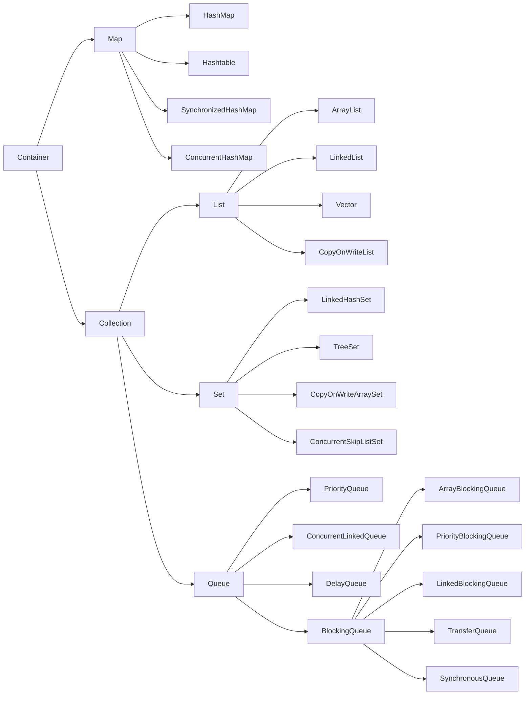

# 多线程与高并发回顾与总结


## 进程、线程、纤程(协程)

1. 进程: 在内核中启动应用程序就是开启一个进程，那么进程就是在内存的一块独立空间，是资源调度的基本单位
2. 线程:内核态的线程，在进程独立内存空间的基础上创建的，并没有自己的内存空间，这是执行调度的基本单位
3. 纤程:用户态的线程，线程中的线程，纤程之间的切换不需要内核的参与，java中调用第三方包可以实现，只能完成执行简单计算功能，如获取数据库数据就不能使用

## Thread方法

1. yield：直接放弃当前线程的执行，不管当前线程执行什么程序，一般不用
2. wait：当前线程持锁进入休眠状态，必须由另外一个线程调用notify/notifyAll方法唤醒
3. notify/notifyAll：唤醒其他线程并让其他线程释放锁
4. sleep：当前线程处于休眠状态，暂时放弃CPU资源的争夺，例如：线程1执行过程中调用sleep方法，那么线程2就可以获得CPU资源执行，线程2也可以获取不用volatile修饰的全局变量的值
5. interrupt：打断当前线程的执行，当前线程直接退出
6. join：排斥其他线程，只让当前线程运行

## synchronized

1. synchronized锁的是对象而不是代码块

2. 保证同步代码块的原子性和可见性，如果变量被修改的代码部分已经被synchronized修饰，那么变量就不用volatile修饰保证可见性了

3. 可重入锁：同步代码块1内部调用同步代码块2, 1 2代码块可按顺序执行，前提是锁的同一个对象

4. 使用时在同步代码块中少加入无关紧要的代码

5. 排他锁：锁的不是同一个对象，无法起到同步效果

6. 原理：在jdk不断地改良中，synchronized效率已经不比其他锁低了

   > 一开始synchronized处于无锁状态，只有一个线程执行时进入排他锁状态，当多个线程争夺锁时进入自旋锁状态，线程自旋10次还获取不到锁，那么线程进入重量级锁状态，线程进入阻塞队列，等待CPU分配资源

   > 四种锁状态：
   >
   > 1.无锁状态。2.排他锁状态。3.自旋锁状态(轻量级锁)。4.重量级锁状态

## volatile

1. 只能修饰变量，不能修饰方法

2. 保证变量的可见性

   > 原理：使用缓存一致性协议，变量A在当前线程修饰时，所有线程中的变量A都会被修改

3. 禁止指令重排序

   > DCL,Double Check Lock,在单例模式中懒加载时，采用DCL能一定程度保证只会创建一个对象，但是在高并发下也可能获取到半初始化对象，那么对象就需要volatile修饰。为什么？
   >
   > 在下面代码中，jvm为了提高效率可能会让指令重排序，astore_1被放在invokespecial前面，那么volatile会在对象被创建前后加入读或写屏障，保证指令的顺序完成

   ```java
   public static void main(String[] args) {
       Object o=new Object();
   }
   //======================================
   0 new #2 <java/lang/Object> //申请新的内存空间
   3 dup //在jvm栈中复制o对象
   4 invokespecial #1 <java/lang/Object.<init>> //初始化Object实例
   7 astore_1 //取出o对象，并把实例内存地址赋值给它
   8 return
   ```

## ReentrantLock与Synchronized异同

1. 相同
   1. 都属于可重入锁与排他锁
   2. 都需要对线程阻塞和唤醒，需要内核在用户态和内核态来回切换，比较浪费资源

2. 不同
   1. synchronized属于关键字，已经在底层实现；reentrantlock是在API提供的类，需要配合使用lock/unlock/finally来完成
   2. synchronized的使用简洁方便，锁的获取与释放都是底层来完成，但是灵活性不高；reentrantlock都需要自己完成，但是可以灵活使用各种方法来完成所需功能。
   3. synchronized有四种锁状态，其中包括reentrantlock的CAS技术；reentrantlock只使用CAS技术

## ReentrantLock

1. 公平锁与非公平锁
   1. 公平锁：所有线程自动进入阻塞队列，按顺序获取锁执行程序
   2. 非公平锁：线程首先争抢锁，如果抢到就执行程序，失败则进入阻塞队列

2. CountDownLatch/CyclicBarrier
   1. CountDownLatch:线程数达到，释放锁，线程同步执行
   2. CyclicBarrier:一组一组的释放锁

3. ReadWriteLock/StampedLock
   1. ReadWriteLock:读操作是共享锁，写操作是排他锁
   2. StampedLock:读操作在写操作完成后进入，那么读操作是乐观锁，但是读操作进入时发现还有写操作，此时读操作转成悲观锁，与ReadWriteLock一样

4. Exchanger:必须而且只有两个线程调用exchange方法，才能互相交换信息。只有一个线程调用方法会进入阻塞状态，直到另一个线程调用才能唤醒
5. LockSupport：park/unpark类似wait/notify方法，但是阻塞时并不会持有锁

## CAS

1. Compare And Set被称为乐观锁、无锁化，所有方法都不加锁，是ReentrantLock锁的核心，包括AQS都使用CAS

2. 原理

   > CAS机制中有3个操作数：内存地址V，旧的期望值A，新的期望值B。
   >
   > 更新一个变量时，首先V与A比较，若相同，将V的值替换为B，若不相同，返回failure

3. ABA问题

   > CAS前线程改变了V中变量的值，在CAS比较内存地址一样时，CAS还是会执行成功
   >
   > 基本数据类型不受影响，引用数据类型受影响

## AQS

1. AbstractQueuedSynchronizer,JUC包下的类都是实现此类的。
2. 原理
   1. 数据结构使用双向链表+FIFO队列
   2. 所有线程共享state变量，state表示线程持有的锁的数量，state为0代表没有线程持锁
   3. 所有修改操作都使用CAS

## 强软弱虚

1. 强引用：普通对象new出来就是强引用
2. 软引用 SoftReference:堆内存不够时，GC会回收软引用，适用于缓存
3. 弱引用 WeakReference:触发GC就会被回收，但是弱引用指向的对象还有强引用指向，那么此对象不会被回收，适用于容器
4. 虚引用 PhantomReference:一定会被回收，适用于指向堆外内存

## Container




1. Map：高并发下，使用synchronized的Hashtable，SynchronizedHashMap修改元素效率略高，查找元素效率偏低；ConcurrentHashMap修改元素效率不比前面的差，但是查询元素效率较高
2. Collection
   1. ConcurrentSkipListArraySet:跳表，Redis中sorted_set数据类型就是用跳表实现的。其原理是使用多层表，每一层都是从下一层随机抽取几个元素组成，查找元素时从上一层判断在哪两个元素之间，下一层就在这之间查找，一直往下找到完整表
   2. BlockingQueue:非常重要，在线程池中都是使用阻塞队列
      1. ArrayBlockingQueue:FIFO执行的阻塞队列
      2. PriorityBlockingQueue:优先级高的先执行
      3. TransferQueue: transfer实现阻塞直到消费者取元素，而其他方法不阻塞
      4. SynchronousQueue:类似Exchanger，只有阻塞到消费者取元素，这之前其他方法都阻塞

## ThreadPool

1. 7个参数

   > corePoolSize:核心线程数
   >
   > maxPoolSize:最大线程数
   >
   > keepAliveTime:线程池空闲时间超过，那么线程池关闭
   >
   > unit:TimeUnit时间单位
   >
   > threadFactory:线程工厂，用于创建线程
   >
   > queue:选择哪种工作线程阻塞队列
   >
   > handle:当任务和工作线程达到最大值时，使用哪种策略拒绝新任务。
   >
   > 四种拒绝策略：Abort抛出异常；Discard直接丢弃任务；DiscardOldest丢弃进入队列最早的任务；CallerRuns让调用任务线程执行被拒绝的任务

2. 线程池的执行者ThreadPoolExecutor类的原理，也就是线程池的核心原理，所有线程共享任务队列

   > 新任务进入线程池，核心线程数小于corePoolSize,直接创建核心线程执行任务；否则让任务进入队列。当队列满了，则需要添加工作线程。若线程和任务队列都满了，执行拒绝策略。
   >
   > addWorker添加工作线程使用自旋操作，直到成功添加或者线程池关闭才返回

3. Executors:线程池的工具类
   1. CachedThreadPool:来一个任务开启一个线程
   2. FixedThreadPool:工作线程数固定
   3. SingleThreadPool:线程池只有一个线程，可用于线程池的任务队列调度和周期管理
   4. ScheduledPool:定时任务
   5. WorkStealingPool:工作线程A执行完毕，会从其他线程中偷取任务执行，此线程池好处在于均衡线程执行任务数量

4. ForkJoinPool:可以分批量执行任务，每个线程都有自己的任务队列，利用了"分而治之"思想