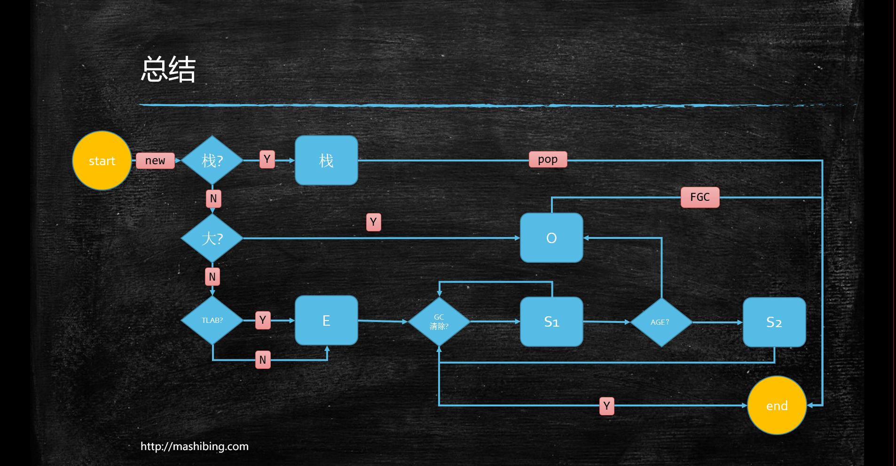

# JVM总结与回顾

## JVM内存结构

### 类加载过程


1. Loading

   - 类加载器

     - BootstrapClassLoader:用来加载核心库,不能被调用

     - ExtClassLoader:负责加载\lib\ext目录下类库，能被调用

     - AppClassLoader:负责加载CLASSPATH下的类库，一般编写的java类都是由这个加载器加载

     - App加载器通过调用getParent()方法获取Ext加载器，Ext通过调用getParent()方法获取Bootstrap加载器

       > 注意：getParent()只是方法，而不是指父子关系

   - 类加载过程使用双亲委派机制

     - 主要出于安全考虑，例如自定义java.lang.String类，通过双亲委派机制使用BootstrapClassLoader加载，不然会加载自定义的类，导致程序运行混乱

       

   - java虚拟机规范中提到在以下五种情况将触发类的初始化

     - 遇到new、getstatic、putstatic、invokestatic指令，访问final变量除外。静态方法和静态代码块会在编译期汇集到<clinit>类初始化方法中
     - java.lang.reflect包或Class对类进行反射调用时
     - 初始化子类时，父类首先初始化
     - 虚拟机启动时，被执行的主类要先进行初始化
     - 动态语言支持java.lang.invoke.MethodHandle解析的结果为REF_getstatic REF_putstatic REF_invokestatic的方法句柄时，该类必须初始化

   - ClassLoader源码

     - findInCache->parent.loadClass->findClass

       > 使用指定的二进制名称来加载类，这个方法的默认实现按照以下顺序查找类：
       > 调用`findLoadedClass(String)`方法检查这个类是否被加载过
       > 使用父加载器调用`loadClass(String)`方法，如果父加载器为`Null`，类加载器装载虚拟机内置的加载器调用`findClass(String)`方法装载类，
       > 如果，按照以上的步骤成功的找到对应的类，并且该方法接收的`resolve`参数的值为`true`,那么就调用`resolveClass(Class)`方法来处理类。

   - 自定义加载器

     - parent是通过super(ClassLoader parent)指定
     - 打破双亲委派
       - 如何打破：重新loadClass()方法
       - 何时打破过
         - JDK1.2之前，自定义ClassLoader必须重写loadClass
         - ThreadContextClassLoader可以实现基础类调用实现类代码，通过thread.setContextClassLoader指定
         - 热启动，热部署。osgi Tomcat 都有自己的模块指定classLoader(可以加载同一类库的不同版本)

2. Linking

   - Verification。验证文件是否符合jvm规范
   - Preparation。静态成员变量赋默认值
   - Resolution。将类、方法、属性等符号引用解析为直接引用。常量池中的各种符号引用解析为指针、偏移量等内存地址的直接引用

3. Initializing

   - 调用类初始化代码<clinit>，给成员变量赋初始值

     **注意：**

     **load ：默认值 - 初始值**

     **new ：申请内存 - 默认值 - 初始值**

### JMM

1. 硬件层数据一致性

   - 现代CPU的数据一致性实现=缓存锁(MESI..) + 总线锁
   - 读取缓存以cache line为单位，目前64bytes
   - 位于同一缓存行的两个不同数据，被两个不同CPU锁定，产生互相影响的伪共享问题
   - 使用缓存行对齐能够提高效率

2. 乱序问题

   - CPU为了提高指令执行效率，会在一条指令执行过程中，去同时执行另一条指令，前提是两条指令没有依赖关系

3. 如何保证特定情况下不乱序

   - 硬件内存屏障 X86

     - sfence：store | 在sfence指令前的写操作必须在sfence指令后的写操作前完成
     - lfence：load | 在lfence指令前的读操作当必须在lfence指令后的读操作前完成。
     - mfence：mix | 在mfence指令前的读写操作当必须在mfence指令后的读写操作前完成。
     - 原子指令，如x86上的”lock …” 指令是一个Full Barrier，执行时会锁住内存子系统来确保执行顺序，甚至跨多个CPU。Software Locks通常使用了内存屏障或原子指令来实现变量可见性和保持程序顺序

   - jvm规范

     - LoadLoad屏障：对于这样的语句Load1; LoadLoad; Load2。在Load2及后续读取操作要读取的数据被访问前，保证Load1要读取的数据被读取完毕。
     - StoreStore屏障：对于这样的语句Store1; StoreStore; Store2。在Store2及后续写入操作执行前，保证Store1的写入操作对其它处理器可见。
     - LoadStore屏障：对于这样的语句Load1; LoadStore; Store2。在Store2及后续写入操作被刷出前，保证Load1要读取的数据被读取完毕。
     - StoreLoad屏障：对于这样的语句Store1; StoreLoad; Load2。在Load2及后续所有读取操作执行前，保证Store1的写入对所有处理器可见。

   - volatile实现细节

     - 字节码层面：ACC_VOLATILE

     - jvm层面：volatile内存区的读写，都加屏障

       > StoreStoreBarrier
       >
       > volatile 写操作
       >
       > StoreLoadBarrier

       > LoadLoadBarrier
       >
       > volatile 读操作
       >
       > LoadStoreBarrier

     - OS和硬件层面：windows lock指令实现

   - synchronized实现细节

     - 字节码层面：ACC_SYNCHRONIZED moniterenter moniterexit
     - jvm层面：C/C++调用了操作系统的同步机制
     - OS和硬件层面：X86 : lock cmpxchg 

### 运行时数据区

1. Program Counter：存放当前指令位置

   - 虚拟机的运行，类似这样的循环：

     > while (not end) {
     >
     > ​	取出PC中的指令;
     >
     > ​	执行该指令;
     >
     > ​	PC++;
     >
     > }

2. JVM Stack

   - Frame - 每个方法对应一个栈帧
     - Local Variable Table
     - Operand Stack：对于long的处理，多数虚拟机的实现都是原子的，不用加volatile
     - Dynamic Linking
     - Return Address：a()->b()，方法a调用了方法b，b方法的返回值在a方法的栈顶

3. Heap

   - 存放对象的实例，垃圾回收器会回收没有被GC ROOTS指向的引用

4. Method Area

   - Perm Space(jdk<1.8)。字符串常量位于PermSpace；FGC不会清理；内存大小启动时指定，不能改变
   - Meta Space(jdk>=1.8)。字符串常量位于堆；会触发FGC清理；不设定的话，最大是物理内存

5. Runtime Constant Pool

6. Native Method Stack

7. Direct Memory

   - jvm可以直接访问内核空间的内存(OS管理的内存)

## 对象大小（64位机）

1. 普通对象
   - 对象头：markword 8字节
   - ClassPointer指针：-XX:+UseCompressedClassPointers 开启压缩指针为4字节，不开启为8字节
   - 实例数据
     - 引用类型：-XX:+UseCompressedOops 开启为4字节，不开启为8字节
     - Oops - Ordinary Object Pointers 普通对象指针
   - Padding对齐，8的倍数
2. 数组对象
   - 对象头：markword 8字节
   - ClassPointer指针同上
   - 数组长度：4字节
   - 数组数据同上
   - Padding对齐，8的倍数
3. HotSpot开启内存压缩的规则
   - 4G以下，直接去掉高32位
   - 4G - 32G，默认开启内存压缩 ClassPointer Oops
   - 32G以上，压缩无效

## GC

### GC 基础知识

1. 什么是垃圾？

   - 没有任何引用指向的一个对象或多个对象(循环引用)

2. 如何定位垃圾？

   - 引用计数
     - 引用为0即为垃圾
   - 根搜索算法(RootSearching)
     - java虚拟机栈变量、JNI变量、静态变量、常量池

3. 常见的垃圾算法

   - 标记清除(mark sweep) - 位置不连续，产生碎片，效率低(两遍扫描)
   - 拷贝算法(copying)：没有碎片，浪费空间
   - 标记压缩(mark compact)：没有碎片，效率偏低(两遍扫描，指针需要调整)

4. jvm内存分代模型

   - 部分垃圾回收器使用的模型

     > 除Epsilon ZGC Shenandoah之外的GC都是使用逻辑分代模型
     >
     > G1逻辑分代，物理不分代
     >
     > 除此之外不仅逻辑分代，物理也分代

   - 新生代+老年代+永久代(1.8以前为Perm Generation，1.8以后为MetaSpace)

     

   - 新生代 = Eden区 + 2 个 survivor区

     - YGC后，大部分对象被回收，无法被回收的进入s0
     - 再次YGC，s0和Eden区无法被回收的对象进入s1
     - 再次YGC，s1和Eden区无法被回收的对象进入s0
     - 对象年龄足够(默认15，CMS为6)，进入老年代
     - 或者s区装不下，进入老年代

     

### 常见垃圾回收器


1. CMS - ConcurrentMarkSweep

   - 老年代 并发标记清除。垃圾回收和应用程序同时运行，降低STW时间

   - CMS使用MarkSweep，肯定会有碎片化问题，碎片到一定程度后，老年代分配不下对象时，触发SerialOld进行老年代回收

   - 算法：三色标记+Incremental Update

     - 三色标记。将对象用黑、灰、白标记。黑色表示本身不是垃圾，指向的所有引用也不是垃圾；灰色表示本身不是垃圾，但指向的引用没有标记完成；等到没有对象可以被标记为灰色后，白色就是要被清理的垃圾

     - CMS是并行标记对象，可能出现漏标的情况。B已经标记完成，但是还有指向D的引用，那么D被回收肯定会出问题。

       

     - Incremental Update可以解决漏标问题。只要在写屏障里发现有一个白色对象引用到黑色对象字段里，那就把白色对象标记为灰色

2. G1 - Garbage First

   - 设计原则：收集尽可能多的垃圾

   - G1采用内存分区的思路，将内存划分为Eden、survivor、Old、Humongous等分区，回收时则以分区为单位进行回收，存活的对象复制到另外一个空闲分区

   - G1收集是STW的，但是年轻代和老年代收集界限比较模糊，采用了混合收集方式

     

   - Remember Set(RSet)

     - 在串行和并行垃圾回收器中，GC通过扫描整堆，确定对象是否在根可达路径中。G1为了避免整堆扫描，在每个分区记录了RSet，类似反向指针，记录引用分区内对象的卡片索引
     - 引用本分区的对象，不需要记录到RSet中
     - G1 GC每次都会对年轻代进行整体收集，因此引用年轻代的对象，也不需要记录到RSet中
     - 只有老年代的分区可能会有RSet记录

   - Collection Set(CSet)

     - CSet是一组可被回收的分区集合。在任意一次收集暂停中，CSet所有分区都会被释放，内部存活的对象被复制到空闲的分区

   - 算法：三色标记+SATB

     - 三色标记与CMS一样

     - SATB - Snapshot At The Beginning。删除时记录所有对象

       - 在开始标记时，生成一个快照记录所有存活对象
       - 在并发标记时，所有被改变的对象入列
       - 可能出现游离的垃圾，将在下次被收集

       > Incremental Update:在插入时记录对象
       >
       > SATB:在删除时记录对象

### 日志详解

#### PS GC日志详解

1. 日志格式

   

2. heap dump部分

   ```shell
   eden space 5632K, 94% used [0x00000000ff980000,0x00000000ffeb3e28,0x00000000fff00000)
                       #后面的内存地址指的是，起始地址，使用空间结束地址，整体空间结束地址
   total = eden + 1个 survivor
   ```

   

#### G1日志详解

```java
[GC pause (G1 Evacuation Pause) (young) (initial-mark), 0.0015790 secs]
//young -> 年轻代 Evacuation-> 复制存活对象 
//initial-mark 混合回收的阶段，这里是YGC混合老年代回收
   [Parallel Time: 1.5 ms, GC Workers: 1] //一个GC线程
      [GC Worker Start (ms):  92635.7]
      [Ext Root Scanning (ms):  1.1]
      [Update RS (ms):  0.0]
         [Processed Buffers:  1]
      [Scan RS (ms):  0.0]
      [Code Root Scanning (ms):  0.0]
      [Object Copy (ms):  0.1]
      [Termination (ms):  0.0]
         [Termination Attempts:  1]
      [GC Worker Other (ms):  0.0]
      [GC Worker Total (ms):  1.2]
      [GC Worker End (ms):  92636.9]
   [Code Root Fixup: 0.0 ms]
   [Code Root Purge: 0.0 ms]
   [Clear CT: 0.0 ms]
   [Other: 0.1 ms]
      [Choose CSet: 0.0 ms]
      [Ref Proc: 0.0 ms]
      [Ref Enq: 0.0 ms]
      [Redirty Cards: 0.0 ms]
      [Humongous Register: 0.0 ms]
      [Humongous Reclaim: 0.0 ms]
      [Free CSet: 0.0 ms]
   [Eden: 0.0B(1024.0K)->0.0B(1024.0K) Survivors: 0.0B->0.0B Heap: 18.8M(20.0M)->18.8M(20.0M)]
 [Times: user=0.00 sys=0.00, real=0.00 secs] 
//以下是混合回收其他阶段
[GC concurrent-root-region-scan-start]
[GC concurrent-root-region-scan-end, 0.0000078 secs]
[GC concurrent-mark-start]
//无法evacuation，进行FGC
[Full GC (Allocation Failure)  18M->18M(20M), 0.0719656 secs]
   [Eden: 0.0B(1024.0K)->0.0B(1024.0K) Survivors: 0.0B->0.0B Heap: 18.8M(20.0M)->18.8M(20.0M)], [Metaspace: 38
76K->3876K(1056768K)] [Times: user=0.07 sys=0.00, real=0.07 secs]
```


## 调优

### 调优前基础概念

1. 吞吐量：用户代码时间 / (用户代码时间 + 垃圾回收时间)

   > QPS - Queries Per Seconds:服务器处理流量的衡量标准
   >
   > TPS - Transaction Per Seconds:一个事务是指客户端发出请求，服务器做出响应的过程

2. 响应时间：STW越短，响应时间越好

3. 追求吞吐量还是响应时间

   - 吞吐量优先使用PS + PO
   - 响应时间优先使用 G1

### 调优从规划开始

1. 调优从业务场景开始，并且要监控，也就是压力测试
2. 步骤
   - 熟悉业务场景。没有最好的垃圾回收器，只有最合适的垃圾回收器。吞吐量和响应时间分别采用PS+PO 和 G1 CMS ZGC
   - 选择回收器组合。PS+PO ParNew+CMS Serial+CMS 等等
   - 计算内存需求。垃圾回收器和内存大小成正相关
   - 选定CPU。越高越好
   - 设定年代大小、升级年龄。对象存活短的多，增加年轻代内存，否则增加老年代内存；对象刚被放入老年代就变成垃圾，可以增加年龄次数
   - 设定日志参数。日志全部放进一个文件，增加排错难度
     - -Xloggc:/opt/logs/xxx-xxx-gc-%t.log -XX:+UseGCLogFileRotation -XX:NumberOfGCLogFiles=5 -XX:GCLogFileSize=20M -XX:+PrintGCDetails -XX:+PrintGCDateStamps -XX:+PrintGCCause 	一共5个文件，每个文件20M，循环覆盖
     - 或者每天产生一个日志文件
   - 观察日志情况。产生大量对象进入老年代，通过指令查看哪些对象存活时间长，然后修改程序

### 优化环境

1. 有一个50万PV(PageView)的资料类网站（从磁盘提取文档到内存）原服务器32位，1.5G
   的堆，用户反馈网站比较缓慢，因此公司决定升级，新的服务器为64位，16G
   的堆内存，结果用户反馈卡顿十分严重，反而比以前效率更低了

   - 为什么原网站慢？

     很多用户浏览网站，大量数据load到内存，内存不足，频繁GC，STW长，响应时间变慢

   - 为什么会更卡顿？

     内存越大，FGC时间越长

   - 怎么解决？

     PS+PO -> PN+CMS 或 G1

2. 系统CPU经常100%，如何调优？(面试高频)
   CPU100%那么一定有线程在占用系统资源

   - 找出哪个进程CPU高(top)
   - 该进程哪个线程CPU高(top -Hp)
   - 导出该线程的堆栈(jstack)
   - 查看哪个方法消耗时间长(jstack)
   - 工作线程占比高 - 提高CPU性能 | 垃圾回收线程占比高 - 减少GC阈值 -> 增加GC次数，减少GC的内存

3. 系统内存飙高，如何查找问题？（面试高频）

   - 导出堆内存(jmap)。jmap不要在jvm执行时运行，可以配置参数，堆内存溢出执行jmap
   - 分析(jvisualvm,jconsole,jprofile)

### 解决jvm运行中问题

1. 测试代码

   ```java
   import java.math.BigDecimal;
   import java.util.ArrayList;
   import java.util.Date;
   import java.util.List;
   import java.util.concurrent.ScheduledThreadPoolExecutor;
   import java.util.concurrent.ThreadPoolExecutor;
   import java.util.concurrent.TimeUnit;
   
   /**
    * 从数据库中读取信用数据，套用模型，并把结果进行记录和传输
    */
   
   public class FullGC_Problem01 {
   
       private static class CardInfo {
           BigDecimal price = new BigDecimal(0.0);
           String name = "张三";
           int age = 5;
           Date birthdate = new Date();
   
           public void m() {}
       }
   
       private static ScheduledThreadPoolExecutor executor = new ScheduledThreadPoolExecutor(50,
               new ThreadPoolExecutor.DiscardOldestPolicy());
   
       public static void main(String[] args) throws Exception {
           executor.setMaximumPoolSize(50);
   
           for (;;){
               modelFit();
               Thread.sleep(100);
           }
       }
   
       private static void modelFit(){
           List<CardInfo> taskList = getAllCardInfo();
           taskList.forEach(info -> {
               // do something
               executor.scheduleWithFixedDelay(() -> {
                   //do sth with info
                   info.m();
   
               }, 2, 3, TimeUnit.SECONDS);
           });
       }
   
       private static List<CardInfo> getAllCardInfo(){
           List<CardInfo> taskList = new ArrayList<>();
   
           for (int i = 0; i < 100; i++) {
               CardInfo ci = new CardInfo();
               taskList.add(ci);
           }
   
           return taskList;
       }
   }
   
   ```

2. 解决问题步骤

   - java -Xms200M -Xmx200M -XX:+PrintGC FullGC_Problem01 为了测试方便只打印GC日志，实际生产环境参数很多

   - top命令观察到问题，内存不断增大，CPU居高不下

   - top -Hp观察进程中的线程，哪个线程CPU和内存占比高

   - jps定位具体java进程

   - jstack定位线程状况，重点关注：WAITING BLOCKED

     > eg:
     > waiting on <0x0000000088ca3310> (a java.lang.Object)
     > 假如有一个进程中100个线程，很多线程都在waiting on <xx> ，一定要找到是哪个线程持有这把锁
     > 怎么找？搜索jstack dump的信息，找<xx> ，看哪个线程持有这把锁RUNNABLE

   - 为什么阿里规范规定，线程的名称必须要写成有意义的。方便定位哪个线程有问题，然后快速定位到程序中的代码

   - jstat -gc动态观察gc情况。阅读gc日志发现频繁FGC。jstat -gc 4655 500 : 每个500个毫秒打印GC的情况

     > 如果面试官问如何定位OOM问题的？不能回答用图形化界面
     >
     > 1.已经上线的系统可以使用arthas
     >
     > 2.图形界面用在测试的时候，压测时进行监控

   - jmap -histo pid | head -20，查找前20个产生最多的对象

   - jmap -dump:format=b,file=xxx pid

     线上系统，内存特别大，jmap执行期间会对进程产生很大影响，甚至卡顿（电商不适合）

     - 设定了参数HeapDump，OOM的时候会自动产生堆转储文件
     - <font color='red'>很多服务器备份（高可用），停掉这台服务器对其他服务器不影响</font>
     - 在线定位(一般小点儿公司用不到)

   - java -Xms20M -Xmx20M -XX:+UseParallelGC -XX:+HeapDumpOnOutOfMemoryError FullGC_Problem01      发生OOM执行HeapDump，把堆内存转化为dump文件

   - 使用MAT / jhat /jvisualvm 进行dump文件分析

     https://www.cnblogs.com/baihuitestsoftware/articles/6406271.html 
     jhat -J-mx512M xxx.dump
     http://192.168.163.100:7000

     若果链接在浏览器打不开，开放防火墙端口

     ```shell
     firewall-cmd --zone=public --add-port=7000/tcp --permanent //开放端口
     firewall-cmd --reload //重启防火墙
     ```

     拉到最后：找到对应链接
     可以使用OQL查找特定问题对象

   - 找到代码问题


