# Redis总结与回顾

## 背景

关系型数据库将数据存在磁盘，每次读取和修改数据经过磁盘。但是磁盘的速度为ms级，内存速度100ns级，CPU速度1ns级。每次用I/O从磁盘传输数据到内存，很耗费资源和时间。那么Redis把数据存储在内存会大量节省时间，性能会很高。

## 安装和配置

```bash
yum install wget -y
wget https://download.redis.io/releases/redis-6.0.9.tar.gz
tar -xf redis-6.0.9.tar.gz
#获取到低版本GCC，Redis6.0不支持
yum install gcc -y
#升级GCC版本
#server.c: In function ‘writeCommandsDeniedByDiskError’: server.c:3934:1: warning: control reaches end of non-void function [-Wreturn-type]  }
yum -y install centos-release-scl
yum -y install devtoolset-9-gcc devtoolset-9-gcc-c++ devtoolset-9-binutils
scl enable devtoolset-9 bash
echo "source /opt/rh/devtoolset-9/enable" >>/etc/profile

make

make install PREFIX=/root/soft/redis-6.0.9/config

#配置环境变量
vi /etc/profile
#在末尾添加Redis
export REDIS_HOME=/root/soft/redis-6.0.9
export PATH=$REDIS_HOME/src:$PATH
#保存，让配置文件生效
source /etc/profile

#注释Redis conf文件，不保存log
#logfile /var/log/redis_6379.log

cd utils/
#注释install_server.sh中代码
#check for root user
#if [ "$(id -u)" -ne 0 ] ; then
#       echo "You must run this script as root. Sorry!"
#       exit 1
#fi

#bail if this system is managed by systemd
#_pid_1_exe="$(readlink -f /proc/1/exe)"
#if [ "${_pid_1_exe##*/}" = systemd ]
#then
#       echo "This systems seems to use systemd."
#       echo "Please take a look at the provided example service unit files in this directory, and adapt and install them. Sorry!"
#       exit 1
#fi
#unset _pid_1_exe

./install_server.sh
#默认配置
#Selected config:
#Port           : 6379
#Config file    : /etc/redis/6379.conf
#Log file       : /var/log/redis_6379.log
#Data dir       : /var/lib/redis/6379
#Executable     : /root/soft/redis-6.0.9/src/redis-server
#Cli Executable : /root/soft/redis-6.0.9/src/redis-cli
```

## Redis原理以及简单使用

1. redis是二进制安全的，数据存储为字节流

2. redis采用多路I/O复用技术（epoll）让单个线程高效的处理多个连接请求。至于为啥redis不用多线程？redis为了高性能，单进程、单线程、单实例避免使用锁降低性能，而且多线程浪费时间消耗CPU进行上下文切换

   > 简单理解select/poll/epoll：
   >
   > select/poll
   > 饭店服务员（内核）告诉饭店老板（用户程序）：”现在有客人结账“
   > 但是这个服务员没人明确告诉老板，哪几桌的客人结帐。老板得自儿一个一个桌子去问：请问是你要结帐？
   >
   > epoll
   > 饭店服务员（内核）告诉饭店老板（用户程序）：”1,2,5号客人结账“
   > 老板就可以直接去1,2,5号桌收钱了

   1. select

      ```c
      //maxfd_add_1:fd_set数组有效fd的长度，后面的三个参数都设置的fd的最大值数量加1。fd_set数组总长度为1024
      //readset,write_set,exceptset:这三个fd_set类型是一个bitmap。如果对应的位被设置，fd满足可读写事件
      int select(int maxfd_add_1, fd_set *readset, fd_set *write_set, fd_set * exceptset, 
                  const struct timeval *timeout);
      struct timeval{
          long tv_sec;
          long tv_usec;
      };
       
       
      /*设置fd_set，下面的四个函数都是宏，不能取地址*/
       
      //清空
      void FD_ZERO(fd_set *fdset);
       
      //设置一个位
      void FD_SET(int fd, fd_set *fdset);
       
      //清除一个位
      void FD_CLR(int fd, fd_set *fdset);
       
      /*检查某个位是否被设置,可用于函数返回时判断那个文件描述符就绪*/
      int FD_ISSET(int fd,fd_set *fdset);
      ```

      1. select流程
         1. 在被调用之前，会被告知select需要监控哪些fd可读、可写、异常事件
         2. select会把3个fd_set类型--readset,write_set,exceptset--传给内核（产生了一次fd_set数组从用户空间到内核空间的复制），内核会根据3个fd_set类型对fd_set数组遍历，判断fd是否满足可读写事件
         3. 如果fd发生了可读写事件，内核会把fd_set数组中没有事件的fd句柄清楚，然后把有事件的fd传给用户空间（又产生一次fd_set从内核空间到用户空间的复制）
         4. 最后应用程序获取fd进行读写操作
      2. select问题：
         1. 发生2次复制fd_set数组操作，当fd数量很大时，这个过程消耗很大
         2. select需要遍历fd_set数组，fd数量很大时，这个过程比较耗时
         3. fd_set数组有长度限制，最大1024

   2. poll

      ```c
      int poll(struct pollfd *fdarray, unsigned long n, int timeout);
      //成功个数，错误-1,超时0
      
      struct pollfd{
        int fd;		//文件描述符
        short events; //注册的事件
        short revents;//实际发生的事件，由内核填充
      };
      ```

      1. 与select基本一样，只是改用链表存储fd
      2. 与select问题一样

   3. epoll

      ```c
      // 创建 epollfd 的函数
      int epoll_create(int size);
       
      // 对要监听的文件描述符的动态的增加修改删除
      int epoll_ctl(int epfd, int op, int fd, struct epoll_event *event);
       
      // 开始阻塞
      int epoll_wait(int epfd, struct epoll_event *events, int maxevents, 
          int timeout);
       
      // epoll_wait 返回的时候，events表示发生的、
      //时间 data则表示与文件描述符相关的信息，可以指向一个结构体，
      //也可以是直接的文件描述符
      typedef union epoll_data {
          void *ptr; // 常用这个
          int fd;
          uint32_t u32;
          uint64_t u64;
      } epoll_data_t;
       
      struct epoll_event
      {
       //感兴趣的事件如EPOLLIN，EPOLLOUT，EPOLLPRI等
          uint32_t events;  
       //一般使用data的fd成员表示感兴趣的socket
          epoll_data_t data;
      };
      ```
      

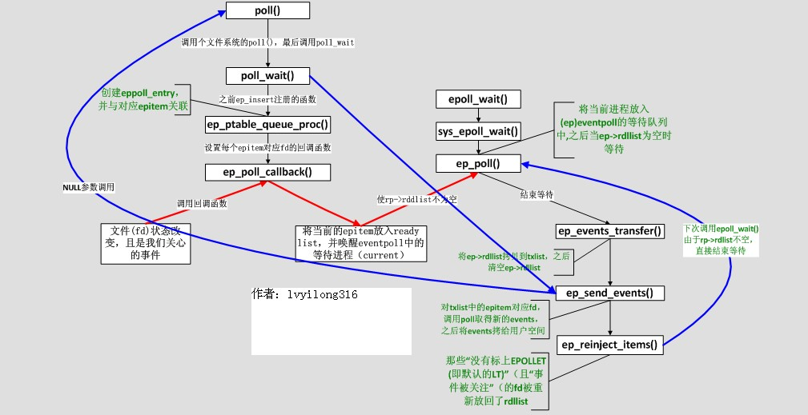
      
深入理解epoll原理http://blog.chinaunix.net/uid-28541347-id-4273856.html
      
1. epoll流程
   
   1. epoll_create：创建内核事件表，结构为红黑树，用来保存应用程序需要监听的fd
         2. epoll_ctl：动态的增删改查内核事件表中的fd
         3. epoll_wait：内核向事件表的fd绑定一个回调函数。当监控的fd就绪时，会调用callback把fd加入到就绪事件队列（链表实现）中，最后在epoll_wait被唤醒时内核会把队列中fd和fd类型返回给用户空间
   
2. 高效原因
   
   1. 内核每次调用不会从用户空间传入所有fd
         2. 每次epoll_wait被唤醒不用遍历所有的fd
         3. epoll没有数量限制
   
3. 工作方式
   
   1. LT：水平触发。epoll默认的工作方式，支持阻塞和非阻塞模式。效率会低于ET触发，尤其在大并发，大流量的情况下。但是LT对代码编写要求比较低，不容易出现问题。LT模式服务编写上的表现是：只要有数据没有被获取，内核就不断通知你，因此不用担心事件丢失的情况。
      
   2. ET：边缘触发。只支持非阻塞模式。效率非常高，在并发，大流量的情况下，会比LT少很多epoll的系统调用，因此效率高。但是对编程要求高，需要细致的处理每个请求，否则容易发生丢失事件的情况。
      
      > 从本质上讲：与LT相比，ET模型是通过减少系统调用来达到提高并行效率的。
   
3. redis最大的瓶颈是内存或带宽

4. redis包含的数据结构 string,list,hash,set,sorted_set

   1. string

      1. 使用SDS - Simple Dynamic String实现字符串类型。好处有3个：

         1. O(1)获取字符串长度。正常字符数组只能通过遍历获取字符串长度，而SDS定义已用字符串长度
         2. 杜绝缓冲区溢出。对于字符串复制、拼接等操作，SDS会判断字符串长度是否足够，不够扩展数组长度
         3. 减少修改字符串带来的内存重分配次数。解决方法：
            1. 字符串增加操作时，空间预分配
            2. 字符串减少操作时，惰性空间释放

      2. 字符串类型

         ```bash
         set
         get
         append
         setrange
         getrange
         strlen
         ```

         

      3. 数值类型：只有数值的字符串，内部判断为数值内型，可以使用incr/incrby指令增加数值的大小，属于原子操作

         > 抢购、秒杀、详情页、点赞、评论数等等都可以使用incr/incrby对数据库进行事务操作

      4. **bitmap**(很重要)

         1. setbit  key  offset  value:在第offset位设置0/1

         2. bitcount:key中包含1的个数

         3. bitop:支持AND 、 OR 、 NOT 、 XOR操作

         4. bitpos：BITPOS key bit [start] [end]，返回特定范围内第一个0/1的位置

         5. 应用场景

            1. 有用户系统，统计用户登录天数，且登录窗口随机

               ```bash
               setbit person 1 1 #第一天登录
               setbit person 7 1 #第7天登录
               setbit person 364 1 #第364天登录，bitmap为46字节
               strlen person #登录总天数
               bitcount person -2 -1 #统计倒数第二天与倒数第一天登录几次
               ```

            2. 京东618做活动，准备给用户送礼物，该备货多少份礼物。

               ```bash
               # 用户肯定有部分僵尸用户，也有活跃度不同的用户。那么在618前选出3天记录用户登录情况。登录过的用户可以送礼物。
               # key的每一位映射一位用户
               setbit 20200611 1 1 #第一个用户第一天登录
               setbit 20200612 1 1 #第一个用户第二天登录
               setbit 20200613 3 1 #第三个用户第三天登录
               bitop or loginUsers 20200611 20200612
               bitop or loginUsers loginUsers 20200613 #获取三天登录的用户
               bitcount loginUsers 0 -1 #第一位到最后一位登录用户数量
               ```

   2. list

      1. 从左边增删改查元素：lpush,lpop,lset,lindex
      2. 从右边增删改查元素：rpush,rpop,rset,rindex
      3. 表示多种数据结构
         1. 队列：反向命令
         2. 栈：同向命令
         3. 数组
         4. 阻塞队列

   3. hash

      1. 和java中的HashMap一样的功能
      2. 应用场景：点赞、收藏、详情页等等

   4. set

      1. 元素存储无序且有随机性，元素放入的多少不同，存储的顺序不同

      2. 命令

         ```bash
         SADD key member [member ...]
         summary: Add one or more members to a set
         
         SCARD key
         summary: Get the number of members in a set
         # 去重多个set中重复值
         SDIFF key [key ...]
         summary: Subtract multiple sets
         
         SDIFFSTORE destination key [key ...]
         summary: Subtract multiple sets and store the resulting set in a key
         # 交集操作
         SINTER key [key ...]
         summary: Intersect multiple sets
         
         SINTERSTORE destination key [key ...]
         summary: Intersect multiple sets and store the resulting set in a key
         
         SISMEMBER key member
         summary: Determine if a given value is a member of a set
         
         SMEMBERS key
         summary: Get all the members in a set
         
         SMOVE source destination member
         summary: Move a member from one set to another
         
         SPOP key [count]
         summary: Remove and return one or multiple random members from a set
         # 随机获取set中元素.正数：取出一个去重的结果集（不能超过已有集合）；负数：取出一个带重复的结果集，一定满足需要的数量；0，不返回
         SRANDMEMBER key [count]
         summary: Get one or multiple random members from a set
         
         SREM key member [member ...]
         summary: Remove one or more members from a set
         
         SSCAN key cursor [MATCH pattern] [COUNT count]
         summary: Incrementally iterate Set elements
         
         # 并集操作
         SUNION key [key ...]
         summary: Add multiple sets
         
         SUNIONSTORE destination key [key ...]
         summary: Add multiple sets and store the resulting set in a key
         
         ```

      3. SRANDMEMBER使用

         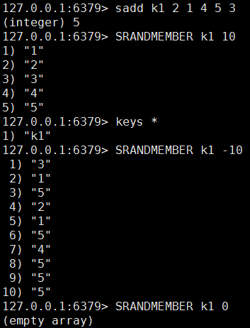

      4. 应用场景

         1. 可用于抽奖

            > 10个奖品，<10 或>10个人抽奖可以使用SRANDMEMBER命令

   5. sorted_set

      1. 根据输入元素的score内部从小到大排序

      2. 命令

         ```bash
         BZPOPMAX key [key ...] timeout
         summary: Remove and return the member with the highest score from one or more sorted sets, or block until one is available
         
         BZPOPMIN key [key ...] timeout
         summary: Remove and return the member with the lowest score from one or more sorted sets, or block until one is available
         
         ZADD key [NX|XX] [CH] [INCR] score member [score member ...]
         summary: Add one or more members to a sorted set, or update its score if it already exists
         
         ZCARD key
         summary: Get the number of members in a sorted set
         
         ZCOUNT key min max
         summary: Count the members in a sorted set with scores within the given values
         
         ZINCRBY key increment member
         summary: Increment the score of a member in a sorted set
         
         ZINTERSTORE destination numkeys key [key ...] [WEIGHTS weight] [AGGREGATE SUM|MIN|MAX]
         summary: Intersect multiple sorted sets and store the resulting sorted set in a new key
         
         ZLEXCOUNT key min max
         summary: Count the number of members in a sorted set between a given lexicographical range
         
         ZPOPMAX key [count]
         summary: Remove and return members with the highest scores in a sorted set
         
         ZPOPMIN key [count]
         summary: Remove and return members with the lowest scores in a sorted set
         
         ZRANGE key start stop [WITHSCORES]
         summary: Return a range of members in a sorted set, by index
         
         ZRANGEBYLEX key min max [LIMIT offset count]
         summary: Return a range of members in a sorted set, by lexicographical range
         
         ZRANGEBYSCORE key min max [WITHSCORES] [LIMIT offset count]
         summary: Return a range of members in a sorted set, by score
         
         ZRANK key member
         summary: Determine the index of a member in a sorted set
         
         ZREM key member [member ...]
         summary: Remove one or more members from a sorted set
         
         ZREMRANGEBYLEX key min max
         summary: Remove all members in a sorted set between the given lexicographical range
         
         ZREMRANGEBYRANK key start stop
         summary: Remove all members in a sorted set within the given indexes
         
         ZREMRANGEBYSCORE key min max
         summary: Remove all members in a sorted set within the given scores
         # 反转有序集合
         ZREVRANGE key start stop [WITHSCORES]
         summary: Return a range of members in a sorted set, by index, with scores ordered from high to low
         
         ZREVRANGEBYLEX key max min [LIMIT offset count]
         summary: Return a range of members in a sorted set, by lexicographical range, ordered from higher to lower strings.
         
         ZREVRANGEBYSCORE key max min [WITHSCORES] [LIMIT offset count]
         summary: Return a range of members in a sorted set, by score, with scores ordered from high to low
         
         ZREVRANK key member
         summary: Determine the index of a member in a sorted set, with scores ordered from high to low
         
         ZSCAN key cursor [MATCH pattern] [COUNT count]
         summary: Incrementally iterate sorted sets elements and associated scores
         
         ZSCORE key member
         summary: Get the score associated with the given member in a sorted set
         
         ZUNIONSTORE destination numkeys key [key ...] [WEIGHTS weight] [AGGREGATE SUM|MIN|MAX]
         summary: Add multiple sorted sets and store the resulting sorted set in a new key
         ```

      3. 内部排序实现原理：跳表

         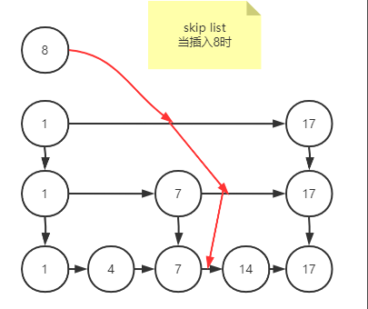

         1. 维护多层次表，上一层表每个元素都有一个指向下一层相同元素的索引，当查询一个元素时，会从最上层往下判断在哪两个元素之间，查询的时间复杂度为O(logN)

      

## Redis进阶使用

1. 当我订阅一个频道，我就有两个需求：获取历史信息；实时发布信息。

   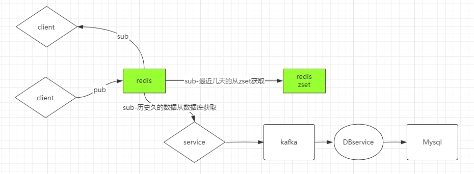

   1. 获取历史信息

      1. 获取很老的数据 - 从数据库查询
      2. 获取最近三天的数据 - redis将数据用sorted_set存储，score用时间戳

   2. 实时发布信息

      1. pubsub

         ```bash
         PSUBSCRIBE pattern [pattern ...]
         summary: Listen for messages published to channels matching the given patterns
         
         PUBLISH channel message
         summary: Post a message to a channel
         
         PUBSUB subcommand [argument [argument ...]]
         summary: Inspect the state of the Pub/Sub subsystem
         
         PUNSUBSCRIBE [pattern [pattern ...]]
         summary: Stop listening for messages posted to channels matching the given patterns
         
         SUBSCRIBE channel [channel ...]
         summary: Listen for messages published to the given channels
         
         UNSUBSCRIBE [channel [channel ...]]
         summary: Stop listening for messages posted to the given channels
         ```

         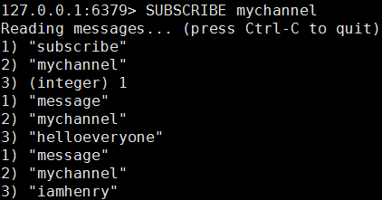

         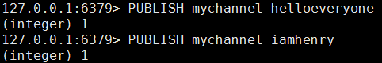

         > 通过SUBSCRIBE订阅频道，PUBLISH给专门的频道发布信息。

      2. 可以用来实现在线聊天功能

2. redis事务

   1. 能保证原子性操作，但修改失败并不能回滚事务，只会异常退出事务执行

   2. 命令

      ```bash
      DISCARD -
      summary: Discard all commands issued after MULTI
      
      EXEC -
      summary: Execute all commands issued after MULTI
      
      MULTI -
      summary: Mark the start of a transaction block
      
      UNWATCH -
      summary: Forget about all watched keys
      
      WATCH key [key ...]
      summary: Watch the given keys to determine execution of the MULTI/EXEC block
      ```

   3. MULTI执行后所有命令都在一个事务，EXEC执行事务中所有命令

3. 布隆过滤器

   1. 安装配置使用

      ```bash
      wget https://github.com/RedisBloom/RedisBloom/archive/master.zip
      unzip master.zip
      make #编译文件
      cp bloom.so /path/to/ #将bloom执行文件copy到redis执行文件目录下
      redis-server --loadmodule /path/to/redisbloom.so
      ```

      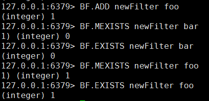

   2. bloom通过映射函数将已有元素映射到bitmap中的某一位并改为1，查询时将查询的元素映射在bitmap上，没有的话这个元素肯定没有，但是有则不一定存在

      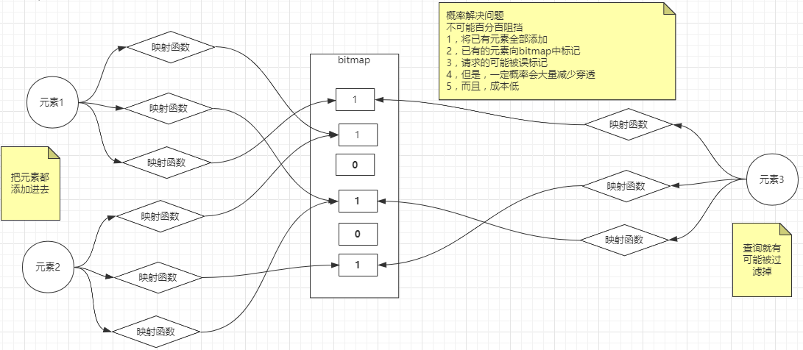

      > 肯定也有穿透的情况，如果有穿透，增加元素的key-value标记，数据库添加元素，最后要对bloom完成这个元素的添加

   3. bloom部署的几种方式

      1. client实现bloom算法，自己承载bitmap；redis没有

         > client端有负担

      2. client实现bloom算法；redis承载bitmap

         > server只承担业务，不承担计算

      3. client没有；redis实现bloom算法，自己承载bitmap

         > server 端承担较多

4. redis做缓存用

   1. 首先明确一点，数据库数据很重要不能丢，但是缓存的数据不是全量数据，并不重要，数据可以消失，需要时再从数据库获取即可。

   2. redis作为缓存里的数据会随着业务的变化，只保留热数据，也就是被经常访问的数据。主要是物理内存有限，不可能存所有的数据。

   3. 通过业务逻辑让redis数据设置key有效期

      > key的有效期设置后，不能延长有效期，不能通过get改变有效期，incr/incrby命令也不行，但是set会删除过期时间，也就是会一直存在
      >
      > key过期判定原理：
      >
      > 1.被动访问时判定
      >
      > 2.周期轮询判定（增量） - redis默认使用
      >
      > 目的：稍微牺牲内存，但是保住了redis性能为王!
      >
      > 
      >
      > maxmemory-policy 六种方式
      > 1、volatile-lru：只对设置了过期时间的key进行LRU（默认值） 
      >
      > 2、allkeys-lru ： 删除lru算法的key   
      >
      > 3、volatile-random：随机删除即将过期key   
      >
      > 4、allkeys-random：随机删除   
      >
      > 5、volatile-ttl ： 删除即将过期的   
      >
      > 6、noeviction ： 永不过期，返回错误

   4. 通过业务运转，随着访问的变化以及内存有限，应该淘汰冷数据，使用LRU/LFU算法删除最不常用或最少使用的数据

      > LRU:Least Recently Used 最不常用
      >
      > LFU:Least Frequently Used 最少使用

5. redis做数据库用

   1. 数据库要求数据持久化，读取数据快，数据肯定要存储到磁盘。redis数据存储在内存，就需要过一段时间redis做持久化把数据存储到磁盘。但是在持久化中间的这段时间出现断电，那么从上一次持久化到现在修改或添加的数据就会消失。怎么解决这个问题呢？那么需要了解redis两种存储方式：RDB/AOF

   2. RDB - Redis Database

      1. 具有时点性，保存某个时间点的数据

      2. save命令：阻塞redis服务器进程，直到RDB文件创建完成为止，这期间redis不能接收任何请求。可以明确用来关机维护

      3. bgsave命令：fork出子进程创建RDB文件，不影响redis服务器进程。

         > 配置文件中给出bgsave规则：save这个标识
         >
         > save 900 1
         >
         > save 300 10
         >
         > save 60 10000

         > fork出的子进程在8点创建rdb文件，那么到8:10时这个时间段内新增数据会不会加入到rdb中？
         >
         > 不会。redis服务进程是父进程，fork出来的是子进程。父进程的修改不会破坏子进程，子进程的修改不会破坏父进程。
         >
         > 进程之间的数据是隔离的。但是父进程可以让子进程看到数据。内核机制：copy on write，写时复制。

      4. 优劣

         1. 不支持拉链，只有一个dump.rdb
         2. 丢失数据多一点，时点与时点之间的窗口数据容易丢失。例如8点创建完成rdb文件，9点刚要save rdb文件，断电了，那么这个时间段内存储的数据就会丢失
         3. 优势：类似java中的序列化，恢复的速度相对快，适合数据量大的恢复

   3. AOF - Append Only File

      1. redis的写操作记录到aof文件中

      2. redis可以同时开启RDB和AOF，如果开启了AOF，只会用AOF恢复数据。redis4.0以后，aof包含rdb的全量，然后增加新的写操作

      3. 弊端：文件无限变大，恢复数据慢。优势：丢失的数据少，设置一秒就把写操作记录到文件，那么最多丢失1秒数据

         > 如何保证AOF优势，同时让日志或AOF文件足够小？

         1. hdfs，fsimage+edits.log。让日志只记录增量，这是一个合并的过程

         2. rewrite

            1. redis4.0以前，删除抵消的命令，合并重复的命令。最终也只是一个纯日志文件
            2. redis4.0以后，将老的数据以rdb方式添加到aof文件，新增的写操作以指令的方法append在文件中。AOF是一个混合体，利用了RDB的块，也利用了日志的全量

            > redis是内存数据库，写操作会触发IO，那么不能让AOF文件过大，不然rewrite会很慢
            >
            > //开启AOF
            >
            > appendonly yes
            >
            > //AOF文件名
            >
            > appendfilename "appendonly.aof"
            >
            > //rewrite百分比
            >
            > auto-aof-rewrite-percentage 100
            >
            > //文件最小多少时，触发rewrite
            >
            > auto-aof-rewrite-min-size 64mb
            >
            > //append操作频率
            >
            > appendfsync always
            >
            > appendfsync everysec
            >
            > appendfsync no 

## Redis运用AKF思想

1. redis是单进程、单线程、单实例。在高并发时会出现各种问题，总体分为三部分：单点故障；容量有限；并发压力。那么怎么解决这些问题呢？采用AKF拆分原则

   

   1. 单点故障。复刻多个一样的redis。
   2. 容量有限。根据业务拆分，每个redis只负责一个业务
   3. 并发压力。按优先级把数据、访问拆分。

2. 通过AKF拆分原则，把redis一变多。那么又会出现很多问题，例如多台redis数据不一致。采用CAP原则

   > CAP原则又称CAP定理，指的是在一个分布式系统中，一致性（Consistency）、可用性（Availability）、分区容错性（Partition tolerance）。CAP 原则指的是，这三个要素最多只能同时实现两点，不可能三者兼顾。

   1. 数据一致性。所有节点阻塞直至数据完成一致。也就是强一致性。但是强一致性破坏可用性，那为什么让redis一变多？目的就是让redis高可用。使用异步方式在所有redis中传输数据，容忍数据丢失一部分，这样才能让一致性、可用性勉强兼顾。

   2. 强一致性破坏可用性，弱一致性丢失部分数据保持高可用，但是可以使用MQ中间件，例如kafka，存储主从复制的数据，保证数据一致

      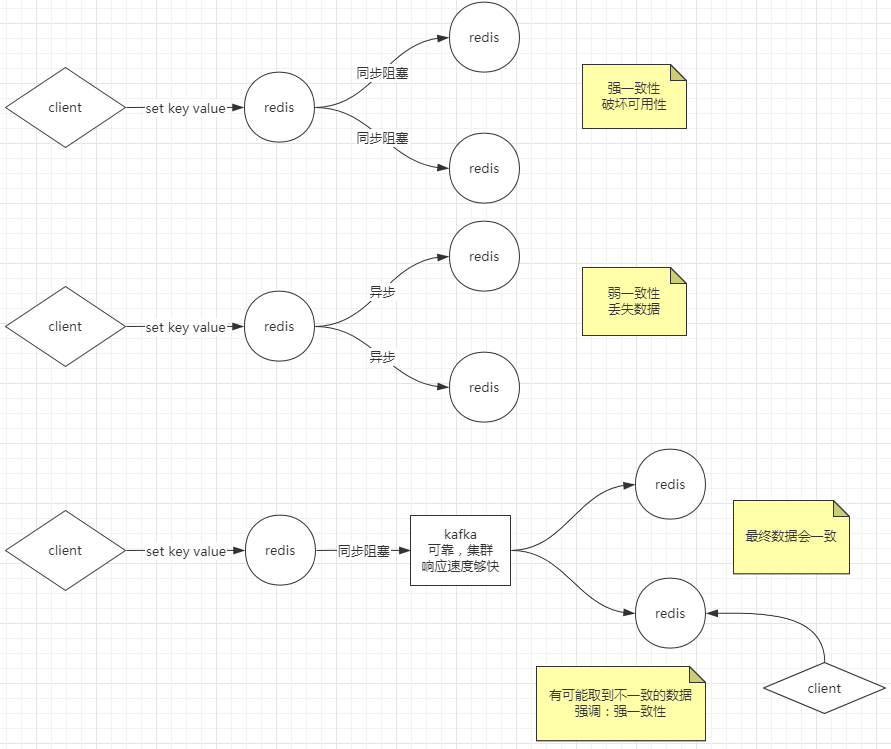

## Redis主从复制

3. redis的解决数据一致性方法是使用主从复制模型。一台redis作为master，其他的都是slave。那么master也会出现单点故障，怎么解决？

   > 主备：主和备都能读写
   >
   > 主从：主负责读写，从只负责读

   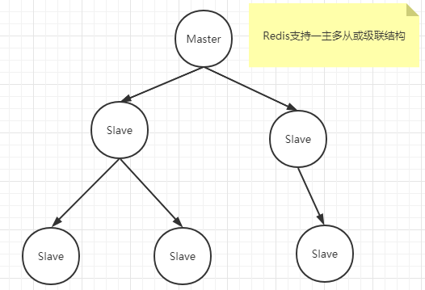

   1. redis有两种同步方式，master复制数据给slave，有全量同步、增量同步

      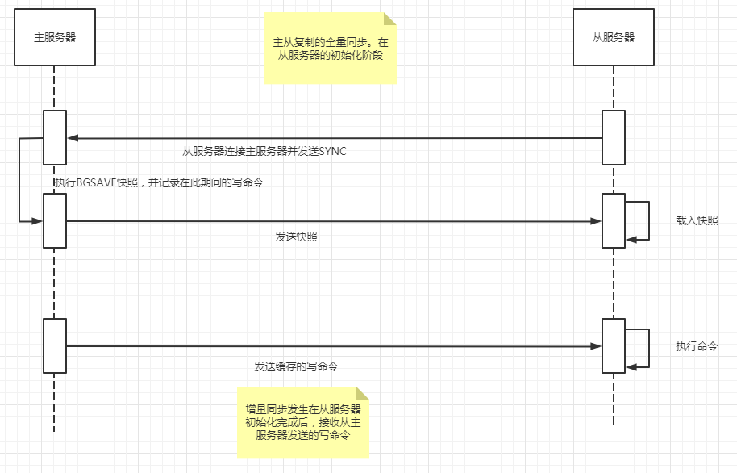

      1. 全量同步。发生在slave刚连接上的初始化阶段，这时slave从master复制全量数据

      2. 增量同步。master执行每执行一个写命令，都会向slave发送相同的写命令，slave接收并执行

2. 主从复制配置与启动

   1. 配置

      ```bash
      #当slave与master正在同步或失去连接时。yes：继续接收client请求；no：必须与master同步完才能接收client请求
      replica-serve-stale-data yes
      #slave是否为只读操作
      replica-read-only yes
      #no：master的rdb文件先存储到磁盘，再传给slave；yes：直接通过IO传输rdb
      repl-diskless-sync no
      #增量复制。如果slave短时间断开，master通过增量复制方式给slave最新数据。怎么实现的呢？master维护一个队列，下面的size就是队列的大小，如果在slave断开的过程中会把新增数据放在队列，slave上线后master会把队列数据传给slave，超过队列大小，会触发全量复制也就是RDB
      repl-backlog-size 1mb 
      #最少给多少个slave写成功
      min-replicas-to-write 3
      #必须多少秒内写成功
      min-replicas-max-lag 10
      ```

      

   2. 启动

   ```bash
   #声明：创建3个redis实例，端口号分别为6379/6380/6381，6379为master，6380/6381为slave，当master挂了，必须手动从slave中选出master
   #   +------------------+      +---------------+
   #   |      Master      | ---> |    Replica    |
   #   | (receive writes) |      |  (exact copy) |
   #   +------------------+      +---------------+
   ####第一种配置：
   #启动3个redis，在6379中创建几个数据
   #让6380追随6379
   redis-cli -p 6380
   replicaof 127.0.0.1 6379
   ####6379日志####
   #6379可以看见谁追随他了
   1300:M 18 Dec 2020 23:44:16.089 * Replica 127.0.0.1:6380 asks for synchronization
   #接收到6380追随6379的请求后，执行BGSAVE fork出子进程创建RDB文件，存储在磁盘
   1300:M 18 Dec 2020 23:44:16.099 * Starting BGSAVE for SYNC with target: disk
   1300:M 18 Dec 2020 23:44:16.121 * Background saving started by pid 1366
   1366:C 18 Dec 2020 23:44:16.125 * DB saved on disk
   #用copy-on-write把RDB复制给6380
   1366:C 18 Dec 2020 23:44:16.126 * RDB: 2 MB of memory used by copy-on-write
   1300:M 18 Dec 2020 23:44:16.189 * Background saving terminated with success
   1300:M 18 Dec 2020 23:44:16.189 * Synchronization with replica 127.0.0.1:6380 succeeded
   ####6380日志####
   1332:S 18 Dec 2020 23:44:16.087 * Connecting to MASTER 127.0.0.1:6379
   1332:S 18 Dec 2020 23:44:16.088 * MASTER <-> REPLICA sync started
   1332:S 18 Dec 2020 23:44:16.088 * Non blocking connect for SYNC fired the event.
   1332:S 18 Dec 2020 23:44:16.089 * Master replied to PING, replication can continue...
   1332:S 18 Dec 2020 23:44:16.089 * Trying a partial resynchronization (request 9d9066838384bd65758f1dc747abd88881220514:1).
   1332:S 18 Dec 2020 23:44:16.121 * Full resync from master: 02d0c0ec2612d861a3ff7fea6bbde8e39f96f205:0
   1332:S 18 Dec 2020 23:44:16.122 * Discarding previously cached master state.
   #6380接收到6379的rdb文件
   1332:S 18 Dec 2020 23:44:16.189 * MASTER <-> REPLICA sync: receiving 230 bytes from master to disk
   #清除6380中老的数据
   1332:S 18 Dec 2020 23:44:16.189 * MASTER <-> REPLICA sync: Flushing old data
   #把rdb加载到内存中
   1332:S 18 Dec 2020 23:44:16.189 * MASTER <-> REPLICA sync: Loading DB in memory
   1332:S 18 Dec 2020 23:44:16.192 * Loading RDB produced by version 6.0.9
   1332:S 18 Dec 2020 23:44:16.192 * RDB age 0 seconds
   1332:S 18 Dec 2020 23:44:16.192 * RDB memory usage when created 1.85 Mb
   1332:S 18 Dec 2020 23:44:16.192 * MASTER <-> REPLICA sync: Finished with success
   
   
   ####第二种配置
   #跟上面一样，追随6379，开启AOF
   redis-server --port 6380 --replicaof 127.0.0.1 6379 --appendonly yes
   ####6380日志####
   1399:S 19 Dec 2020 00:01:51.295 * Full resync from master: 39ddbd2cf1fe3d1e97e1f01f4fcd33d85f6dd989:42
   #还是接收6379的rdb文件并加载到内存
   1399:S 19 Dec 2020 00:01:51.342 * MASTER <-> REPLICA sync: receiving 175 bytes from master to disk
   1399:S 19 Dec 2020 00:01:51.342 * MASTER <-> REPLICA sync: Flushing old data
   1399:S 19 Dec 2020 00:01:51.342 * MASTER <-> REPLICA sync: Loading DB in memory
   1399:S 19 Dec 2020 00:01:51.344 * Loading RDB produced by version 6.0.9
   1399:S 19 Dec 2020 00:01:51.344 * RDB age 0 seconds
   1399:S 19 Dec 2020 00:01:51.344 * RDB memory usage when created 1.83 Mb
   1399:S 19 Dec 2020 00:01:51.345 * MASTER <-> REPLICA sync: Finished with success
   #与第一种配置不一样的是：开启AOF，redis只会使用AOF，redis会把rdb文件rewrite禁aof文件
   1399:S 19 Dec 2020 00:01:51.345 * Background append only file rewriting started by pid 1405
   1399:S 19 Dec 2020 00:01:51.394 * AOF rewrite child asks to stop sending diffs.
   1405:C 19 Dec 2020 00:01:51.394 * Parent agreed to stop sending diffs. Finalizing AOF...
   1405:C 19 Dec 2020 00:01:51.394 * Concatenating 0.00 MB of AOF diff received from parent.
   1405:C 19 Dec 2020 00:01:51.395 * SYNC append only file rewrite performed
   1405:C 19 Dec 2020 00:01:51.395 * AOF rewrite: 6 MB of memory used by copy-on-write
   1399:S 19 Dec 2020 00:01:51.496 * Background AOF rewrite terminated with success
   1399:S 19 Dec 2020 00:01:51.496 * Residual parent diff successfully flushed to the rewritten AOF (0.00 MB)
   1399:S 19 Dec 2020 00:01:51.496 * Background AOF rewrite finished successfully
   ```

3. 主从复制+哨兵(sentinel)

   1. 主从复制需要人工维护master的故障问题。

   2. 那么哨兵能让redis主从复制实现高可用性

   3. 启动

      ```bash
      #添加配置文件26379.conf、26380.conf、26381.conf，只需修改port
      port 26379
      sentinel monitor mymaster 127.0.0.1 6379 2 #2表示有两个追随者
      #启动redis实例
      redis-server ./6379.conf
      redis-server ./6380.conf --replicaof 127.0.0.1 6379 
      redis-server ./6381.conf --replicaof 127.0.0.1 6379
      #再启动sentinel,redis-sentinel集成在redis-server中
      redis-server ./26379.conf --sentinel
      redis-server ./26380.conf --sentinel
      redis-server ./26381.conf --sentinel
      ###sentinel日志
      1568:X 19 Dec 2020 01:13:54.017 # +monitor master mymaster 127.0.0.1 6379 quorum 2
      #sentinel从6379知道有两个slave
      1568:X 19 Dec 2020 01:13:54.018 * +slave slave 127.0.0.1:6380 127.0.0.1 6380 @ mymaster 127.0.0.1 6379
      1568:X 19 Dec 2020 01:13:54.024 * +slave slave 127.0.0.1:6381 127.0.0.1 6381 @ mymaster 127.0.0.1 6379
      #通过发布订阅发现其他sentinel
      1568:X 19 Dec 2020 01:13:54.787 * +sentinel sentinel 43879796937113a1d7b58a6cadbfac0f63d8cb6b 127.0.0.1 26379 @ mymaster 127.0.0.1 6379
      1568:X 19 Dec 2020 01:13:55.090 * +sentinel sentinel ebbce6cb36ec95c8878ed710545801f65f2eff10 127.0.0.1 26380 @ mymaster 127.0.0.1 6379
      
      #当停掉6379后，sentinel会投票过半选出新的master
      ####6380日志
      #6380成为master，向6381发出同步请求
      1511:M 19 Dec 2020 01:26:15.851 # CONFIG REWRITE executed with success.
      1511:M 19 Dec 2020 01:26:16.371 * Replica 127.0.0.1:6381 asks for synchronization
      1511:M 19 Dec 2020 01:26:16.371 * Partial resynchronization request from 127.0.0.1:6381 accepted. Sending 156 bytes of backlog starting from offset 181555.
      ####6381日志
      #6381收到请求并完成同步
      1518:S 19 Dec 2020 01:26:16.371 * MASTER <-> REPLICA sync started
      1518:S 19 Dec 2020 01:26:16.371 * Non blocking connect for SYNC fired the event.
      1518:S 19 Dec 2020 01:26:16.371 * Master replied to PING, replication can continue...
      1518:S 19 Dec 2020 01:26:16.371 * Trying a partial resynchronization (request e7c2d6c4815257070aa6e787fba7e7096d47622a:181555).
      1518:S 19 Dec 2020 01:26:16.371 * Successful partial resynchronization with master.
      1518:S 19 Dec 2020 01:26:16.371 # Master replication ID changed to d2ba600f4fab30b4ab13f6b2f960d9a3e2a65fa1
      1518:S 19 Dec 2020 01:26:16.371 * MASTER <-> REPLICA sync: Master accepted a Partial Resynchronization
      ####26381日志
      #sentinel选出6380位master
      1568:X 19 Dec 2020 01:26:17.258 # +failover-end master mymaster 127.0.0.1 6379
      1568:X 19 Dec 2020 01:26:17.258 # +switch-master mymaster 127.0.0.1 6379 127.0.0.1 6380
      1568:X 19 Dec 2020 01:26:17.258 * +slave slave 127.0.0.1:6381 127.0.0.1 6381 @ mymaster 127.0.0.1 6380
      1568:X 19 Dec 2020 01:26:17.258 * +slave slave 127.0.0.1:6379 127.0.0.1 6379 @ mymaster 127.0.0.1 6380
      ####26379.conf
      port 26379
      sentinel myid 43879796937113a1d7b58a6cadbfac0f63d8cb6b
      # Generated by CONFIG REWRITE
      protected-mode no
      user default on nopass ~* +@all
      dir "/root/test"
      sentinel deny-scripts-reconfig yes
      #6380成为master
      sentinel monitor mymaster 127.0.0.1 6380 2
      sentinel config-epoch mymaster 1
      sentinel leader-epoch mymaster 2
      #6379/6381成为slave
      sentinel known-replica mymaster 127.0.0.1 6379
      sentinel known-replica mymaster 127.0.0.1 6381
      sentinel known-sentinel mymaster 127.0.0.1 26380 ebbce6cb36ec95c8878ed710545801f65f2eff10
      sentinel known-sentinel mymaster 127.0.0.1 26381 6ae2925f381308411525ff27678cc899d7333ba5
      sentinel current-epoch 2
      ```

      ```bash
      ####sentinel怎么发现其他sentinel的呢？使用redis的发布订阅
      psubscribe *
      1) "pmessage"
      2) "*"
      3) "__sentinel__:hello"
      4) "127.0.0.1,26381,6ae2925f381308411525ff27678cc899d7333ba5,0,mymaster,127.0.0.1,6379,0"
      1) "pmessage"
      2) "*"
      3) "__sentinel__:hello"
      4) "127.0.0.1,26380,ebbce6cb36ec95c8878ed710545801f65f2eff10,0,mymaster,127.0.0.1,6379,0"
      1) "pmessage"
      2) "*"
      3) "__sentinel__:hello"
      4) "127.0.0.1,26379,43879796937113a1d7b58a6cadbfac0f63d8cb6b,0,mymaster,127.0.0.1,6379,0"
      ```

      

## Redis集群

1. 容量的问题怎么解决呢？

   1. 数据可以分类，交集不多。逻辑：直接业务拆分

   2. 数据没办法划分拆解

      1. 算法：modula：hash+取模。取模的数必须固定，%3，%7。弊端：影响分布式下的扩展性

      2. 逻辑：random。例如：多个redis共用一个list，一个client用lpush随机放入某个redis，另一个client用rpop从list取出。类似消息队列。

      3. 逻辑：kemata：一致性hash

         1. 一致性hash算法也是使用取模的方法，不过，modula对服务器的数量进行取模，而一致性hash是对2^32取模。一致性hash算法将整个hash空间虚拟成一个hash环。

         2. 现在有3台redis服务器，通过映射找到3台server在hash环上的位置，这3个hash环上的点是物理节点。

         3. 每个物理节点都有自己的虚拟节点，例如1~100属于A节点，100~300属于B节点，300~400属于C节点，新增数据映射在159的位置，那么这个数据属于B节点。

         4. 新增D节点，假如计算出B节点分出100个，那么B 100~200，D 200~300，其他虚拟节点不受影响。

            > 优点：增加节点，可以分担其他节点的压力
            >
            > 弊端：新增server导致一小部分数据无法查询到。高并发时可能会产生击穿。

         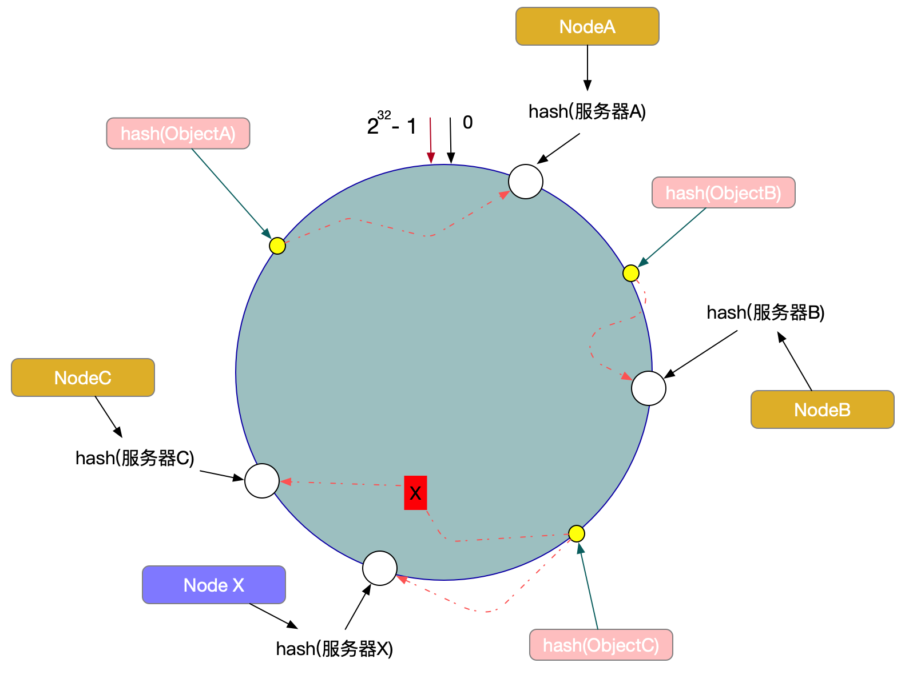

2. 当有两台redis，多个client可能会同时连接两台redis，会有什么问题？

   1. 大量的请求通过redis交给server，对server造成很大的压力。如何解决呢？使用代理服务器接收client请求，再分发给两台redis。

   2. 一台代理服务器有单点故障问题，怎么解决呢？再添加一台代理服务器

   3. 怎么保持高可用呢？在代理服务器前加入LVS，一台坏了换另外一台

   4. LVS也有单点故障问题，怎么解决？再添加一台LVS和keepalived，keepalived监控两台LVS和两台代理服务器的健康状况。

      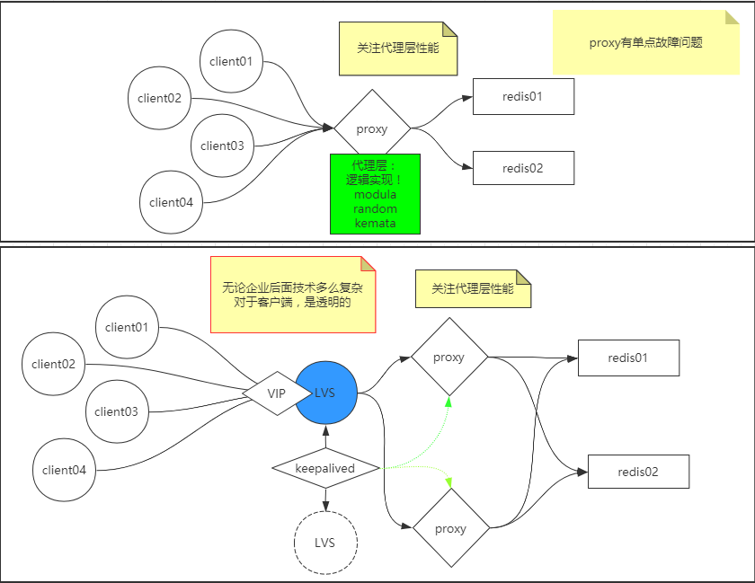

   5. twemproxy：Twitter使用的框架。是一种用于memcached和redis协议的快速轻量级代理。实现了上面的架构模型。https://github.com/twitter/twemproxy

   6. predixy：是Redis哨兵和Redis集群的高性能和全功能代理。https://github.com/joyieldInc/predixy

3. redis没有使用一致性hash，而是引入了hash槽的概念。redis集群有16384个hash槽。集群中redis怎么查询到其他redis数据呢？redis映射其他redis的节点，当前redis没有，会告诉client去哪个redis能查询到数据。

   > hash tag概念，{tag}key1,{tag}key2分在同一个redis，前提是tag必须相同

   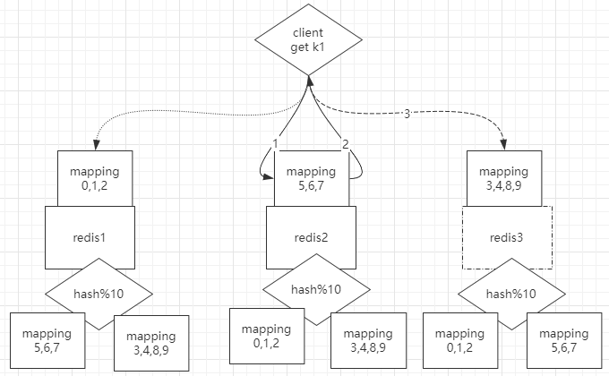

4. 集群配置

   ```bash
   ##使用redis提供的脚本
   vi /path/redis/utils/create-cluster
   #总共6台redis
   NODES=6
   #3台master。3台slave
   REPLICAS=1
   
   #启动cluster
   ./create-cluster start
   #创建节点
   ./create-cluster create
   #开启client不会自动跳转redis
   redis-cli -p 30001
   #自动跳转redis
   redis-cli -c -p 30001
   set k1 abc
   #跳转到10003redis并设置在10003redis里
   > Redirected to slot [12706] located at 127.0.0.1:30003
   
   ##事务操作时使用{tag}加在key前面，这些keys都在同一个redis下
   
   ##手动建立cluster
   #查看cluster命令
   redis-cli --cluster help
   #失败了，待后续再找原因，报错：Could not connect to Redis at 127.0.0.1:30001: Connection refused
   #必须添加配置文件
   redis-cli --cluster create --cluster-replicas 1 127.0.0.1:30001 127.0.0.1:30002 127.0.0.1:30003 127.0.0.1:30004 127.0.0.1:30005 127.0.0.1:30006
   #在redis目录下创建cluster-test，创建文件夹7000~7005
   mkdir cluster-test
   cd cluster-test
   mkdir 7000 7001 7002 7003 7004 7005
   #每个文件夹添加redis.conf，需添加最小配置
   port 7000
   cluster-enabled yes
   cluster-config-file nodes.conf
   cluster-node-timeout 5000
   appendonly yes
   #启动每个端口号
   redis-server ./7000/redis.conf
   #启动集群
   redis-cli --cluster create --cluster-replicas 1 127.0.0.1:7000 127.0.0.1:7001 127.0.0.1:7002 127.0.0.1:7003 127.0.0.1:7004 127.0.0.1:7005
   ```

## Redis面试常问

1. 击穿。高并发的前提下，大量请求访问某个数据，这个数据已经过期，请求会压到数据库，给数据库带来很大的压力
   1. 分布式锁setnx(SET IF NOT EXIST)，一个请求获取锁后，其他请求sleep 1s，获得锁的请求去数据库查询数据，访问成功后，其他请求都能访问数据
   2. 如果第一个获得锁的请求从数据库获取数据失败了怎么办？可以设置锁的过期时间，这个时间内失败把锁交给其他请求
   3. 如果获得锁的请求没失败，但是锁超时了怎么办？多线程：一个线程去数据库取数据；一个线程监控是否取回数据，若没有，更新锁时间
2. 穿透。从业务接收查询的是数据库不存在的数据
   1. bloom。布隆过滤器。不存在的肯定没有，存在的不一定有
   2. bloom不能删除，只能添加。可以让key为null，bloom会略过key
3. 雪崩。大量的key失效，间接导致并发访问到达数据库
   1. 与时点性无关。随机设置过期时间，降低雪崩的概率
   2. 与时点性有关。redis在零点所有旧数据换成新数据，容易造成雪崩。解决方法：业务层加判断，到零点，所有请求随机sleep一个时间，等到时间过去后，部分数据更新完毕，可以缓冲雪崩的情况。

## Redis API

参考https://docs.spring.io/spring-data/redis/docs/2.4.2/reference/html/#reference

1. 创建spring-redis项目，在application.properties添加redis连接配置

   ```java
   spring.redis.host=192.168.163.100
   spring.redis.port=6379
   ```

2. redis必须改一个配置项，在客户端输入config get *,发现protected-mode:yes，临时改为no，项目启动时才能访问

   ```bash
   config set protected-mode no
   ```

3. redisTemplate使用

   ```java
   @Component
   public class TestRedis {
       @Autowired
       RedisTemplate redisTemplate;
   
       @Autowired
       StringRedisTemplate stringRedisTemplate;
   
       public void test(){
           redisTemplate.opsForValue().set("name","henry");
           //redis存储的key为 \xac\xed\x00\x05t\x00\x04name
           //redisTemplate，将key进行java序列化，而不是序列化成二进制
           System.out.println(redisTemplate.opsForValue().get("name"));
   
           //stringRedisTemplate会把key-value转成二进制流
           stringRedisTemplate.opsForValue().set("name","henry");
           System.out.println(stringRedisTemplate.opsForValue().get("name"));
           //=================================上面使用的是高阶API，下面使用的是低阶API==================================
           RedisConnection connection=redisTemplate.getConnectionFactory().getConnection();
           connection.set("name".getBytes(),"henry".getBytes());
           System.out.println(new String(connection.get("name".getBytes())));
           
           //添加复杂value
           HashOperations<String, Object, Object> hash = stringRedisTemplate.opsForHash();
           hash.put("henry","name","huang");
           hash.put("henry","age","22");
   
           System.out.println(hash.entries("henry"));
           
           
   		
       }
   }
   ```

   