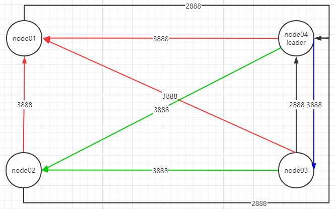

# Zookeeper总结

## 回顾Redis

Redis单实例，在内存运行数据，速度快，主从复制和sentinel提供数据一致性和高可用，集群提供了高可用和分区容错性，完成分布式协调和实现分布式锁。但是在Redis出现故障时，会出现停顿、响应慢情况。使用zookeeper可以实现无停顿体验。

## zookeeper安装

```bash
#准备node01~node04
#安装jdk并设置Javahome
####先在node01设置
#使用mirror仓库，不然文件下载失败
wget https://mirror.bit.edu.cn/apache/zookeeper/zookeeper-3.6.2/apache-zookeeper-3.6.2-bin.tar.gz
#解压
tar xf apache-zookeeper-3.6.2-bin.tar.gz
#改名
mv apache-zookeeper-3.6.2-bin zookeeper-3.6.2
#添加环境变量
vi /etc/profile
	ZOOKEEPER_HOME=/soft/zookeeper-3.6.2
	PATH=$PATH:$ZOOKEEPER_HOME/bin
source /etc/profile

cd zookeeper/conf
mv zoo-sample.cfg zoo.cfg
vi zoo.cfg
	#不要使用默认目录
	dataDir=/var/soft/zookeeper
	server.1=192.168.42.11:2888:3888
	server.2=192.168.42.12:2888:3888
	server.3=192.168.42.13:2888:3888
	server.4=192.168.42.14:2888:3888
mkdir /var/soft/zookeeper
#node02~04,分别使用2~4
echo 1 > var/soft/zookeeper/myid
#分别复制给node02~04
cd root && scp -r ./soft/ 192.168.42.12:`pwd` 
#node02~04设置zookeeper环境变量
vi /etc/profile
	ZOOKEEPER_HOME=/soft/zookeeper-3.6.2
	PATH=$PATH:$ZOOKEEPER_HOME/bin
source /etc/profile
#启动顺序1~4,前台启动，日志显示在控制台
zkServer.sh start-foreground
```

## zookeeper原理

zookeeper是一个目录树结构，分布式协调服务。并没有类似数据库等功能。3种类型节点，leader、follower、observer。leader负责写操作，把数据同步给follower；follower负责读操作；observer负责非事务操作，放大查询能力，不参与选举，没有投票权。

> zoo.cfg
>
> server.1=node01:2888:3888
>
> server.2=node02:2888:3888
>
> server.3=node03:2888:3888
>
> server.4=node04:2888:3888:observer

1. 分布式肯定都有这些问题

   1. leader肯定会挂，单点故障
      1. follower根据ZAB协议投票过半选出leader
   2. 服务处于不可用状态
      1. 4台节点挂了2台，剩下2台处于不可用状态，如果上线一台，通过3888端口得知，迅速选出leader，变为可用状态。
   3. 集群可不可靠
      1. zookeeper能够快速的回恢复leader

2. zookeeper是一个目录树结构，每个点都是一个node，node只能存1M数据。节点也分为临时节点、持久化节点、序列节点。

   

   1. 节点只能存1M数据，为了不让当作数据库，也为了协调服务时速度快
   2. PERSISTENT。持久化节点。client与zk断开连接后，节点依然存在
   3. PERSISTENT_SEQUENTIAL。持久化顺序编号节点。client与zk断开连接后，节点依然存在，zk给节点顺序编号，后面再创建节点，编号+1
   4. EPHEMERAL。临时目录节点。client与zk断开连接后，节点被删除
   5. EPHEMERAL_SEQUENTIAL。client与zk断开连接后，节点被删除。但是zk保留节点编号顺序，后面再创建节点，编号+1

3. zookeeper client命令。

   ```bash
   #给一个目录添加watch，这个目录下的节点有事件发生，watch回调给client。PERSISTENT_RECURSIVE：watch这个目录下所有子目录，并递归到最后一级目录
   addWatch [-m mode] path # optional mode is one of [PERSISTENT, PERSISTENT_RECURSIVE] - default is PERSISTENT_RECURSIVE
   #用于节点认证，使用方式：addauth app1 username:password
   addauth scheme auth
   #关闭client
   close 
   #动态加载配置
   config [-c] [-w] [-s]
   #连接client
   connect host:port
   #创建节点。-e 临时节点，不允许有子节点。-s 序列节点。-c 默认节点，持久化节点
   create [-s] [-e] [-c] [-t ttl] path [data] [acl]
   #删除节点
   delete [-v version] path
   #删除目录下所有节点包括子目录
   deleteall path [-b batch size]
   #删除节点配额。-n 节点数 -b 字节数
   delquota [-n|-b] path
   #取得节点的值。-s 取值和状态。-w 添加监听
   get [-s] [-w] path
   #取得节点权限。-s 取权限和状态
   getAcl [-s] path
   #取子节点的数量
   getAllChildrenNumber path
   #取临时节点数量
   getEphemerals path
   history 
   #查看节点限额
   listquota path
   #查看节点。-s查看节点和内容  -w（添加监听是否添加或删除子节点，但不会监听子节点值的变化） -R查到所有节点（包含根节点）
   ls [-s] [-w] [-R] path
   #是否打印监听事件
   printwatches on|off
   quit 
   #重新加载配置文件
   reconfig [-s] [-v version] [[-file path] | [-members 			 						serverID=host:port1:port2;port3[,...]*]] | [-add 							           serverId=host:port1:port2;port3[,...]]* [-remove serverId[,...]*]
   #重新操作某命令，与history配合使用
   redo cmdno
   #删除监听
   removewatches path [-c|-d|-a] [-l]
   #设置节点值
   set [-s] [-v version] path data
   setAcl [-s] [-v version] [-R] path acl
   setquota -n|-b val path
   #查看节点状态
   stat [-w] path
   #强制同步
   sync path
   version 
   ```

4. 节点属性。

   ```bash
   # Zxid.zookeeper的事务ID
   #节点创建时的Zxid
   cZxid = 0x200000003
   #创建时间
   ctime = Sun Dec 20 07:25:38 EST 2020
   #节点修改时的Zxid
   mZxid = 0x200000003
   #修改时间
   mtime = Sun Dec 20 07:25:38 EST 2020
   #与该节点的子节点最近一次创建/删除Zxid对应。若无子节点，则是当前节点
   pZxid = 0x200000003
   #子节点版本号
   cversion = 0
   #数据版本号，修改次数
   dataVersion = 0
   #权限版本号，修改次数
   aclVersion = 0
   #是否为临时节点，有值表示临时节点
   ephemeralOwner = 0x0 # ephemeralOwner = 0x10000926cfa0000
   #数据长度
   dataLength = 0
   #子节点数量
   numChildren = 0
   ```

5. 持久化节点、序列节点都有各自的功能。临时节点有什么用处呢？

   1. 设置临时节点与session配合使用，zookeeper分布式锁与session绑定，session结束锁释放，比Redis手动设置过期时间好很多

6. zookeeper可以实现哪些功能呢？

   1. 统一配置管理，使用1M空间存储数据‘
   2. 分组管理，使用path结构
   3. 统一命名，使用sequential顺序编号
   4. 分布式同步，使用临时节点+session，实现分布式锁

7. zookeeper特征/保障

   1. 顺序一致性。client的更新将按发送顺序应用
   2. 原子性。更新成功或失败，没有中间状态
   3. 统一视图。无论连接到哪台服务器，客户端都能看到相同的视图
   4. 可靠性。一旦应用了更新，会持续到客户端覆盖更新
   5. 及时性。系统的视图保证在特定时间范围内时最新的

8. 在配置文件zoo.cfg中，设置server.1=192.168.42.11:2888:3888，那么2888,3888端口用来干什么的呢？

   1. 3888-选leader投票用的

   2. 2888-leader接收write请求或者与follower同步数据

      

9. zookeeper使用paxos算法。

   > 参考https://zhuanlan.zhihu.com/p/31780743
   >
   > Paxos算法运行在允许宕机故障的异步系统中，不要求可靠的消息传递，可容忍消息丢失、延迟、乱序以及重复。它利用大多数 (Majority) 机制保证了2F+1的容错能力，即2F+1个节点的系统最多允许F个节点同时出现故障。

10. ZAB协议 - Zookeeper Atomic Broadcast:原子广播协议。协议作用的在可用状态，也就是有leader时。

    1. 原子性：只有成功或失败，没有中间状态；广播协议：分布式多节点，只需要通知到一半以上follower就可以。
    2. zookeeper为每个follower维护一个队列。队列存的是更新日志和更新操作。zookeeper的数据状态存在内存，日志存在磁盘。
    3. ZAB实现原理
       1. client对着某个follower发出写操作，比如create app1创建一个节点，follower收到后转给leader
       2. leader收到后，创建事务ID，也就是Zxid
       3. leader通过队列给follower发出更新日志，follower会把写操作更新到日志里，没有立即创建节点，follower回送确认信息。
       4. 如果只有3台zookeeper，那么只需一个follower回送确认信息加上leader自己的确认，已经过半，leader就会把写操作发给follower，最后给client发送操作成功的信息。
       5. 如果leader没来得及给follower写操作，leader就挂了，写操作是失败还是成功吗？ 失败，写操作会回滚，因为zookeeper是原子性操作。

11. zookeeper选举机制

    1. 端口3888完成两两通信，建立投票选举通道
    2. 只要任何节点投票，都会触发准leader发起自己的投票，其他节点都会推选准leader当选
    3. 准leader标准：先比较事务ID Zxid，若Zxid相同，再比较myid。
    4. zookeeper是一种推选制
    5. 如果节点不过半，那么节点处于不可用状态，直到其他节点上线，节点过半才能推举leader，变为可用状态

12. watch工作过程

    1. client A在zookeeper创建节点/app/a代表自己，client B通过统一视图获取A创建的节点。
    2. B用watch监听A的状态，a节点是临时节点+session结构，当session失效或A断开连接，a节点触发删除事件，watch监听到事件立即回调给B，B立马就知道A断开连接了。
    3. B也可通过轮询的方式监听A，但是轮询肯定有时间间隔。zookeeper的直接回调没有延迟。
    4. API实现watch的监听及回调功能

13. zookeeper分布式协调，实现reactive

14. zookeeper实现分布式锁

    1. 争抢锁，只有一个请求能获得锁
    2. 获得锁的请求出问题，靠临时节点（session）规避问题
    3. 获得锁的请求成功了，完成业务功能，释放锁
    4. 锁被释放、删除，别的节点怎么知道呢？
       1. 主动轮询。弊端：延迟、当client太多时被轮询的client压力很大
       2. watch，解决延迟。弊端：压力
       3. sequence+watch。watch谁呢？watch前一个，最小的获得锁，一旦最小的释放了锁，zookeeper会给第二个发送回调
    5. API实现